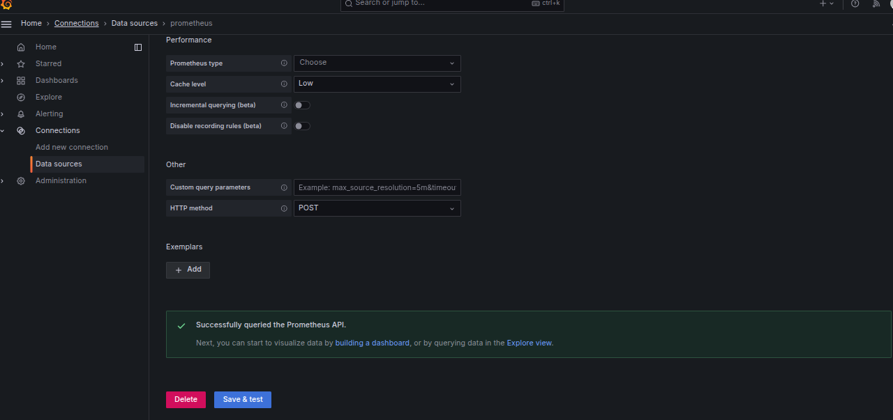
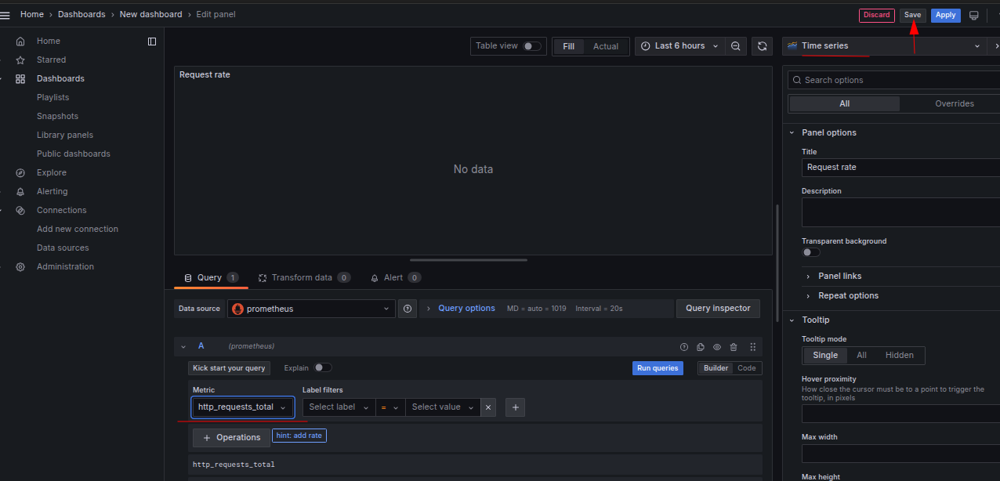
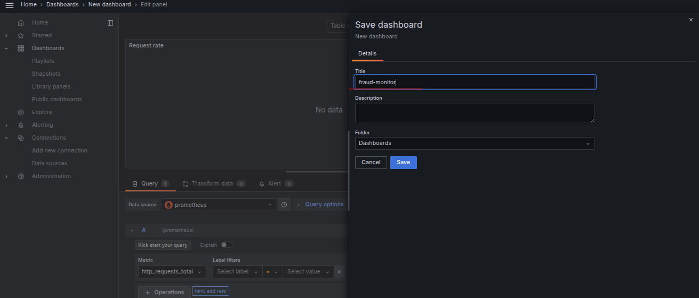
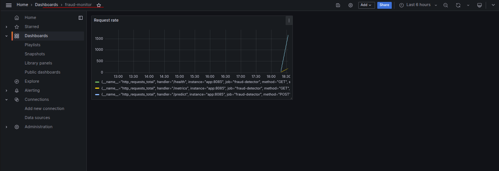

# Task:  Capstone (4/4): Close the Loop with Prometheus + Grafana Observability

The xFusionCorp Industries MLOps team wants a live dashboard of the `fraud-detector` service's request rate so oncall can see when the endpoint is receiving traffic. The service is already instrumented, Prometheus is already scraping it, and synthetic traffic is being generated in the background. Grafana was provisioned empty — no data source, no dashboards. Wire Grafana to Prometheus and author a dashboard named `fraud-monitor` with a panel showing `request rate`.

1. Open the Grafana and Prometheus buttons at the top of the lab. Grafana `admin` credentials are `admin` / `admin`. The pre-staged state:

  - The FastAPI app on `:8085` exposes Prometheus metrics at `/metrics` (instrumented via `prometheus-fastapi-instrumentator`).
  - Prometheus on `:9090` scrapes the app every 5 s as job `fraud-detector`.
  - A background traffic generator is hitting `/predict` and `/health` continuously, so Prometheus already has non-zero samples flowing.
  - Grafana on `:3000` has no data source and no dashboards.

2. From the Grafana UI, add a Prometheus data source pointed at `http://prometheus:9090`.

3. Author a dashboard named `fraud-monitor` with at least one panel whose PromQL query references `http_requests_total` (e.g. `http_requests_total,` `rate(http_requests_total[1m])`, or `sum(rate(http_requests_total[5m])))`.

4. The end state must include:

  - Grafana has a data source of type `prometheus` pointed at `http://prometheus:9090`.
  - Grafana has a dashboard named `fraud-monitor`.
  - The dashboard has at least one panel whose query references `http_requests_total`.

> The Compose stack lives under /root/code/observability/ (app/, compose.yaml, prometheus.yml, scripts/) for transparency; nothing under that directory needs to be edited.

---

# Solution:

- This task deals with observability layer of the MLOps lifecycle. The `fraud-detector` service is already instrumented to expose Prometheus metrics, and Prometheus is already scraping those metrics while synthetic traffic continuously generates requests. Our objective is to connect Grafana to Prometheus by configuring a Prometheus data source, then create a dashboard named `fraud-monitor` that visualizes the service's request activity using the `http_requests_total` metric (or a rate derived from it). This enables operators to monitor traffic flowing through the `model-serving` endpoint and provides real-time visibility into the health and usage of the deployed service.

- Navigate to Grafana UI using the credentials provided, add Prometheus as an *Data source* with server URL being `http://prometheus:9090` and test
the connectivity.

- Now, we need to create a dashnoard with a panel showing `request rate` with PromQL query `http_requests_total`. Navigate to Dashboard from the left menu, and create a new dashboard.

- Save the dashboard and give it the required name of `fraud-monitoring`

- Confirm the named dashboard is saved and check if the metrics are displayed in the panel.

Done!! Hit **Check**.
