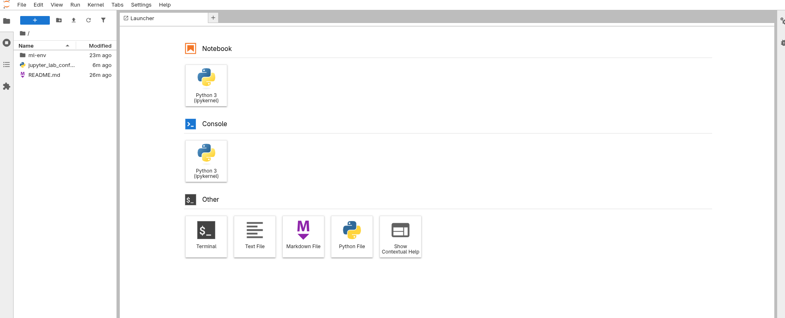

# Task: Set Up and Configure Jupyter Notebook Server 

A teammate has configured a JupyterLab server for the xFusionCorp Industries data science team, but the server does not behave correctly. Inspect the configuration, diagnose the issues, and start the server.


JupyterLab is already installed in the virtual environment at /root/code/ml-env/. The team's configuration file is at /root/code/jupyter_lab_config.py and is visible in the file explorer.

When JupyterLab is started, the Jupyter UI button at the top of the lab must open the notebook interface.

For this to work, the running server must meet the following requirements:

- it listens on port `8888`;
- it binds on `0.0.0.0` (the lab proxy cannot reach a server that is only bound on 127.0.0.1);
- the notebook root directory is `/root/notebooks/`, and that directory exists on disk.
- Open the configuration file, identify every setting that prevents the requirements above from being met, and correct it. Create any missing directories.

Start JupyterLab from the virtual environment using the corrected configuration:

```
   source /root/code/ml-env/bin/activate
   jupyter lab --config=/root/code/jupyter_lab_config.py --allow-root --no-browser &
```
Make sure JupyterLab is running before using the button at the top of the lab.


---
# Solution:
- The task asks to *Create any missing directories*. If we look at the config, we see that `c.ServerApp.notebook_dir = '/root/notebooks'` is defined. However, there is no `notebooks` directory under `/root`.

- First create this directory with `mkdir /root/notebooks`

- Update the config according to the requirement provided in the task:

```
# Jupyter configuration file for the xFusionCorp Industries data science team

# --- xFusionCorp team overrides (review before starting the server) ---
c.ServerApp.token = ''
c.ServerApp.password = ''
c.ServerApp.disable_check_xsrf = True
# Udpate this line with `/root/notebooks`
c.ServerApp.nootbook_dir = '/root/notebooks'
c.ServerApp.port = 8888
c.ServerApp.ip = '0.0.0.0'
```

Now, activate the virtual environment and run: `jupyter lab --config=/root/code/jupyter_lab_config.py --allow-root --no-browser &`

You should be able to open the JupyterLab UI by clicking the button at the top right of the lab.



Now you can hit **Check**
