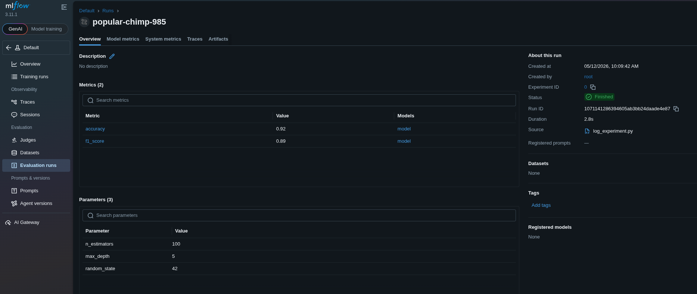

# Task: 

A xFusionCorp Industries data scientist needs a training run recorded in MLflow so the team has a baseline record on the tracking dashboard. The non-MLflow scaffolding has already been written at `/root/code/log_experiment.py`; the MLflow logging calls are left as TODO blocks. Your task is to complete the script so that every element of the run is captured by the MLflow tracking server.


1. The MLflow tracking server is already running on port `5000`. The MLflow UI button at the top of the lab can be opened to view the dashboard; the Default experiment is present on first load.

2. `/root/code/log_experiment.py` can be opened in the VS Code editor. The script prepares a `params` dictionary, fits a trivial sklearn model, and advertises a pair of synthetic evaluation scores (accuracy and f1). Three blocks marked # `TODO` inside the `mlflow.start_run()` context are the only edits required.

3. Execute the script once (python3 /root/code/log_experiment.py) after the TODOs are completed. The end state must include:

  - Exactly one new run in the `Default` experiment.
  - Every hyperparameter in the params dict (`n_estimators=100`, `max_depth=5`, `random_state=42`) recorded as a run parameter.
  - Both advertised scores (`accuracy`, `f1_score`) recorded as run metrics.
  - The sklearn model captured as an MLflow model artefact on the run.


> The result can be confirmed in the MLflow UI—once the run is opened, the Parameters, Metrics, and Artifacts panels each show the expected content.

---
# Solution:

The main task with this is to use the mlflow Python SDK and complete this task. You can refer to
this [official doc](https://mlflow.org/docs/latest/api_reference/python_api/mlflow.html) relevant for this task.

- Open the `./code/log_experiment.py` in the VSCode editor and update the `TODOs` as following:

```
# ./code/log_experiment.py

"""
MLflow experiment logging — three TODO blocks below record a training
run with MLflow.

The model and metric values in this script are synthetic. A trivial
DummyClassifier stands in for a trained model so that the MLflow
logging calls have a real sklearn estimator and deterministic numeric
metrics to persist. The purpose of the lab is to practise the MLflow
logging API, not to reason about model quality.

The three `# TODO` blocks inside the `mlflow.start_run()` context
are the only edits required.
"""
import numpy as np
import mlflow
import mlflow.sklearn
from sklearn.dummy import DummyClassifier

<snip>

with mlflow.start_run():

    # TODO 1: log every entry in `params` as an MLflow parameter so that
    # n_estimators, max_depth, and random_state become searchable
    # parameters on this run.
    mlflow.log_params(params)


    # TODO 2: log `accuracy` and `f1` as MLflow metrics named
    # "accuracy" and "f1_score" respectively.
    mlflow.log_metric("accuracy", accuracy)
    mlflow.log_metric("f1_score", f1)


    # TODO 3: log the trained `model` as an MLflow sklearn model
    # artefact on this run.
    mlflow.sklearn.log_model(model, "model")


    print(f"accuracy={accuracy}, f1_score={f1}")
```


- After updating the script, run the `log_experiment.py` 
Finally, open the MLFlow UI and navigate to `Training runs` to see the logs captured in MLFlow.



