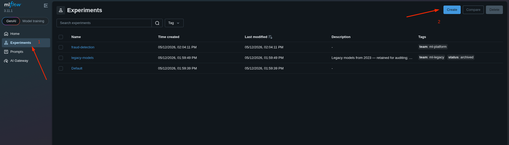
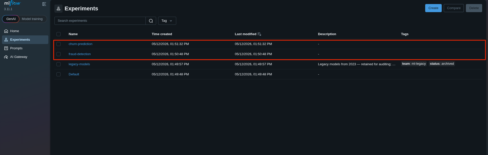
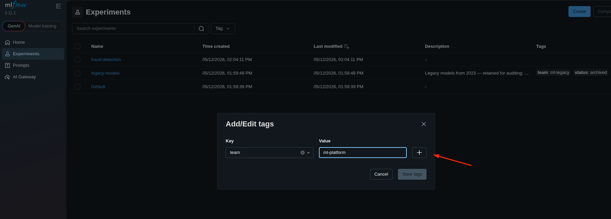
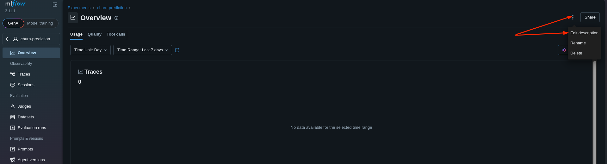
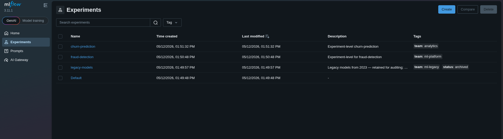

# Task: Create and Organize MLflow Experiments

The xFusionCorp Industries ML platform team is onboarding two new ML projects and needs each one organised under its own MLflow experiment rather than sharing the `Default` experiment. Your task is to register both experiments through the MLflow UI and tag them with the owning team.

1. The MLflow tracking server is already running on port `5000`. The MLflow UI button at the top of the lab can be opened to view the dashboard. One seeded experiment (`legacy-models`) is listed alongside the platform-created Default—both act as reference material and must not be modified.

2. Using the MLflow UI, register two new experiments with the experiment-level metadata below. The task is complete when both records satisfy every bullet.

  - `fraud-detection`

    - Experiment-level description is a non-empty string describing the project (any phrasing).
    - Experiment-level tag: key `team`, value `ml-platform`.

  - `churn-prediction`

    - Experiment-level tag: key `team`, value `analytics`.

> The result can be confirmed in the MLflow UI: both new experiments appear in the left-hand list, with the description and tags visible on each experiment's page.

---
# Solution:

This task needs to be completed on the MLFlow UI.

- Access the MLFlow UI from the button at the top.

- We already have two experiments listed. We are asked not to touch them in any way, and create two
  experiments.

- We create two experiments named `fraud-detection`, and `churn-prediction`

- Next, we enter into the experiment view, and add the required tags for each experiment

- Once we add tags for both the experiments, we need to add a description

The final screen after we create the experiments with relevant tags, and description the UI should
show something similar:

