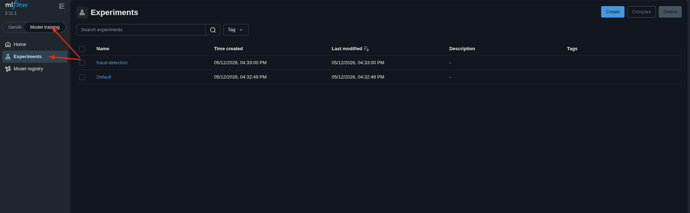
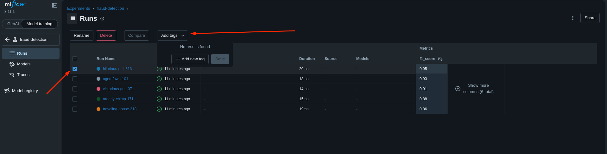
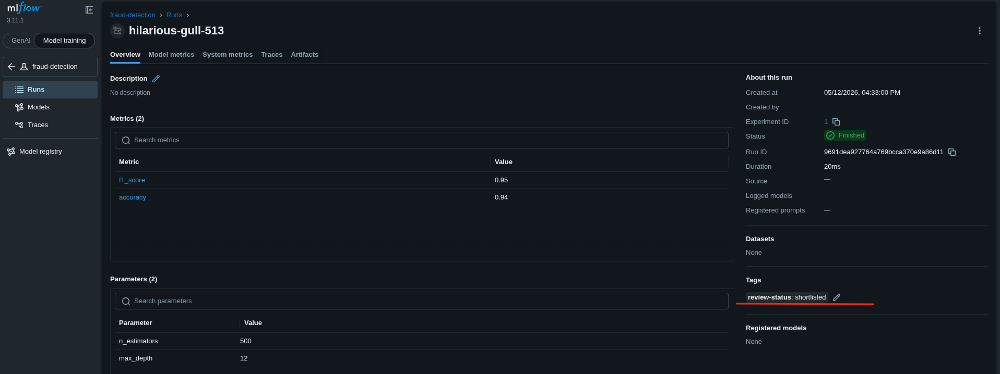
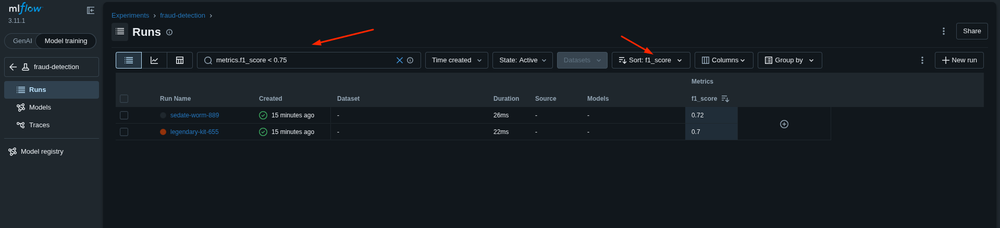
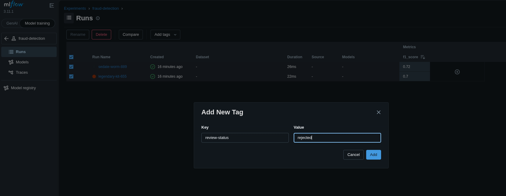

# Task: Search and Query MLflow Runs

A xFusionCorp Industries data scientist has accumulated ten runs in the fraud-detection MLflow experiment. Your task is to triage those runs via the MLflow UI: mark the single best-performing candidate as the shortlisted model, and flag every clearly under-performing run for removal.

1. The MLflow tracking server is already running on port `5000`, and the `fraud-detection` experiment has been pre-populated with ten runs. The runs can be viewed via the MLflow UI button → `fraud-detection` experiment.

1. Using the MLflow UI, complete the triage below. The end state is what is tested—the path taken through the UI is not.

  - Shortlist the best candidate. Among all runs where `metrics.f1_score > 0.85`, the single run with the highest `f1_score` must carry a run-level tag: key `review-status`, value `shortlisted`.

  - **Reject the under-performers**. Every run where `metrics.f1_score < 0.75` must carry a run-level tag: key `review-status`, value `rejected`.

3. The other runs (those in the 0.75 ≤ f1 ≤ 0.85 band, and the second-best shortlisting candidate) must carry no `review-status` tag at all.

---
# Solution

- Open the MLflow UI by clicking the button at the top right.

- The task is to triage all the experiments based on the `f1_score` metric. From the UI, select the **Model training** button and click the **Experiments** tab. This exposes all experiments. Two experiments are listed: `fraud-detection` and `Default`. We need to triage the `fraud-detection` experiment based on filters.

- Click on `fraud-detection` to open all the **Runs** for this experiment. At the top there is a query window. Use it to filter runs based on the first requirement: `metrics.f1_score > 0.85`, and sort by the highest `f1_score`.

- Once we identify the run with the highest `f1_score`, tag it with `review-status: shortlisted`.

- Repeat the process, but this time filter based on `metrics.f1_score < 0.75`, and tag all qualifying runs with `review-status: rejected`.

Verify that the tags are correctly added, and hit **Check**.

