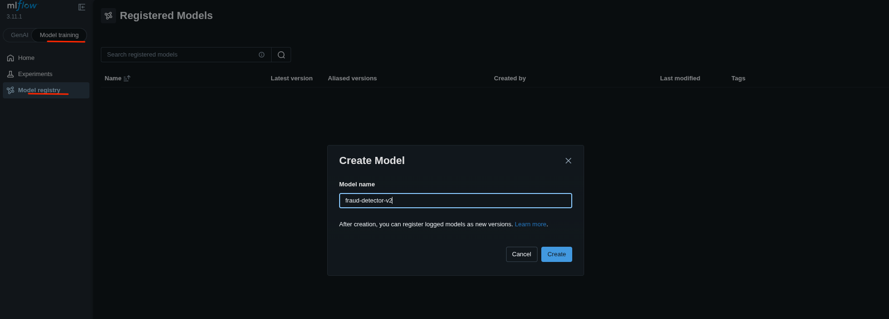
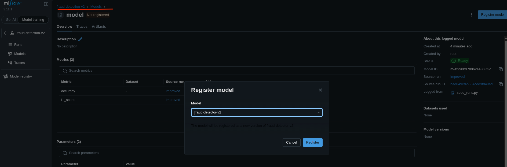
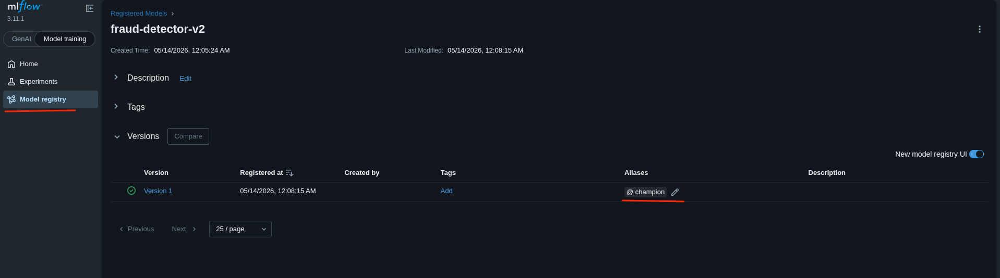
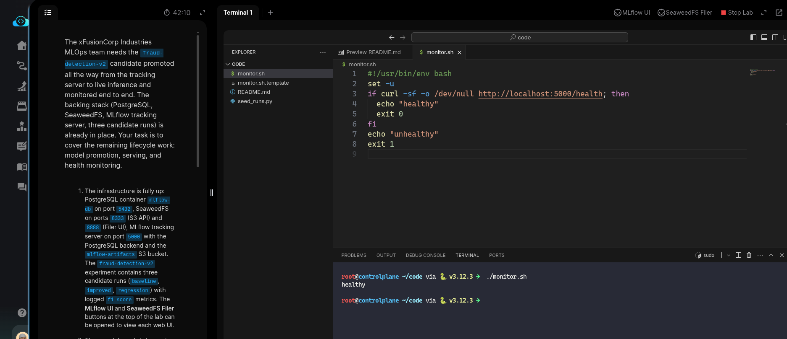

# Task: End-to-End MLflow Lifecycle: Train, Register, Serve, Monitor

The xFusionCorp Industries MLOps team needs the `fraud-detection-v2` candidate promoted all the way from the tracking server to live inference and monitored end to end. The backing stack (PostgreSQL, SeaweedFS, MLflow tracking server, three candidate runs) is already in place. Your task is to cover the remaining lifecycle work: model promotion, serving, and health monitoring.


1. The infrastructure is fully up: PostgreSQL container `mlflow-db` on port `5432`, SeaweedFS on ports `8333` (S3 API) and `8888` (Filer UI), MLflow tracking server on port `5000` with the `PostgreSQL` backend and the `mlflow-artifacts` S3 bucket. The `fraud-detection-v2` experiment contains three candidate runs (`baseline`, `improved`, `regression`) with logged `f1_score` metrics. The MLflow UI and SeaweedFS Filer buttons at the top of the lab can be opened to view each web UI.

2. The complete end state requires the following.

  - A registered model named `fraud-detector-v2` exists in the **MLflow** Model Registry.
  - A `champion` alias on that model points at the version sourced from the `fraud-detection-v2` run with the **highest** `f1_score`.
  - An `mlflow models serve` process listens on port `5001` serving the `champion` version (`--env-manager=local` is the supported choice for the lab). The three AWS env vars (`AWS_ACCESS_KEY_ID`, `AWS_SECRET_ACCESS_KEY`, `MLFLOW_S3_ENDPOINT_URL`) must be exported in the serving shell so the model artefact can be loaded from SeaweedFS.
The served endpoint returns 200 on GET /health.
  - A shell script at `/root/code/monitor.sh` exists, is executable, probes the served morundel's `/health` endpoint once, and exits with status 0 when the endpoint is healthy.

3. The top run can be identified either through the MLflow UI Compare view or with a one-off `MlflowClient.search_runs()` call—whichever is preferable. The registration and alias assignment are likewise available from the UI (Models tab) or the SDK.

> `mlflow models serve` is long-running; start it in the background, and ensure that the new process is listening on port 5001 before writing the monitoring script.

---

# Solution:

- The environment is already set up with the backing stack (PostgreSQL, SeaweedFS, MLflow tracking server, three candidate runs). The task is to cover the remaining lifecycle work: model promotion, serving, and health monitoring.

- The requirements are to register a model named `fraud-detector-v2` in the MLflow Model Registry. Navigate to the MLflow UI. Under the *Model training* tab, select *Model registry* and click the **Create model** button:

Create a model named `fraud-detector-v2` (**not** `fraud-detection-v2`):







- The next task is to add a `champion` alias to the model version sourced from the `fraud-detection-v2` run with the **highest f1_score**. Navigate back to the MLflow UI and select the training runs for the `fraud-detection-v2` experiment, then sort by `f1_score`.




- Now return to the lab terminal and create `./monitor.sh` from the template script `./monitor.sh.template`, then make it executable:

```
cp ./monitor.sh.template ./monitor.sh

chmod +rx ./monitor.sh
```

- Verify `./monitor.sh`. According to the requirements, we need to export `AWS_ACCESS_KEY_ID`, `AWS_SECRET_ACCESS_KEY`, and `MLFLOW_S3_ENDPOINT_URL` environment variables and use `mlflow models serve` to load the model from the MLflow server.
Update `monitor.sh` accordingly:

Check `mlflow models serve --help` for available flags and arguments:

```
#!/usr/bin/env bash
set -u
export AWS_ACCESS_KEY_ID=weedadmin
export AWS_SECRET_ACCESS_KEY=weedadmin123
export MLFLOW_S3_ENDPOINT_URL=http://localhost:8333

mlflow models serve \
  -m "models:/fraud-detector-v2@champion" \
  -p 5001 \
  --env-manager=local

if curl -sf -o /dev/null http://localhost:5001/health; then
  echo "healthy"
  exit 0
fi
echo "unhealthy"
exit 1
```

- Once we run `./monitor.sh`, we should see `healthy`:




