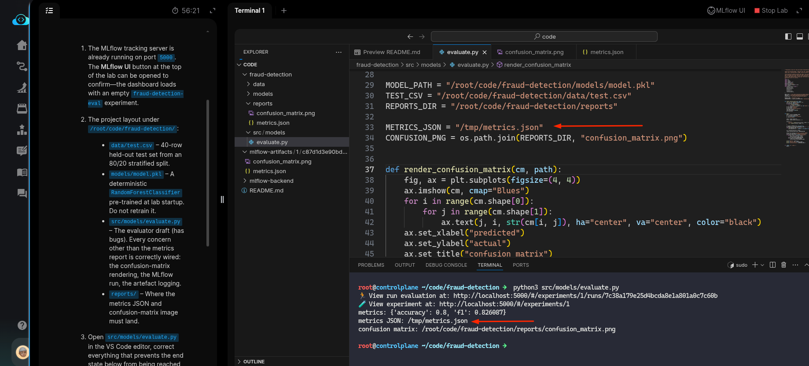
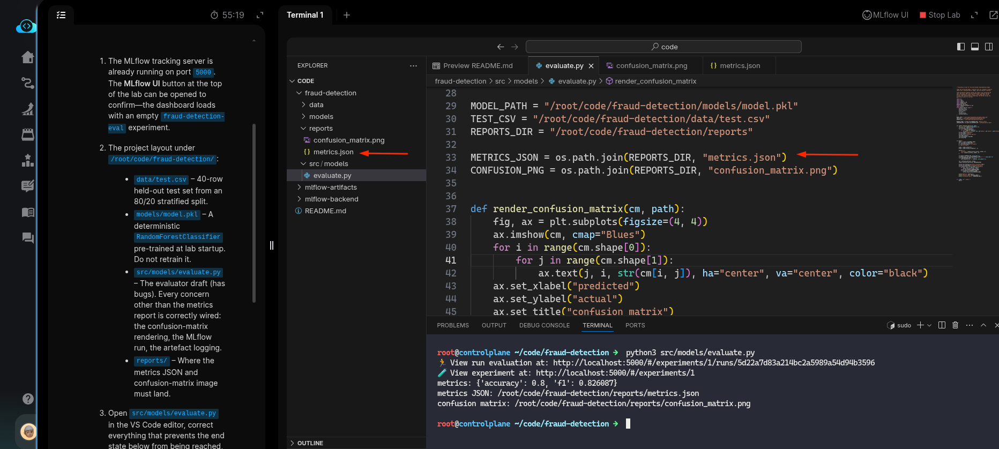
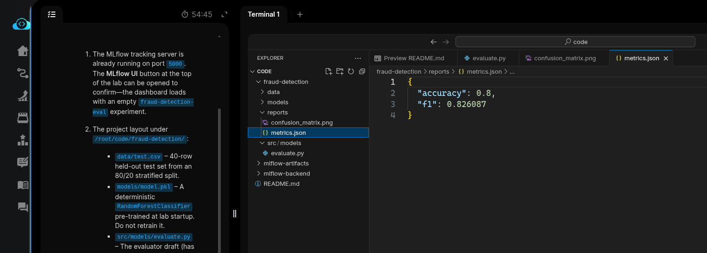
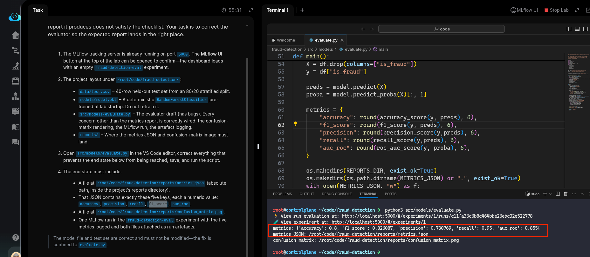
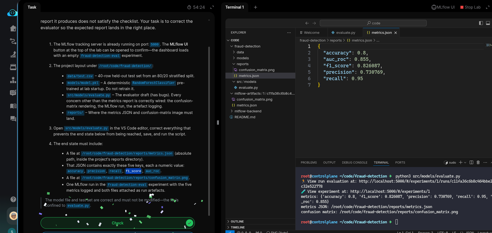

# Task: Evaluate a Trained Model and Generate Classification Report

The xFusionCorp Industries ML platform team's release checklist requires a five-metric evaluation report for every candidate model, plus a confusion-matrix image, published to the project's `reports/` directory. A draft `evaluate.py` exists for the pre-trained fraud-detection model, but the report it produces does not satisfy the checklist. Your task is to correct the evaluator so the expected report lands in the right place.

1. The MLflow tracking server is already running on port `5000`. The MLflow UI button at the top of the lab can be opened to confirm—the dashboard loads with an empty `fraud-detection-eval` experiment.

2. The project layout under `/root/code/fraud-detection/`:

  - `data/test.csv` – 40-row held-out test set from an 80/20 stratified split.
  - `models/model.pkl` – A deterministic `RandomForestClassifier` pre-trained at lab startup. Do not retrain it.
  - `src/models/evaluate.py` – The evaluator draft (has bugs). Every concern other than the metrics report is correctly wired: the confusion-matrix rendering, the MLflow run, the artefact logging.
  - `reports/` – Where the metrics JSON and confusion-matrix image must land.

3. Open `src/models/evaluate.py` in the VS Code editor, correct everything that prevents the end state below from being reached, save, and run the script.

4. The end state must include:

  - A file at `/root/code/fraud-detection/reports/metrics.json` (absolute path, inside the project's reports directory).
  - That JSON contains exactly these five keys, each a numeric value: `accuracy`, `precision`, `recall`, `f1_score`, `auc_roc`.
  - A file at `/root/code/fraud-detection/reports/confusion_matrix.png`.
  - One MLflow run in the `fraud-detection-eval` experiment with the five metrics logged and both files attached as run artefacts.

> The model file and test set are correct and must not be modified—the fix is confined to evaluate.py.

---

# Solution

- The tasks states, *`src/models/evaluate.py` has bugs*. We `cd` into the `raud-detection` directory
  and inspect the `evaluate.py` and run it once to see what it shows.

- We can see that the logs are not written to the desired `./reports` directory, and instead
written to `/tmp/metrics.json`.

- We update the `metrics.json` path in the script and re-run it once to verify that metrics are
written to the desired path. and verify the `./reports/metrics.json` file to see if all metrics are
populated.

- We can see that only two of five metrics are pipulated and one of them `f1` is wrong and the
desired name is `f1 score`. Looking at the script, we see that only two metrics are defined and
other three needs to be defined. We update the `metrics` block by defining other three metrics as
follows, and re run the script after update.

Desired metric names: `accuracy`, `precision`, `recall`, `f1_score`, `auc_roc`.

- Now, all the metrics are populated in the `./reportes/metrics.json` with correct name and values.
  Once verified, hit **Check**

**Note**: You can referto the [`sklearn_metrics` official Python API docs](https://scikit-learn.org/stable/api/sklearn.metrics.html) for info on defining
metrics.

