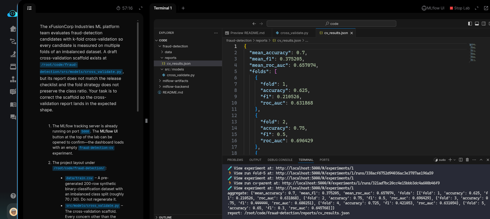
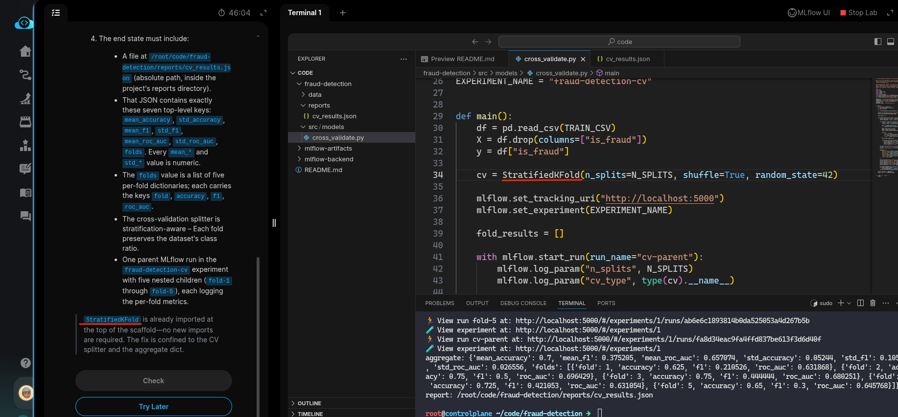
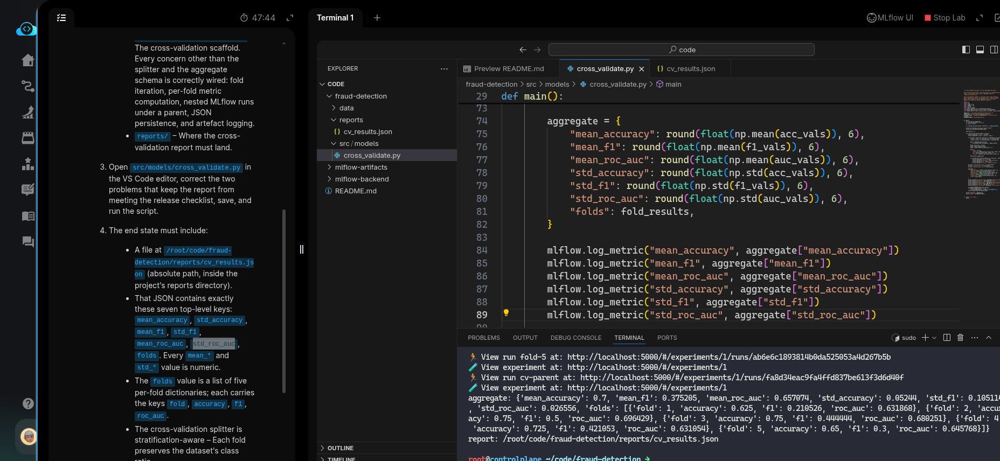
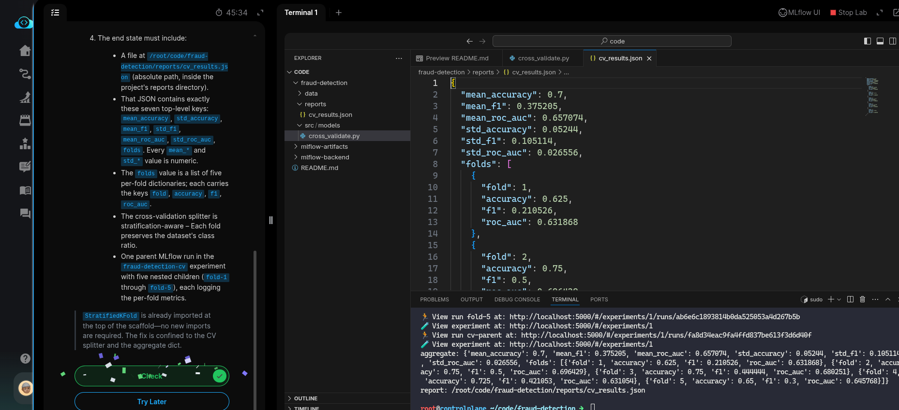

# Task: Implement Cross-Validation for Model Selection

The xFusionCorp Industries ML platform team evaluates fraud-detection candidates with k-fold cross-validation so every candidate is measured on multiple folds of an imbalanced dataset. A draft cross-validation scaffold exists at `/root/code/fraud-detection/src/models/cross_validate.py`, but its report does not match the release checklist and the fold strategy does not preserve the class ratio. Your task is to correct the scaffold so the cross-validation report lands in the expected shape.

1. The MLflow tracking server is already running on port `5000`. The MLflow UI button at the top of the lab can be opened to confirm—the dashboard loads with an empty `fraud-detection-cv` experiment.

2. The project layout under `/root/code/fraud-detection/`:

  - `data/train.csv` – A pre-generated 200-row synthetic binary-classification dataset with an imbalanced class split (roughly 70 / 30). Do not regenerate it.
  - `src/models/cross_validate.py` – The cross-validation scaffold. Every concern other than the splitter and the aggregate schema is correctly wired: fold iteration, per-fold metric computation, nested MLflow runs under a parent, JSON persistence, and artefact logging.
`reports/` – Where the cross-validation report must land.

3. Open `src/models/cross_validate.py` in the VS Code editor, correct the two problems that keep the report from meeting the release checklist, save, and run the script.

4. The end state must include:

  - A file at `/root/code/fraud-detection/reports/cv_results.json` (absolute path, inside the project's reports directory).
  - That JSON contains exactly these seven top-level keys: `mean_accuracy`, `std_accuracy`, `mean_f1`, `std_f1`, `mean_roc_auc`, `std_roc_auc`, `folds`. Every `mean_*` and `std_*` value is numeric.
  - The folds value is a list of five per-fold dictionaries; each carries the keys fold`, `accuracy`, `f1`, `roc_auc`.
  - The cross-validation splitter is stratification-aware – Each fold preserves the dataset's class ratio.
  - One parent MLflow run in the `fraud-detection-cv` experiment with five nested children (`fold-1` through `fold-5`), each logging the per-fold metrics.

> `StratifiedKFold` is already imported at the top of the scaffold—no new imports are required. The fix is confined to the CV splitter and the aggregate dict.

---
# Solution:

- This task to properly configure [*k-fold cross-validation*](https://www.datacamp.com/tutorial/k-fold-cross-validation) for the models. It clearly states *Every
concern other than the splitter and the aggregate schema is correctly wired* in the
`src/models.cross_validate.py` script.

- `cd` into the `fraud-detection` directory and inspect `./src/models/cross_validate.py`, and run it
  once to see the behavior.

- The ask is to see all the metrics for `mean_accuracy`, `std_accuracy`, `mean_f1`, `std_f1`, `mean_roc_auc`, `std_roc_auc`, `folds` are captured in `./reports/cv_results.json`
But, whn we run the `cross_validate.py` we can see that only `mean_*` values are populated and
`std_*` are not.

- When we look from line 74 in the script, we can see that only `mean_*` are defined. We use
`np.std()`, a function provided by `numpy` library to calculate the mean for all the scores.

The task also signals about the `StratifiedKFlod` Class from `scikit-learn` for splitting the
dataset and also suggests the fix is confined to CV Splitter and `aggregate` dict. 

- We use the `StraiifiedKFlod()` instead of existing `KFlod()` Class to split the dataset.

And update the `aggregate` dict and re-run the `./src/models/cross_validate.py`:

- We can confirm if all the metrics were properly populated in `./reports/cv_results.json` and hit
**Check**.

