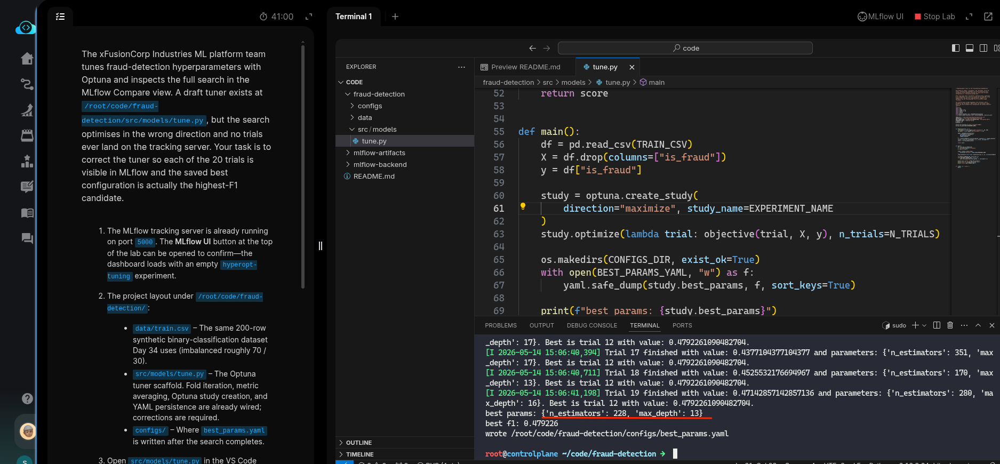
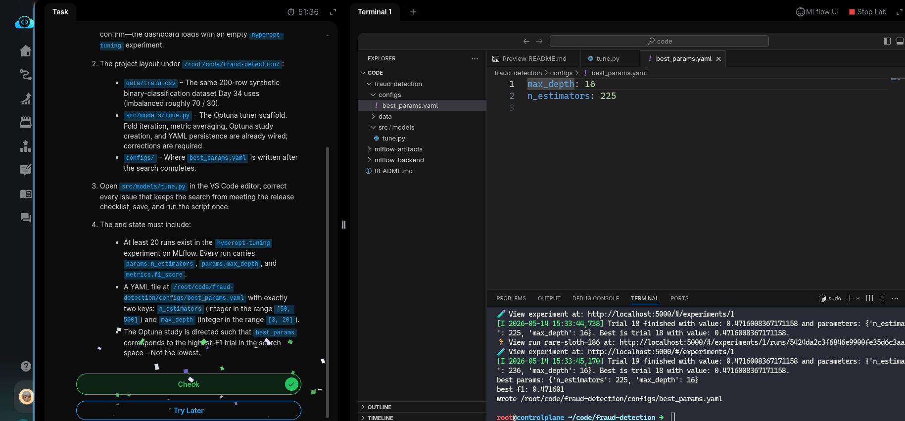

#Task: Hyperparameter Tuning with Optuna

The xFusionCorp Industries ML platform team tunes fraud-detection hyperparameters with Optuna and inspects the full search in the MLflow Compare view. A draft tuner exists at `/root/code/fraud-detection/src/models/tune.py`, but the search optimises in the wrong direction and no trials ever land on the tracking server. Your task is to correct the tuner so each of the 20 trials is visible in MLflow and the saved best configuration is actually the *highest-F1* candidate.

1. The MLflow tracking server is already running on port `5000`. The MLflow UI button at the top of the lab can be opened to confirm—the dashboard loads with an empty `hyperopt-tuning` experiment.

2. The project layout under `/root/code/fraud-detection`:

  - `data/train.csv` – The same 200-row synthetic binary-classification dataset Day 34 uses (imbalanced roughly 70 / 30).
  - `src/models/tune.py` – The Optuna tuner scaffold. Fold iteration, metric averaging, Optuna study creation, and YAML persistence are already wired; corrections are required.
  - `configs/` – Where `best_params.yaml` is written after the search completes.

3. Open `src/models/tune.py` in the VS Code editor, correct every issue that keeps the search from meeting the release checklist, save, and run the script once.

4. The end state must include:

  - At least 20 runs exist in the `hyperopt-tuning` experiment on MLflow. Every run carries `params.n_estimators`, `params.max_depth`, and `metrics.f1_score`.
  - A YAML file at `/root/code/fraud-detection/configs/best_params.yaml` with exactly two keys: `n_estimators` (integer in the range [50, 500]) and `max_depth` (integer in the range [3, 20]).

> The Optuna study is directed such that best_params corresponds to the highest-F1 trial in the search space – Not the lowest.

---

# Solution:

- The task has two requirements *search optimises in the wrong direction and no trials ever land on the tracking server*.

- We cd into the `fraud-detection` directory and navaigate to the `./src/models/tune.py` in VSCode. Upon inspection we can find that the `optuma.create_study()` uses *minimize* as direction, which is contrary to the our requirement. We update this value to *maximize* which is another parameter available which helps produce the highest possible objective value (e.g.,increasing accuracy or F1-score).

- Next we check  the MLFlow UI if the experiment `hyperopt-tuning` is pushed will 20 runs. But, we see no runs being pushed to MLFlow server. When we inspect the `tune.py` we coudl see that the the MLFlow Tracking URL is set but there no code to push the runs to server. We add the code to push and re run the `./tune.py` and see if the runs were pushed to Server in the UI.

- Verify that `./configs/best_prams.yaml` is written and hit **Check**.

