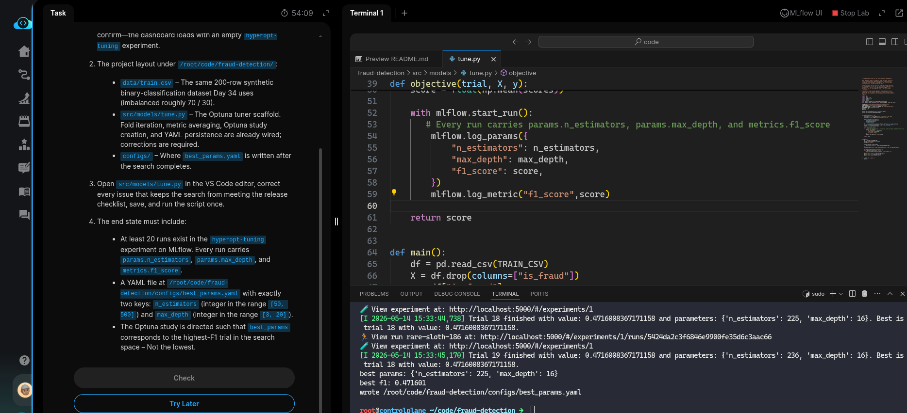
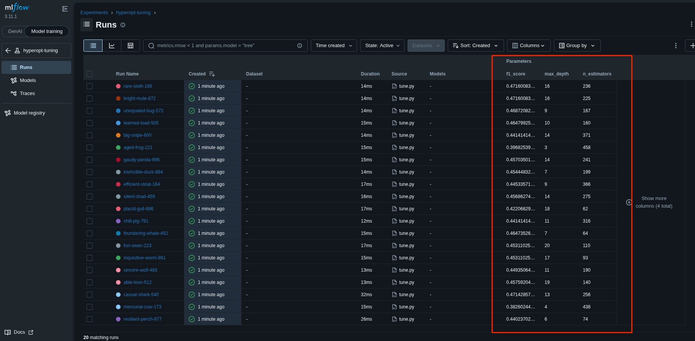

#Task: Hyperparameter Tuning with Optuna

The xFusionCorp Industries ML platform team tunes fraud-detection hyperparameters with Optuna and inspects the full search in the MLflow Compare view. A draft tuner exists at `/root/code/fraud-detection/src/models/tune.py`, but the search optimises in the wrong direction and no trials ever land on the tracking server. Your task is to correct the tuner so each of the 20 trials is visible in MLflow and the saved best configuration is actually the *highest-F1* candidate.

1. The MLflow tracking server is already running on port `5000`. The MLflow UI button at the top of the lab can be opened to confirm—the dashboard loads with an empty `hyperopt-tuning` experiment.

2. The project layout under `/root/code/fraud-detection`:

  - `data/train.csv` – The same 200-row synthetic binary-classification dataset Day 34 uses (imbalanced roughly 70 / 30).
  - `src/models/tune.py` – The Optuna tuner scaffold. Fold iteration, metric averaging, Optuna study creation, and YAML persistence are already wired; corrections are required.
  - `configs/` – Where `best_params.yaml` is written after the search completes.

3. Open `src/models/tune.py` in the VS Code editor, correct every issue that keeps the search from meeting the release checklist, save, and run the script once.

4. The end state must include:

  - At least 20 runs exist in the `hyperopt-tuning` experiment on MLflow. Every run carries `params.n_estimators`, `params.max_depth`, and `metrics.f1_score`.
  - A YAML file at `/root/code/fraud-detection/configs/best_params.yaml` with exactly two keys: `n_estimators` (integer in the range [50, 500]) and `max_depth` (integer in the range [3, 20]).

> The Optuna study is directed such that best_params corresponds to the highest-F1 trial in the search space – Not the lowest.

---

# Solution:

- The task has two issues: the search optimises in the wrong direction, and no trials land on the tracking server.

- Change into the `fraud-detection` directory and open `./src/models/tune.py` in VSCode. The `optuna.create_study()` uses `direction="minimize"`, which is contrary to our requirement. Update this to `direction="maximize"` so that the study searches for the highest possible objective value (e.g., maximising F1-score).

- Next, check the MLflow UI to verify the `hyperopt-tuning` experiment has 20 runs. However, no runs appear. When we inspect `tune.py`, the MLflow tracking URI is set but there is no code to log trials to the server. Add code to log each trial run, then re-run `./tune.py` and verify the runs appear in the UI.

- Verify that `./configs/best_params.yaml` is written correctly and hit **Check**.

