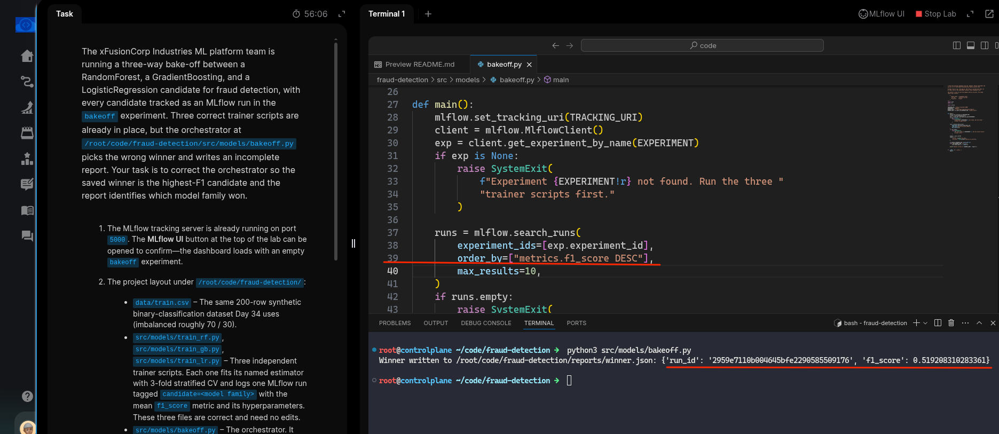
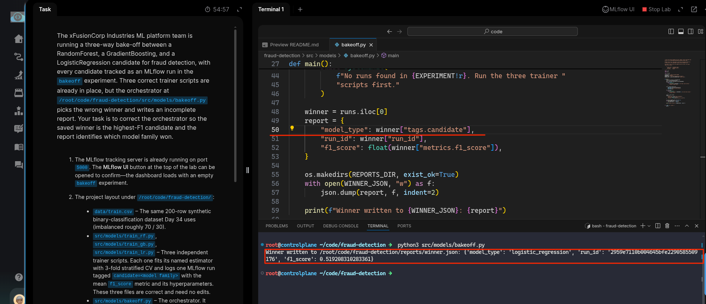
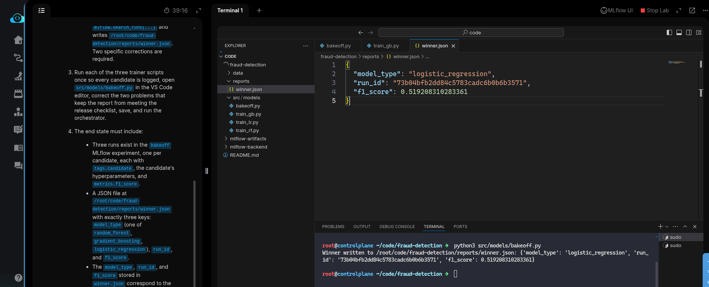
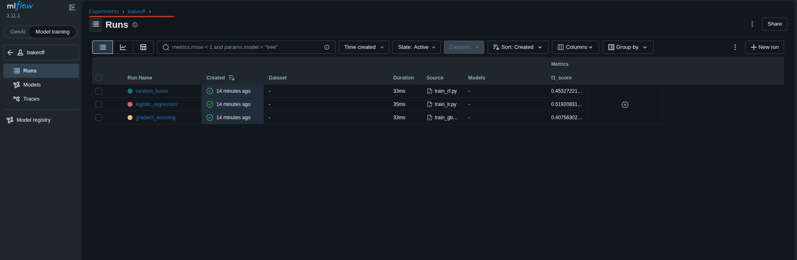

# Task: Automated Model Selection with FLAML AutoML

The xFusionCorp Industries ML platform team is running a three-way bake-off between a RandomForest, a GradientBoosting, and a LogisticRegression candidate for fraud detection, with every candidate tracked as an MLflow run in the `bakeoff` experiment. Three correct trainer scripts are already in place, but the orchestrator at `/root/code/fraud-detection/src/models/bakeoff.py` picks the wrong winner and writes an incomplete report. Your task is to correct the orchestrator so the saved winner is the `highest-F1` candidate and the report identifies which model family won.


1. The MLflow tracking server is already running on port `5000`. The MLflow UI button at the top of the lab can be opened to confirm—the dashboard loads with an empty bakeoff experiment.

2. The project layout under `/root/code/fraud-detection/`:

  - `data/train.csv` – The same 200-row synthetic binary-classification dataset Day 34 uses (imbalanced roughly 70 / 30).
  - `src/models/train_rf.py`, `src/models/train_gb.py`, `src/models/train_lr.py` – Three independent trainer scripts. Each one fits its named estimator with 3-fold stratified CV and logs one MLflow run tagged `candidate=<model family>` with the mean `f1_score` metric and its hyperparameters. These three files are correct and need no edits.
  - `src/models/bakeoff.py` – The orchestrator. It queries the bakeoff experiment with `mlflow.search_runs(...)` and writes `/root/code/fraud-detection/reports/winner.json`. Two specific corrections are required.


3. Run each of the three trainer scripts once so every candidate is logged, open `src/models/bakeoff.py` in the VS Code editor, correct the two problems that keep the report from meeting the release checklist, save, and run the orchestrator.

4. The end state must include:

  - Three runs exist in the `bakeoff` MLflow experiment, one per candidate, each with `tags.candidate`, the candidate's hyperparameters, and `metrics.f1_score`.
  - A JSON file at `/root/code/fraud-detection/reports/winner.json` with exactly three keys: `model_type` (one of `random_forest, `gradient_boosting`, `logistic_regression`), `run_id`, and `f1_score`.
  - The `model_type`, `run_id`, and `f1_score` stored in `winner.json` correspond to the candidate with the highest `f1_score` in the `bakeoff` experiment.


> The MLflow Compare view—select all three runs in the experiment's run list and click Compare—is the fastest way to eyeball which candidate won and spot-check the report.

--- 
# Solution:

- The task requires fixing the orchestrator `bakeoff.py` which picks the wrong winner. We need to ensure `winner.json` corresponds to the candidate with the highest `f1_score`, and also fix the incomplete report generation.

- Change into the `fraud-detection` directory and navigate to `./src/models/bakeoff.py`.
When examining `bakeoff.py`, we observe that the runs are sorted by `ASC`, which orders runs with the oldest first. To get the highest `f1_score` first, update line 39 to use `DESC` in `mlflow.search_runs().order_by`:




- Next, run all three trainer scripts (`src/models/train_gb.py`, `src/models/train_lr.py`, and `src/models/train_rf.py`) first, then run `src/models/bakeoff.py` to verify that `./reports/winner.json` is populated with the required metrics.

```
python3 src/model/train_gb.py

python3 train_lr.py

python3 train_rf.py

# Finally run the backoff script

python3 src/models/backoff.py
```


After running the scripts, we notice that the `./reports/winner.json` only captures `run_id`, and
`f1_score`. Where it need to captoure `model_type` as well,which is missing.

- We need to update `bakeoff.py` to include `model_type` in the report. This can be done where other metrics are defined, around line 49 in the `report` dictionary.

The task mentions that all trainer scripts tag the model with `candidate=<model family>`. Examining the trainer scripts, line 39 sets `mlflow.set_tag("candidate", CANDIDATE)`. We read this tag in `bakeoff.py` around line 49.



- After updating the tag logic, re-run `bakeoff.py` and verify that `./reports/winner.json` is properly written with all required keys.



- Also ensure that the MLflow server has three runs in the `bakeoff` experiment, one per candidate, each with `tags.candidate`, the candidate's hyperparameters, and `metrics.f1_score`.




Confirm, and hit **Check**

