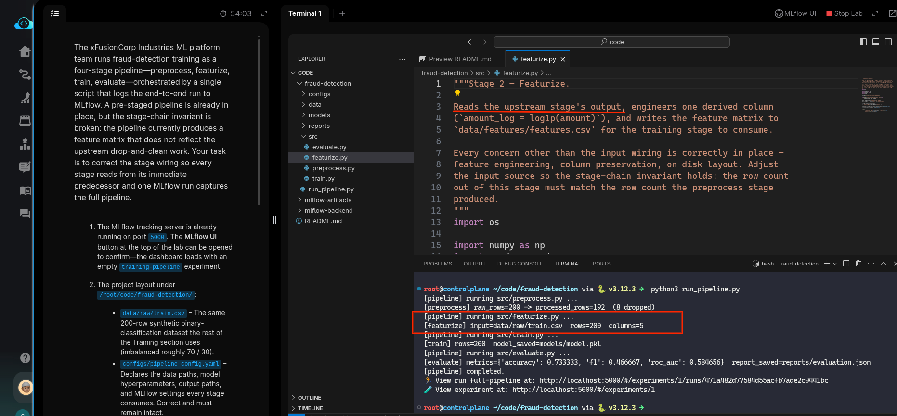
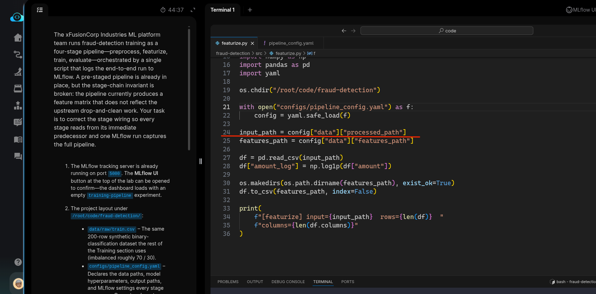
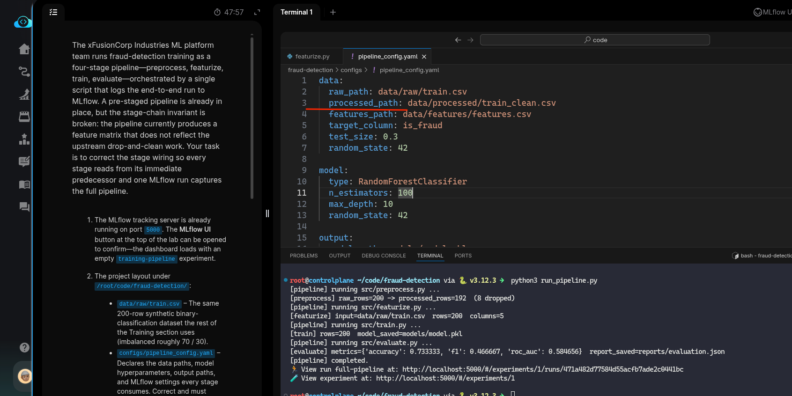
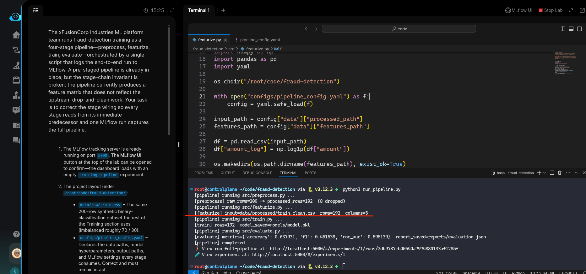

# Task: Distributed Model Training with Joblib Parallelization

The xFusionCorp Industries ML platform team runs fraud-detection training as a four-stage pipeline—preprocess, `featurize`, `train`, `evaluate—orchestrated` by a single script that logs the end-to-end run to MLflow. A pre-staged pipeline is already in place, but the stage-chain invariant is broken: the pipeline currently produces a feature matrix that does not reflect the upstream drop-and-clean work. Your task is to correct the stage wiring so every stage reads from its immediate predecessor and one MLflow run captures the full pipeline.

1. The MLflow tracking server is already running on port `5000`. The MLflow UI button at the top of the lab can be opened to confirm—the dashboard loads with an empty `training-pipeline` experiment.

2. The project layout under `/root/code/fraud-detection/`:

  -` data/raw/train.csv` – The same 200-row synthetic binary-classification dataset the rest of the Training section uses (imbalanced roughly 70 / 30).
  - `configs/pipeline_config.yaml` – Declares the data paths, model hyperparameters, output paths, and MLflow settings every stage consumes. Correct and must remain intact.
  - `src/preprocess.py,` `src/featurize.py,` `src/train.py,` `src/evaluate.py` – The four pipeline stages. `preprocess.py` drops negligible-amount rows (amount < 50) and duplicates before writing the processed CSV. The four stages are wired through the config's data: paths.
  - `run_pipeline.py` – The orchestrator that executes the four stages in order and logs one MLflow run with the config-driven parameters and the final evaluation metrics. Correct and requires no edits.

3. Identify the stage whose input path breaks the chain, correct the wiring in the VS Code editor, save, and run `python3 run_pipeline.py` once from the project root.

4. The end state must include:

  - The row count of `data/features/features.csv` equals the row count of `data/processed/train_clean.csv` and is strictly less than the 200-row raw CSV.
  - `models/model.pkl` and `reports/evaluation.json` are written and the report carries `accuracy,` `f1,` and `roc_auc` as numeric values.
  - Exactly one MLflow run exists in the `training-pipeline` experiment, carrying `params.model_type,` `params.n_estimators,` `params.max_depth,` and the three evaluation metrics.

---

# Solution:

- We look at all the training scripts and see how there are wired in the `run_ippeline.py`. We can observer the stages from the docstrings in each
trainer script:
    - Stage-1: `src/preprocess.py`
    - Stage-2: `src/featurize.py`
    - Stage-3: `src/train.py`
    - Stage-4: `src/evaluate.py`
Each stage uses the output from the previous stage.

- The tasks asks to run the `run_pipeline.py` and see whats broken in stage chain. `cd` into the `fraud-detection` and run the pipeline and observer
the result.
We can notice that the featurize stage show *rows=200  columns=5*. Whereas,it shoukd read the input from preprocess stage, which outputs a csv with
192 rows.

- We investigate the `src/featurize.py`, and can see that the `input_path` variable on line *24* reads from `raw_path` field from the `configs/pipeline_config.yaml`. We fix it with read it from `prosessed_path`.

- Now we re-run the `run_pipeline.py` and see the output. verify if the `model.pkl` and `reports/evaluation.json` is written to the correct path.

- Verify that the MLOps server has one experiment with three runs in the MLFlow UI and hit **cCheck**.
