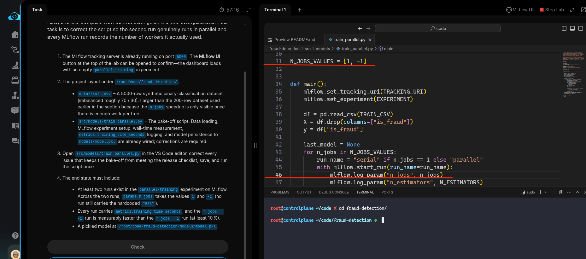
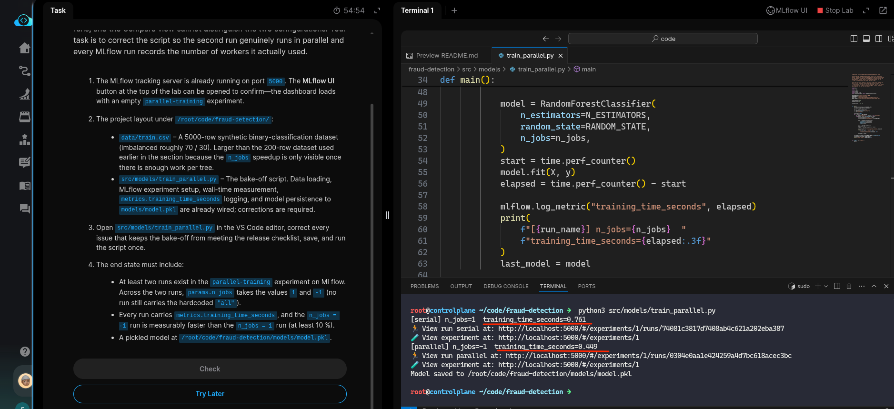

# Task: Build Modular Training Pipeline with Config-Driven Stages

The xFusionCorp Industries ML platform team runs a parallel-training bake-off on the fraud-detection model—the same estimators is trained twice, once on a single worker and once across every available CPU, and the MLflow Compare view surfaces the wall-time gap. A draft script exists at `/root/code/fraud-detection/src/models/train_parallel.py` but running it currently produces near-identical wall times for the 'serial' and 'parallel' runs, and the Compare view cannot distinguish the two configurations. Your task is to correct the script so the second run genuinely runs in parallel and every MLflow run records the number of workers it actually used.

2. The MLflow tracking server is already running on port `5000` . The MLflow UI button at the top of the lab can be opened to confirm—the dashboard loads with an empty parallel-training experiment.

3. The project layout under `/root/code/fraud-detection/`:

  - `data/train.csv` – A 5000-row synthetic binary-classification dataset (imbalanced roughly 70 / 30). Larger than the 200-row dataset used earlier in the section because the `n_jobs` speedup is only visible once there is enough work per tree.
  - `src/models/train_parallel.py` – The bake-off script. Data loading, MLflow experiment setup, wall-time measurement, `metrics.training_time_seconds` `logging`, and model persistence to `models/model.pkl` are already wired; corrections are required.
  - Open `src/models/train_parallel.py` in the VS Code editor, correct every issue that keeps the bake-off from meeting the release checklist, save, and run the script once.

4. The end state must include:

  - At least two runs exist in the `parallel-training` experiment on MLflow. Across the two runs, `params.n_jobs` takes the values `1` and -`1` (no run still carries the hardcoded "all").
  - Every run carries `metrics.training_time_seconds,` and the `n_jobs = -1` run is measurably faster than the `n_jobs = 1` run (at least 10 %).
A pickled model at `/root/code/fraud-detection/models/model.pkl.`

---

# Solution:

- The end-state says: *At least two runs exist in the `parallel-training` experiment on MLflow. Across the two runs, `params.n_jobs` takes the values `1` and -`1` (no run still carries the hardcoded "all"). And, the second ask is *Every run carries `metrics.training_time_seconds,` and the `n_jobs = -1` run is measurably faster than the `n_jobs = 1` run (at least 10 %).*

- We cd into the `fraud-detection` directory and open the `src/models/train_parallel.py` in VSCode and inspect it.

- We can see that the variable `N_JOBS_VALUES` is wrong. It needs to be `1` and `-1`. We fix that, and move to next ask. The task says *no run still
carries the hardcoded "all"*. Buut, on line *46* we see it uses "all". We update it with variable in the loop.

- We run th escript once and see how it behaves, and we can see that the run with `n_jobs` value of `-1` measures faster by more than 10%.
We can also see that the run logs the metrics `training_time_seconds` and `n_jobs` as desired.

- We can verify the same on MLFlow server UI, and hit **Check**.

