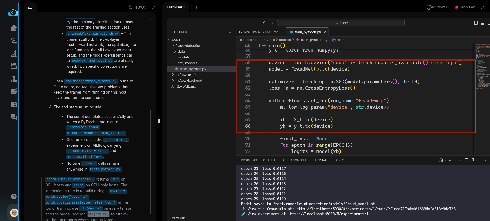
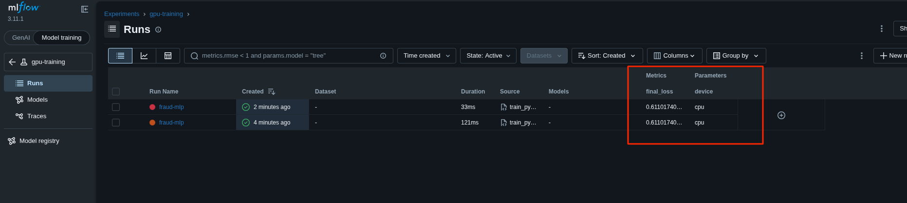

# Task: Train a PyTorch Model with GPU Support and Checkpointing

The xFusionCorp Industries ML platform team ships fraud-detection models built on a tiny PyTorch network. The training script needs to run on whichever accelerator the host exposes — CUDA GPUs in the production cluster, plain CPU on this lab's nodes — so the same code works on every target. A draft trainer exists at `/root/code/fraud-detection/src/models/train_pytorch.py`, but it assumes CUDA is always present and crashes on the first tensor move, and the device parameter it logs to MLflow is hardcoded. Your task is to make the trainer device-aware and ensure the MLflow run truthfully reports the device it actually used.

1. The MLflow tracking server is already running on port `5000`. The MLflow UI button at the top of the lab can be opened to confirm—the dashboard loads with an empty `gpu-training` experiment. PyTorch (CPU build) is baked into the lab image; `import torch` works out of the box. The host does not expose a GPU `(torch.cuda.is_available()` returns False).

2. The project layout under `/root/code/fraud-detection/`:

  - `data/train.csv` – The same 200-row synthetic binary-classification dataset the rest of the Training section uses.
  - `src/models/train_pytorch.py` – The trainer scaffold. The two-layer feedforward network, the optimiser, the loss function, the MLflow experiment setup, and the model-persistence call to `models/fraud_model.pt` are already wired; two specific corrections are required.
  - Open `src/models/train_pytorch.py` in the VS Code editor, correct the two problems that keep the trainer from running on this host, save, and run the script once.

3. The end state must include:

  - The script completes successfully and writes a PyTorch state-dict to `/root/code/fraud-detection/models/fraud_model.pt`.
  - One run exists in the gpu-training experiment on MLflow, carrying `params.device = "cpu"` and `metrics.final_loss`.
  - No bare `.cuda()` calls remain anywhere in `train_pytorch.py`.

> `torch.cuda.is_available()` returns True on GPU hosts and False on CPU-only hosts. The idiomatic pattern is to build a single `device = torch.device("cuda" if torch.cuda.is_available() else "cpu")` at the top of training, use `.to(device)` on every tensor and the model, and log `str(device)` to MLflow so the run reports where it actually ran.

---
# Solution

- The task is to fix two specific issues related to `.cuda()` calls. It specifically states: *No bare `.cuda()` calls remain anywhere in `train_pytorch.py`.*

- Change into the `fraud-detection` directory and inspect `src/models/train_pytorch.py` in VSCode. The docstrings state that *every non-device concern is correctly wired* and *the current wiring assumes a CUDA GPU is always present*. We need to make the script device-aware instead of using hardcoded `.cuda()` calls.

The task hints at using `torch.cuda.is_available()`. The idiomatic approach is `torch.device("cuda" if torch.cuda.is_available() else "cpu")`. This sets the device to GPU if available, otherwise falls back to CPU.

Update the code by removing all hardcoded references to `cuda` as the device and instead use a conditional device variable based on availability.

- Now run `src/models/train_pytorch.py` and check the logs in the MLflow server. Confirm that the experiment has one run and logs both `params.device` and `metrics.final_loss`.

Hit **Check**

