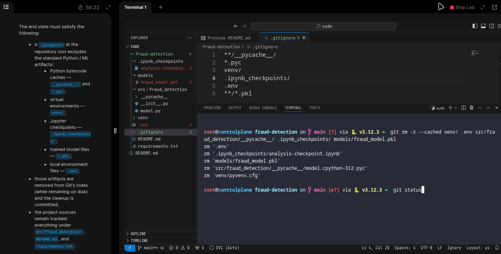
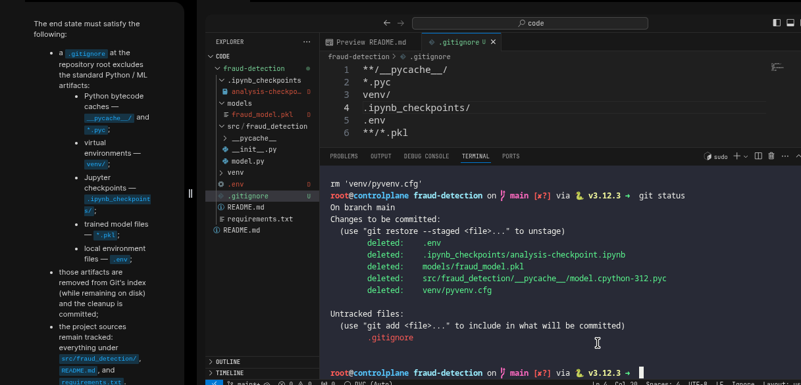
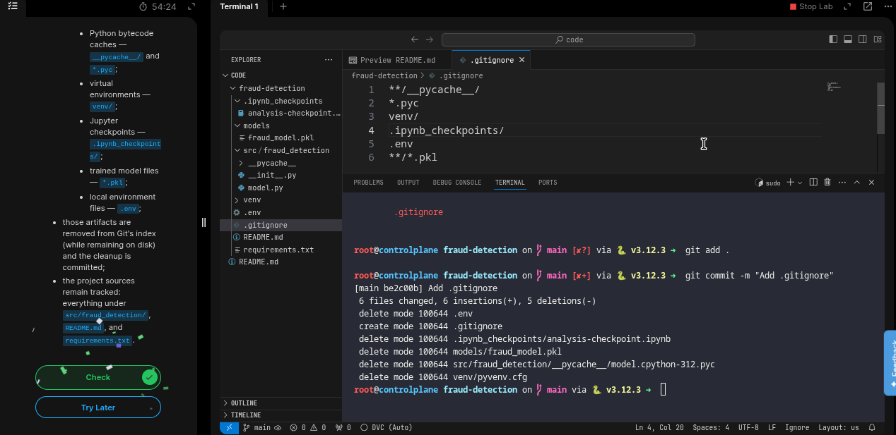

# Add a .gitignore and Untrack Committed Artifacts

## Task: 
The xFusionCorp Industries `fraud-detection` repository was committed without a `.gitignore` file. As a result, Python caches, a trained model file, a virtual environment, notebook checkpoints, and a local secrets file have all been included in version control. Your task is to create a .gitignore file and appropriately stop tracking the artifacts that should not be included in Git.

The Git repository is at `/root/code/fraud-detection/`. Standard Python / ML artifacts were committed before any .gitignore existed, so ignoring them is not enough — a `.gitignore` never untracks files Git already tracks.

The end state must satisfy the following:

- a `.gitignore` at the repository root excludes the standard Python / ML artifacts:
- Python bytecode caches — `__pycache__/` and `*.pyc`;
- virtual environments — `venv/`;
- Jupyter checkpoints — `.ipynb_checkpoints/`;
- trained model files — `*.pkl`;
- local environment files — `.env`;

those artifacts are removed from Git's index (while remaining on disk) and the cleanup is committed;
the project sources remain tracked: everything under `src/fraud_detection/` `README.md`, and `requirements.txt`.

---

# Solution:

- The task requires to create a new `.gitignore` file and add some paths  to it so Git does not track these files. But when we see  the current logs,
  we can see that all the files in the directory are already been tracked by Git. 
The next task is to remove the said paths and commit it and confirm,  that these files/paths are no more tracked.

- CD in to `fraud-detection` directory and create a `.gitignore` file, and the files/paths to the ignore file.

- Now, we need to remove the tracked files from the git tracking cache. We can use `git rm --cached` for a file, and `git rm -r --cached` for directory to recursively remove cached files.

- Stage and commit with appropriate message.

- Hit **Check**

