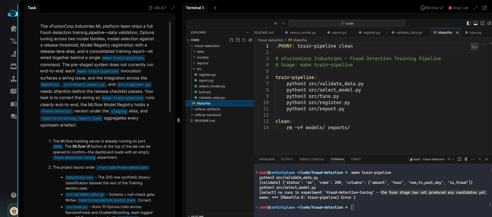
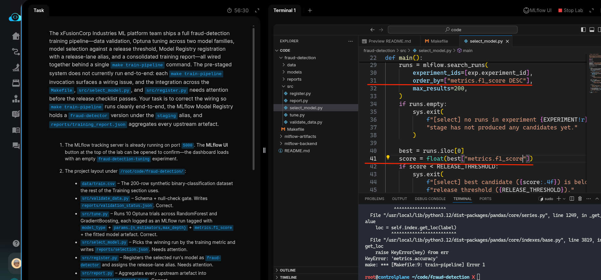
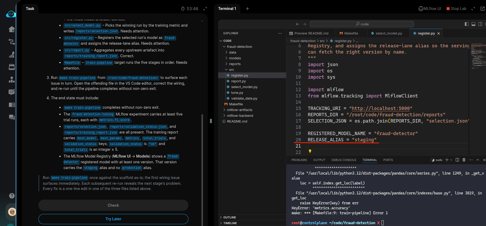
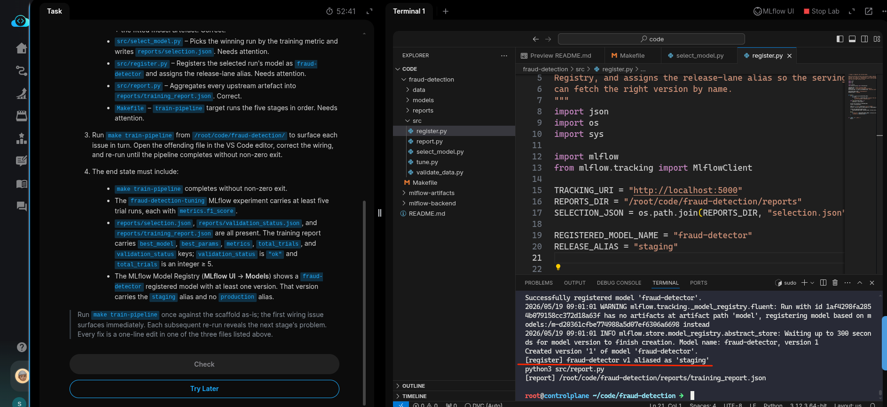
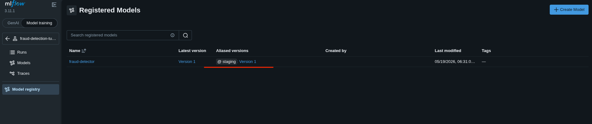
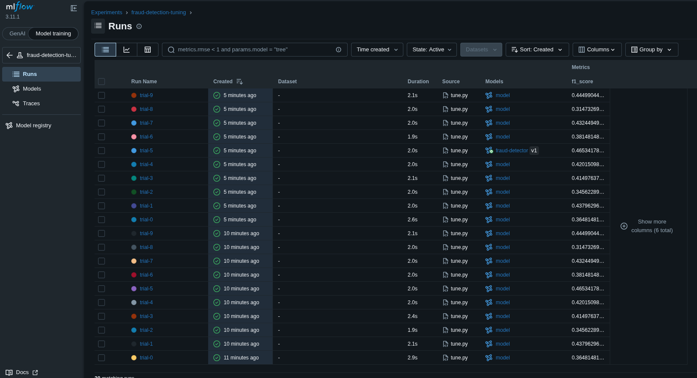

# Task: Production Training System: Tracking, Tuning, and Model Selection

The xFusionCorp Industries ML platform team ships a full fraud-detection training pipeline—data validation, Optuna tuning across two model families, model selection against a release threshold, Model Registry registration with a release-lane alias, and a consolidated training report—all wired together behind a single `make train-pipeline` command. The pre-staged system does not currently run end-to-end: each `make train-pipeline` invocation surfaces a wiring issue, and the integration across the `Makefile`, `src/select_model.py`, and `src/register.py` needs attention before the release checklist passes. Your task is to correct the wiring so `make train-pipeline` runs cleanly end-to-end, the MLflow Model Registry holds a fraud-detector version under the staging alias, and `reports/training_report.json` aggregates every upstream artefact.


1. The MLflow tracking server is already running on port `5000`. The MLflow UI button at the top of the lab can be opened to confirm—the dashboard loads with an empty `fraud-detection-tuning` experiment.

2. The project layout under `/root/code/fraud-detection/`:

  - `data/train.csv` – The 200-row synthetic binary-classification dataset the rest of the Training section uses.
  - `src/validate_data.py` – Schema + null-check gate. Writes reports/validation_status.json. Correct.
  - `src/tune.py` – Runs 10 Optuna trials across RandomForest and GradientBoosting, each logged as an MLflow run tagged with `model_type` + `params.{n_estimators,max_depth}` + `metrics.f1_score` + the fitted model artefact. Correct.
  - `src/select_model.py` – Picks the winning run by the training metric and writes `reports/selection.json.` Needs attention.
  - `src/register.py` – Registers the selected run's model as `fraud-detector` and assigns the release-lane alias. Needs attention.
  - `src/report.py` – Aggregates every upstream artefact into `reports/training_report.json.` Correct.
  - `Makefile` – `train-pipeline` target runs the five stages in order. Needs attention.

3. Run `make train-pipeline` from `/root/code/fraud-detection/` to surface each issue in turn. Open the offending file in the VS Code editor, correct the wiring, and re-run until the pipeline completes without non-zero exit.

4. The end state must include:

  - `make train-pipeline` completes without non-zero exit.
  - The `fraud-detection-tuning` MLflow experiment carries at least five trial runs, each with `metrics.f1_score.`
  - `reports/selection.json,` `reports/validation_status.json,` and `reports/training_report.json` are all present. The training report carries `best_model,` `best_params,` `metrics,` `total_trials,` and `validation_status` keys; `validation_status` is "ok" and `total_trials` is an integer ≥ 5.
  - The MLflow Model Registry (MLflow UI → Models) shows a `fraud-detector` registered model with at least one version. That version carries the `staging` alias and no `production` alias.


>  Run `make train-pipeline` once against the scaffold as-is; the first wiring issue surfaces immediately. Each subsequent re-run reveals the next stage's problem. Every fix is a one-line edit in one of the three files listed above.

---

# Solution:

- The task is to fix the pipeline that is run with `Makefile`. Its given that `src/select_model.py`, and `src/register.py` has some issues.
Run the `make train-pipeline` and observer the output:

```
root@controlplane ~/code/fraud-detection ➜  make train-pipeline
python3 src/validate_data.py
[validate] {'status': 'ok', 'rows': 200, 'columns': ['amount', 'hour', 'num_tx_past_day', 'is_fraud']}
python3 src/select_model.py
[select] no runs in experiment 'fraud-detection-tuning' — the tune stage has not produced any candidates yet.
make: *** [Makefile:8: train-pipeline] Error 1
```

We can see that there is some issue with log that says *the tune stage has not produced any candidates yet.* and returns with non-zero exit code.

- We check the `Makefile`, and see that the **Pipline** stages defined in each of the python sripts (refer the docstring in the python scripts) differes from the stages defined in
`train-pipeline` target in `Makefile`.
If you look at each of the python scripts in `src` we can make out that:
  - Stage-1: Data validation in `validate_data.py`
  - Stage-2: Optuna tuning across two model families with `tune.py`
  - Stage-3: Model selection with `select_model.py`
  - Stage-4: Register the selected model with `register.py`
  - Stage-5: Training report with `report/py`




- After align the `train-pipline` target in the `Makefile`, we re-run the command `make train-pipeline`.  The script runs, but this time it errors with
  `KeyError: 'metrics.accuracy'` in `select_model.py`. When we look at the `select_model.py`, we can see that it wrongly records `metrocs.accuracy`
instead of `metrics.f1_score`. We update the `select_mdoel.py` on line *31* and *41*.



- Now we have another as: The MLFlow server should have a `fraud-detector` registered model with at least one version. That version carries the `staging` alias and no `production` alias.
We update the *alias* in `register.py` for this and re-run the pipeline with `make train-pipeline`.





- We can verify the MLFlow server UI, if the correct model is registerd with required alias with at least five runs and logs `metrics.f1_score` and
hit **Check**






