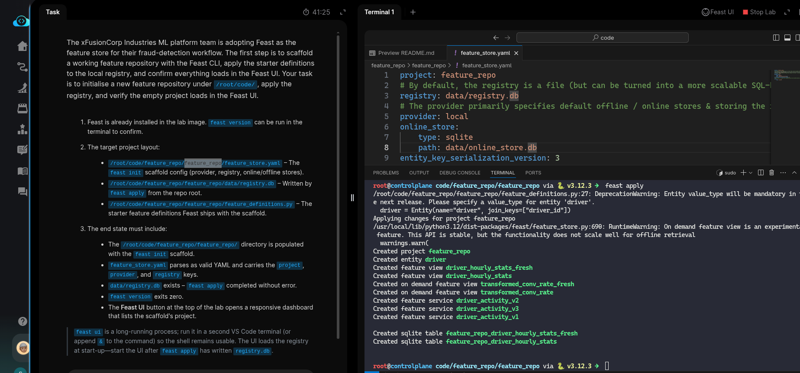
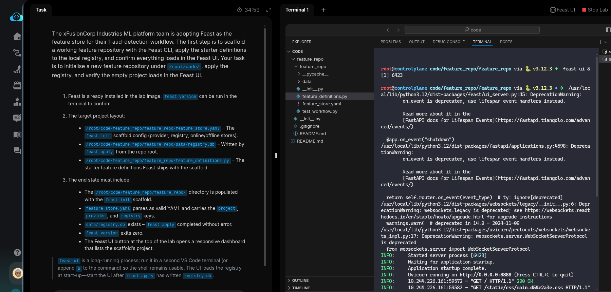

# Task:  Install and Initialize a Feast Feature Store

The xFusionCorp Industries ML platform team is adopting Feast as the feature store for their `fraud-detection` workflow. The first step is to scaffold a working feature repository with the Feast CLI, apply the starter definitions to the local registry, and confirm everything loads in the Feast UI. Your task is to initialise a new feature repository under `/root/code/`, apply the registry, and verify the empty project loads in the Feast UI.

1. Feast is already installed in the lab image. `feast version` can be run in the terminal to confirm.

2. The target project layout:

  - `/root/code/feature_repo/feature_repo/feature_store.yaml` – The feast init scaffold config (provider, registry, online/offline stores).
  - `/root/code/feature_repo/feature_repo/data/registry.db` – Written by feast apply from the repo root.
  - `/root/code/feature_repo/feature_repo/feature_definitions.py` – The starter feature definitions Feast ships with the scaffold.

3. The end state must include:

  - The `/root/code/feature_repo/feature_repo/` directory is populated with the feast init scaffold.
  - `feature_store.yaml` parses as valid YAML and carries the project, provider, and registry keys.
  - `data/registry.db` exists – feast apply completed without error.
  - `feast version` exits zero.
  - The **Feast UI** button at the top of the lab opens a responsive dashboard that lists the scaffold's project.

> feast ui is a long-running process; run it in a second VS Code terminal (or append & to the command) so the shell remains usable. The UI loads the registry at start-up—start the UI after feast apply has written registry.db.

---

# Solution:

- This task deals with [Feast](https://docs.feast.dev/getting-started/quickstart), a feature store for AI/ML systems.

A feature store stores cleaned and transformed raw data that can be used downstream in training pipelines.

- The first task is to initialise a new feature store named `feature_repo`.
The `feast` CLI is already installed, which can be verified with `feast version`. Once confirmed, initialise a new repository with `feast init feature_repo`.

For more details, refer to `feast <command> --help`.

- Next, change into the `feature_repo/feature_repo` directory created by the init command. The next command, `feast apply`, which creates the provider and database defined in `feature_store.yaml`, must be run from this directory.

- The next task is to start the Feast UI and access it from the button at the top right of the lab.

- Open another terminal, change into `feature_repo/feature_repo`, and start the Feast UI with:

`feast ui &`

- Now click the **FeastUI** button at the top right — the UI should open.

Hit **Check**

