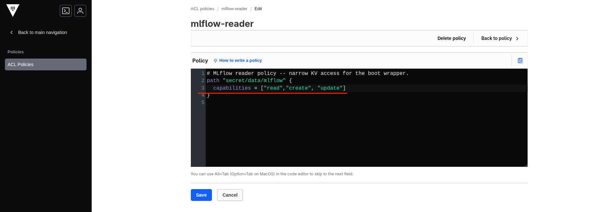
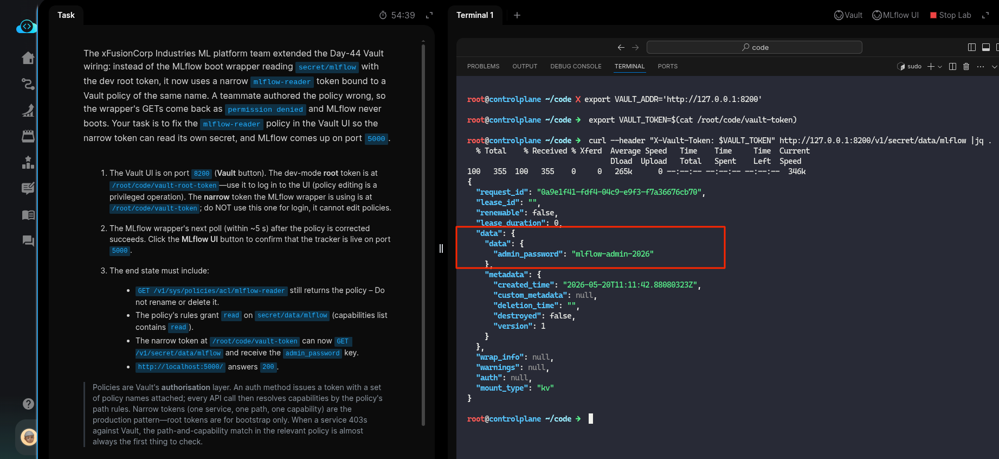

# Task: Fix a Broken Vault KV Policy for the MLflow Reader

The xFusionCorp Industries ML platform team extended the Day-44 Vault wiring: instead of the MLflow boot wrapper reading `secret/mlflow` with the dev root token, it now uses a narrow `mlflow-reader` token bound to a Vault policy of the same name. A teammate authored the policy wrong, so the wrapper's GETs come back as `permission denied` and MLflow never boots. Your task is to fix the `mlflow-reader` policy in the Vault UI so the narrow token can read its own secret, and MLflow comes up on port `5000`.

1. The Vault UI is on port `8200` (Vault button). The dev-mode root token is at `/root/code/vault-root-token` — use it to log in to the UI (policy editing is a privileged operation). The narrow token the MLflow wrapper is using is at `/root/code/vault-token`; do NOT use this one for login, it cannot edit policies.

2. The MLflow wrapper's next poll (within ~5 s) after the policy is corrected succeeds. Click the MLflow UI button to confirm that the tracker is live on port `5000`.

3. The end state must include.:

  - `GET /v1/sys/policies/acl/mlflow-reader` still returns the policy – Do not rename or delete it.
  - The policy's rules grant read on `secret/data/mlflow` (capabilities list contains read).
  - The narrow token at `/root/code/vault-token` can now GET `/v1/secret/data/mlflow` and receive the `admin_password` key.
  - `http://localhost:5000/` answers `200`.

> Policies are Vault's authorisation layer. An auth method issues a token with a set of policy names attached; every API call then resolves capabilities by the policy's path rules. Narrow tokens (one service, one path, one capability) are the production pattern—root tokens are for bootstrap only. When a service 403s against Vault, the path-and-capability match in the relevant policy is almost always the first thing to check.

---

# Solution:

- This lab builds on the previous task. A Vault policy now governs API calls and their capabilities. The task indicates that the policy is misconfigured and needs fixing.

- Open the Vault UI and log in using the token from `/root/code/vault-root-token`. Inspect the policy. The reason API GET calls return `permission denied` is that the policy is missing the `read` capability. Add `read` to the policy and save it.

- Once the policy is updated, the MLflow wrapper will poll the secret within 5 seconds. Query the secret at `v1/secret/data/mlflow` using the token from `/root/code/vault-token` as the bearer token. The API call should now return the secret successfully.

- Next, confirm that the MLflow Server is reachable on `http://localhost:5000` with a `curl` command. Then hit **Check**.

