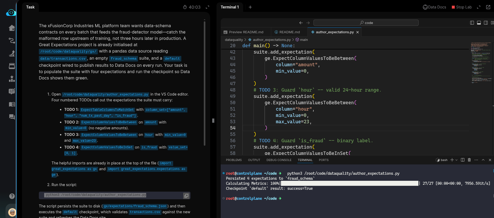
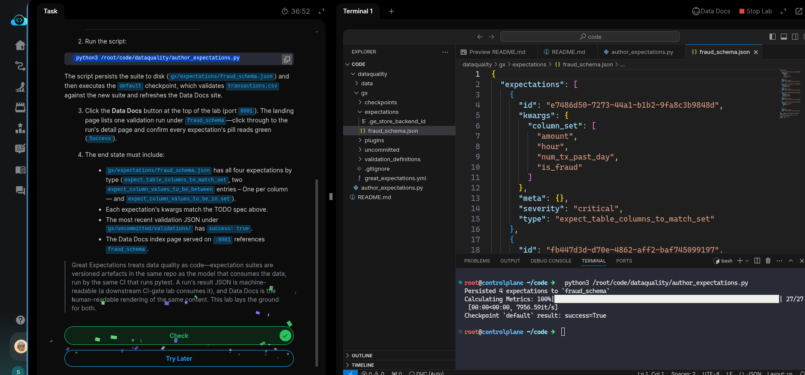

# Task: Author Data-Quality Expectations with Great Expectations

The xFusionCorp Industries ML platform team wants data-schema contracts on every batch that feeds the fraud-detector model — catch the malformed row upstream of training, not three hours later in production. A Great Expectations project is already initialised at `/root/code/dataquality/gx/` with a pandas data source reading `data/transactions.csv`, an empty `fraud_schema` suite, and a default checkpoint wired to publish results to Data Docs on every run. Your task is to populate the suite with four expectations and run the checkpoint so Data Docs shows them green.


1. Open `/root/code/dataquality/author_expectations.py` in the VS Code editor. Four numbered TODOs call out the expectations the suite must carry:

  - TODO 1: `ExpectTableColumnsToMatchSet` with `column_set=["amount", "hour", "num_tx_past_day", "is_fraud"]`.
  - TODO 2: `ExpectColumnValuesToBeBetween` on amount with `min_value=0` (no negative amounts).
  - TODO 3: `ExpectColumnValuesToBeBetween` on hour with `min_value=0` and `max_value=23.`
  - TODO 4: `ExpectColumnValuesToBeInSet` on is_fraud with `value_set=[0, 1]`.

The helpful imports are already in place at the top of the file (`import great_expectations as gx` and `import great_expectations.expectations as ge`).

2. Run the script:

```
   python3 /root/code/dataquality/author_expectations.py
```


The script persists the suite to disk `(gx/expectations/fraud_schema.json)` and then executes the `default` checkpoint, which validates `transactions.csv` against the new suite and refreshes the Data  Docs site.

3. Click the Data Docs button at the top of the lab (port `8081`). The landing page lists one validation run under `fraud_schema` — click through to the run's detail page and confirm every expectation's pill reads green (Success).

4. The end state must include:

  - `gx/expectations/fraud_schema.json` has all four expectations by type (`expect_table_columns_to_match_set`, two `expect_column_values_to_be_between` entries – One per column — and `expect_column_values_to_be_in_set`).
  - Each expectation's kwargs match the TODO spec above.
  - The most recent validation JSON under `gx/uncommitted/validations/` has success: true.
  - The Data Docs index page served on `:8081` references fraud_schema.


> Great Expectations treats data quality as code—expectation suites are versioned artefacts in the same repo as the model that consumes the data, run by
the same CI that runs pytest. A run's result JSON is machine-readable (a downstream CI-gate lab consumes it), and Data Docs is the human-readable
rendering of the same content. This lab lays the ground for both.

---

# Solution:

This task is about using [Great Expectations](https://docs.greatexpectations.io/docs/home/) (GX), an open-source Python-based framework for data testing, validation, profiling, and documentation. In machine learning, GX acts as a gatekeeper for data quality, ensuring the data feeding into models is consistent and meets all structural and business logic requirements.

- The task is to update `/root/code/dataquality/author_expectations.py` by completing the TODOs marked in the script. Open `author_expectations.py` in VSCode and inspect the code.

The `add_expectation()` calls are commented out for the first TODO. Follow the same pattern to add all required expectations.


- Once updated, run the script with `python3 /root/code/dataquality/author_expectations.py`. The script should complete successfully and return `success=True`.




Verify the generated files in `./dataquality/gx/expectations` and `./dataquality/gx/uncommitted` directories, then hit **Check**.




`
