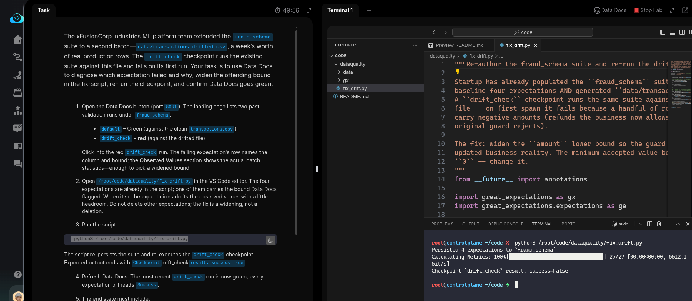
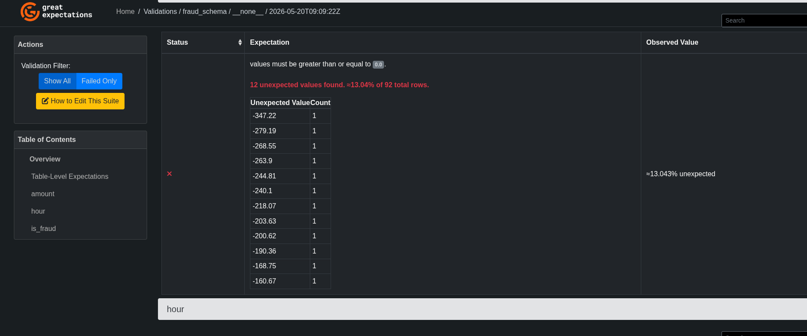
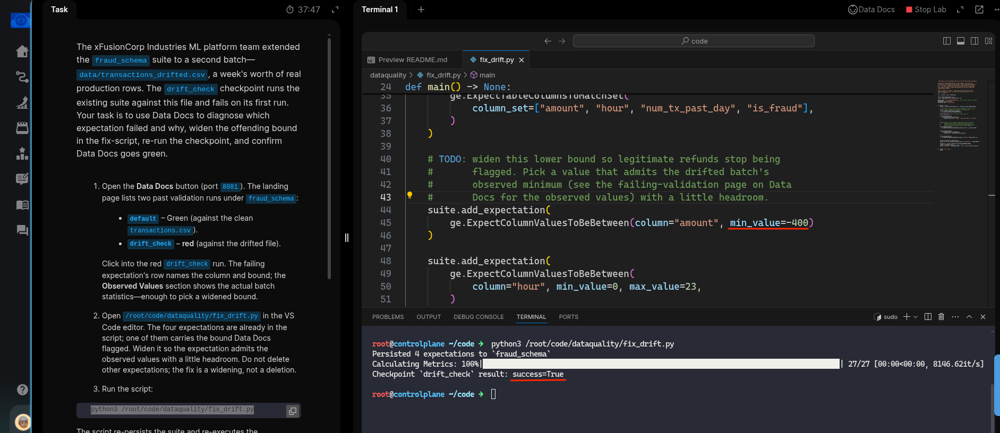
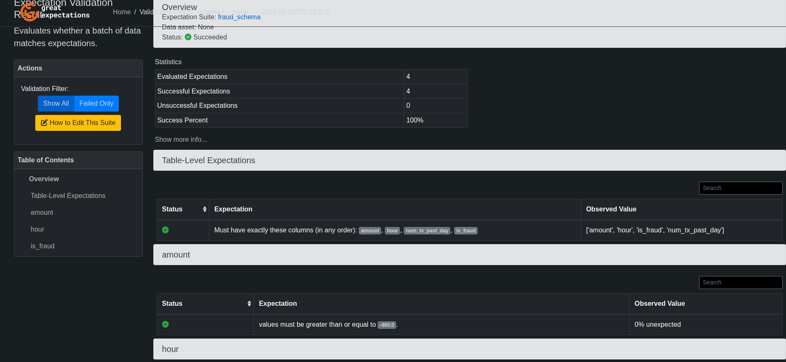
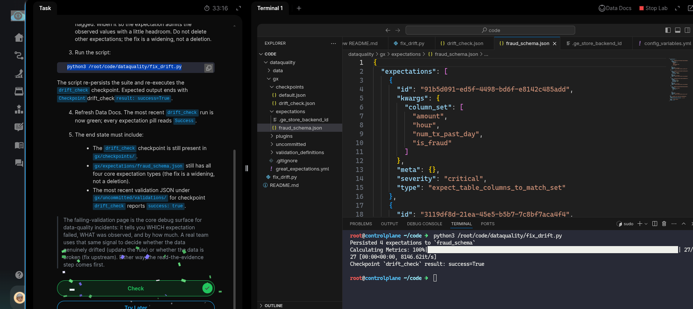

# Task: Debug a Failing Great Expectations Checkpoint

The xFusionCorp Industries ML platform team extended the `fraud_schema` suite to a second batch — `data/transactions_drifted.csv`, a week's worth of real production rows. The `drift_check` checkpoint runs the existing suite against this file and fails on its first run. Your task is to use Data Docs to diagnose which expectation failed and why, widen the offending bound in the fix-script, re-run the checkpoint, and confirm Data Docs goes green.


1. Open the Data Docs button (port `8081`). The landing page lists two past validation runs under fraud_schema:

  - `default` – Green (against the clean transactions.csv).
  - `drift_check` – red (against the drifted file).


Click into the red `drift_check` run. The failing expectation's row names the column and bound; the Observed Values section shows the actual batch statistics—enough to pick a widened bound.

2. Open `/root/code/dataquality/fix_drift.py` in the VS Code editor. The four expectations are already in the script; one of them carries the bound Data Docs flagged. Widen it so the expectation admits the observed values with a little headroom. Do not delete other expectations; the fix is a widening, not a deletion.

3. Run the script:

```
   python3 /root/code/dataquality/fix_drift.py
```

The script re-persists the suite and re-executes the drift_check checkpoint. Expected output ends with Checkpointdrift_checkresult: success=True.

4. Refresh Data Docs. The most recent `drift_check` run is now green; every expectation pill reads Success.

5. The end state must include:

  - The `drift_check` checkpoint is still present in `gx/checkpoints/.`
  - `gx/expectations/fraud_schema.json` still has all four core expectation types (the fix is a widening, not a deletion).
  - The most recent validation JSON under `gx/uncommitted/validations/` for checkpoint `drift_check` reports `success: true`.


> The failing-validation page is the core debug surface for data-quality incidents: it tells you WHICH expectation failed, WHAT was observed, and by how much. A real team uses that same signal to decide whether the data genuinely drifted (update the rule) or whether the data is broken (fix upstream). Either way, the read-the-evidence step comes first.

---
# Solution:

- We first run the `/root/code/dataquality/fix_drift.py` and see what it produces, and also check the Data Docs to see Validation results. We can see
  that the script fails with `success: False` and In the Data Docs we can observe that `amount` expectation has drifted.





- Now, we take a look at the script and see what's going on there. The docstrings say:

> The fix: widen the ``amount`` lower bound so the guard matches the
updated business reality. The minimum accepted value below is still
``0`` -- change it.

When we observer the validation failure logs of the `amount` in Data Docs UI, we can see that the *observed minimum value* is `-347.22`, and the TODO
says to set the `min_value` with a **little headroom**. So we update the `min_value=-400` and re run the script.



- We now see `succes: True` message. We can also inspect the Data Docs UI, and see other JSON entries for the checkpoint and hit **Check**.






