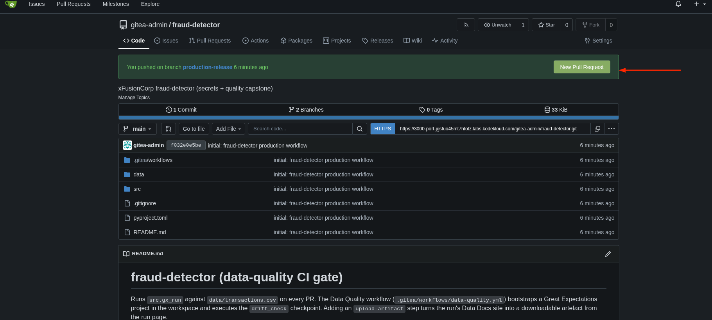
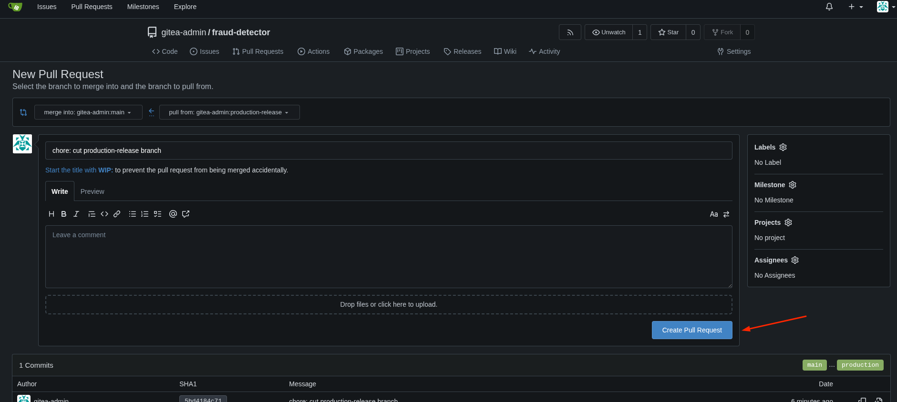
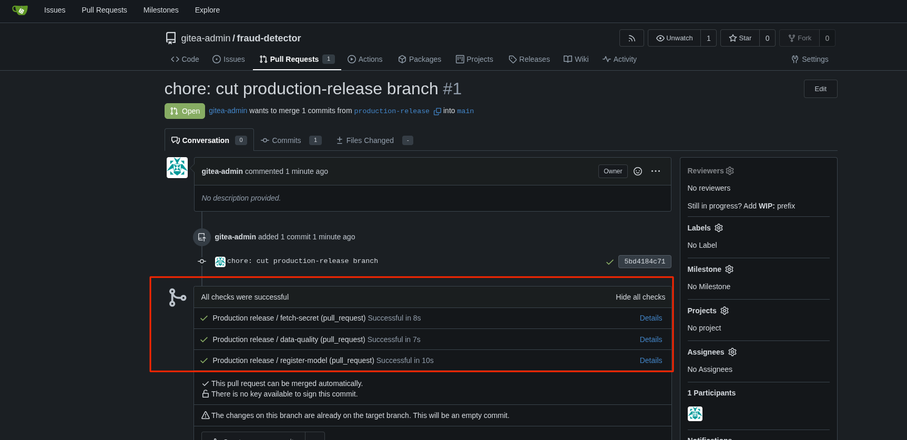
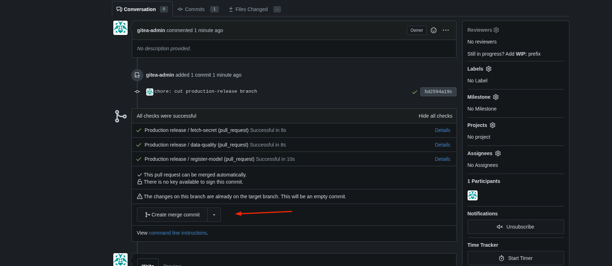

# Task: Secrets + Data-Quality Integration Capstone


The xFusionCorp Industries ML platform team is cutting the first end-to-end release on the `fraud-detector` repo. The release is a three-job Gitea Actions workflow: pull the MLflow credential from Vault, gate on a Great Expectations data-quality checkpoint, and register the trained model in MLflow. All four services—Vault, MLflow, Gitea, the Actions runner—are already running. Your capstone task is to drive the release from its four UIs: stage the credential in Vault, open and merge a pull request in Gitea, then promote the registered model in MLflow.


1. Each of the four UIs has a button at the top of the lab:

  - Gitea (port `3000`) – `gitea-admin` / `gitea2026`. The `fraud-detector` repo sits on `main`; a feature branch `production-release` is pre-pushed. No pull request has been opened yet.
  - Vault (port `8200`) – log in with the token at `/root/code/vault-token.` The KV v2 engine is enabled at `secret/`; `secret/mlflow` is empty.
  - MLflow UI (port `5000`) – the Models page is empty.
  - Data Docs – rendered by the `data-quality` job once the workflow runs.

2. The workflow at `.gitea/workflows/production.yml` on the `production-release` branch is complete and correct. It reads Vault KV key `mlflow_password,` runs the `schema_check` GE checkpoint, and registers the trained model as `fraud-detector` in MLflow. It only triggers on `pull_request` against main.

3. The end state must include:

  - `secret/mlflow` has a non-empty `mlflow_password` key (any value works).
  - A pull request exists from `production-release` → main and has been merged.
  - The workflow run on that PR's head commit reaches combined status success (all three jobs green).
  - `fraud-detector` is registered in MLflow with the `production` alias pointing at one of its versions.


> Each of the four pieces lives behind a different UI and, in a real team, a different owner: Vault (security), Gitea (the dev lead opening + merging the PR), MLflow (the ML engineer promoting the model), Data Docs (the data team reviewing the quality report). The capstone walks all four. Order matters for the first step: stage the Vault secret before opening the PR, otherwise the workflow's very first job fails and the reader has to re-trigger.

---

# Solution:

- The task is to release a model from its four UIs, stage the credential in Vault, open and merge a pull request then promote the model in MLFlow.

- First we inspect the Vault, as one requirement is to have an nom-empty `mlflow_password` in the vault. We see there is no password currently, So we
  `put` a password using `vault put` command.

```
export VAULT_ADDR='http://127.0.0.1:8200'
export VAULT_TOKEN=$(cat /root/code/vault-token)

vault kv put secret/mlflow mlflow_password='mlflow-admin-123'
```

Verify if the `mlflow_password` was pushed to the vault:

```
vault kv get secret/mlflow
```


- Now, we are ready to open the PR and Merge it from the Gitea UI and wait for all CI checks to pass.









- Once the PR is created, we move to PR page and merge it.



- Once the PR is merged, we need to navigate to MLFlow server UI and add an *alias* as `production` to the registered versioned model.


> You might want to refresh the MLFlow UI page to see the added alias

- We've satisfied all the tasks in *End state*, and can hit **Check**


