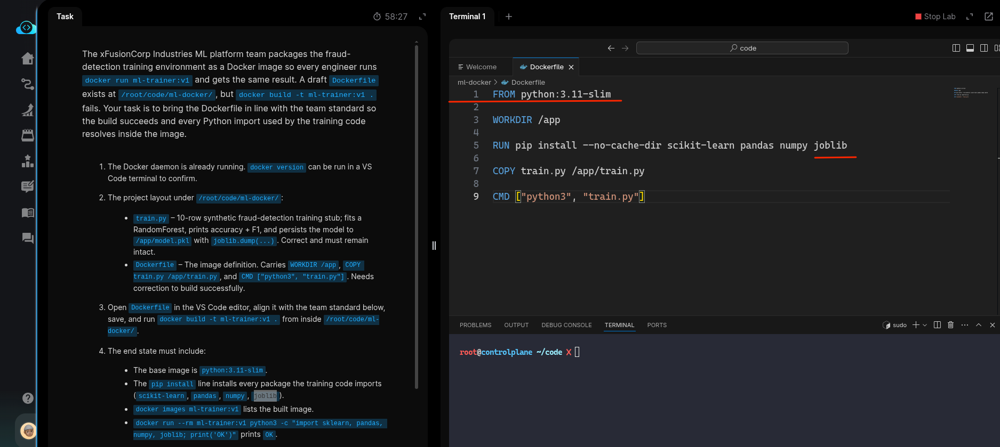
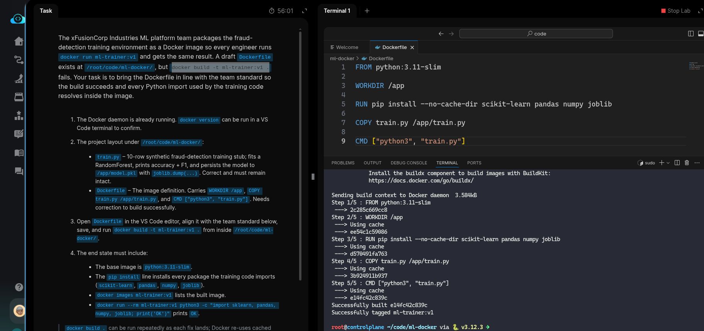
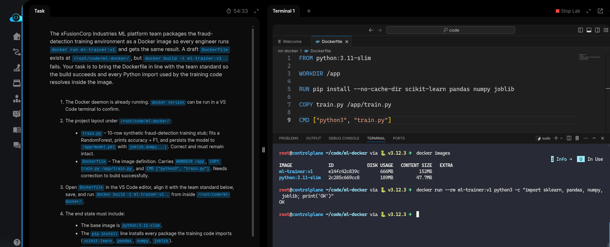

# Task: Create Docker Image for ML Training Environment

The xFusionCorp Industries ML platform team packages the `fraud-detection` training environment as a *Docker* image so every engineer runs `docker run ml-trainer:v1` and gets the same result. A draft *Dockerfile* exists at `/root/code/ml-docker/`, but `docker build -t ml-trainer:v1 .` fails. Your task is to bring the Dockerfile in line with the team standard so the build succeeds and every Python import used by the training code resolves inside the image.

1. The Docker daemon is already running. `docker version` can be run in a VS Code terminal to confirm.

2. The project layout under `/root/code/ml-docker/`:

  - `train.py` – 10-row synthetic `fraud-detection` training stub; fits a RandomForest, prints accuracy + F1, and persists the model to `/app/model.pkl` with `joblib.dump(...)`. Correct and must remain intact.
  - Dockerfile – The image definition. Carries `WORKDIR /app`, `COPY train.py /app/train.py`, and `CMD ["python3", "train.py"]`. Needs correction to build successfully.
  - Open Dockerfile in the VS Code editor, align it with the team standard below, save, and run `docker build -t ml-trainer:v1 .` from inside `/root/code/ml-docker/`.

3. The end state must include:

  - The base image is `python:3.11-slim`.
  - The `pip install` line installs every package the training code imports (`scikit-learn`, `pandas`, `numpy`, `joblib`).
  - `docker images ml-trainer:v1` lists the built image.
  - `docker run --rm ml-trainer:v1 python3 -c "import sklearn, pandas, numpy, joblib; print('OK')"` prints OK.
  - `docker build .` can be run repeatedly as each fix lands; Docker re-uses cached layers so only the changed line re-runs. The scaffolded WORKDIR /app, COPY, and CMD instructions must stay intact.

---

# Solution:

- This task involves fixing an existing Dockerfile and building the image with the specified tag.

- Inspect the Dockerfile first. Change into the `ml-docker` directory and try building with `docker build -t ml-trainer:v1 .`. The base image is `python:3.11-alpine`. Change it to the required `python:3.11-slim` and add `joblib` to the `pip install` instruction. Then rebuild.

- Verify that the image is tagged and built correctly, and that all required Python packages are installed inside the container:

That completes the task. Hit **Check** to verify.
