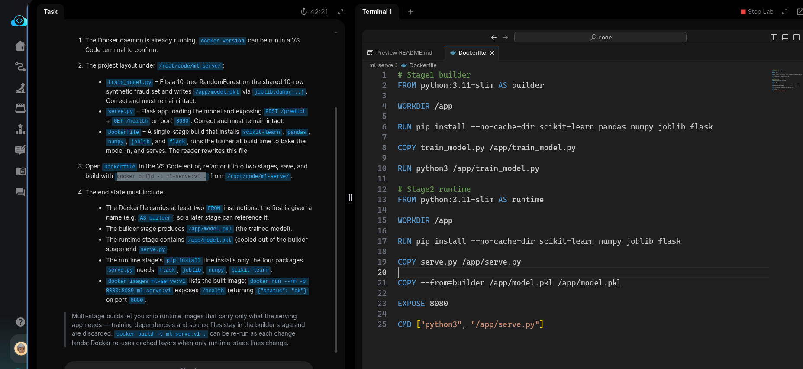
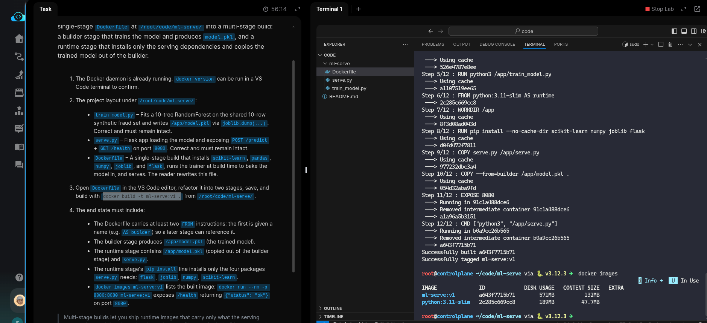

# Task: Create Multi-Stage Docker Build for ML Serving

The xFusionCorp Industries ML platform team ships the `fraud-detection` model as a Docker image, but the runtime image currently carries every package the training stage needs plus the training source itself—it works, but it ships more than a serving image should. Your task is to convert the single-stage *Dockerfile* at `/root/code/ml-serve/` into a multi-stage build: a builder stage that trains the model and produces `model.pkl`, and a runtime stage that installs only the serving dependencies and copies the trained model out of the builder.

1. The Docker daemon is already running. `docker version` can be run in a VS Code terminal to confirm.

2. The project layout under `/root/code/ml-serve/`:

  - `train_model.py` – Fits a 10-tree RandomForest on the shared 10-row synthetic fraud set and writes `/app/model.pkl` via `joblib.dump(...)`. Correct and must remain intact.
  - `serve.py` – Flask app loading the model and exposing `POST /predict` + `GET /health` on port `8080`. Correct and must remain intact.
  - `Dockerfile` – A single-stage build that installs `scikit-learn` `pandas`, `numpy`, `joblib`, and `flask`, runs the trainer at build time to bake the model in, and serves. The reader rewrites this file.

3. Open Dockerfile in the VS Code editor, refactor it into two stages, save, and build with `docker build -t ml-serve:v1 .` from `/root/code/ml-serve/`

4. The end state must include:

  - The Dockerfile carries at least two FROM instructions; the first is given a name (e.g. AS builder) so a later stage can reference it.
  - The builder stage produces /app/model.pkl (the trained model).
  - The runtime stage contains /app/model.pkl (copied out of the builder stage) and serve.py.
  - The runtime stage's pip install line installs only the four packages serve.py needs: flask, joblib, numpy, scikit-learn.
  - docker images ml-serve:v1 lists the built image; `docker run --rm -p 8080:8080 ml-serve:v1` exposes /health returning {"status": "ok"} on port 8080.

> Multi-stage builds let you ship runtime images that carry only what the serving app needs — training dependencies and source files stay in the builder stage and are discarded. docker build -t ml-serve:v1 . can be re-run as each change lands; Docker re-uses cached layers when only runtime-stage lines change.

---
# Solution:

- Refactor the existing Dockerfile into a multi-stage build. Change into the `./ml-serve` directory, inspect the Dockerfile in VSCode, and update it accordingly:

- Run `docker build -t ml-serve:v1 .` to build and tag the image:

- Start the container and test the `/health` endpoint from another terminal with `curl http://localhost:8080/health`. It should return `{"status":"ok"}`.

Hit **Check**

