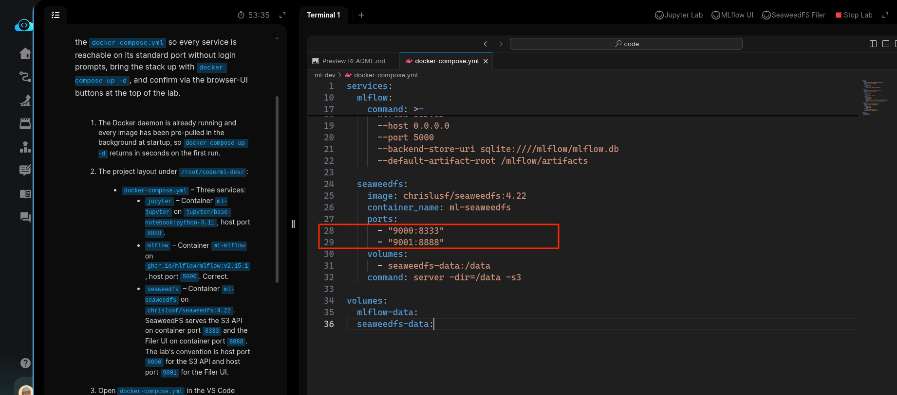
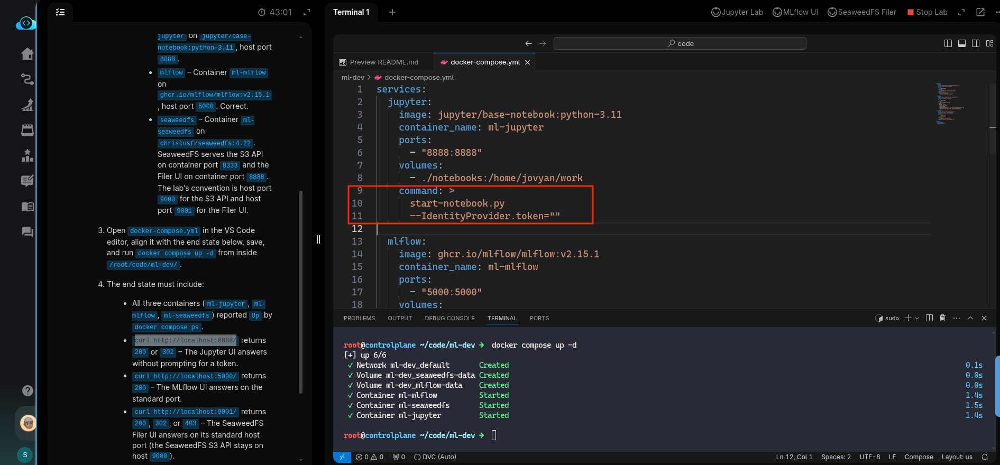

# Task: Set Up Local ML Dev Environment with Docker Compose

The xFusionCorp Industries ML platform team ships a local dev stack — Jupyter Lab for notebooks, MLflow for experiment tracking, SeaweedFS for S3-compatible artefact storage — as a three-service docker `compose deployment`. A draft `docker-compose.yml` exists at `/root/code/ml-dev/`, but as it ships the stack does not bring all three browser UIs up on their standard ports. Your task is to correct the `docker-compose.yml` so every service is reachable on its standard port without login prompts, bring the stack up with `docker compose up -d`, and confirm via the browser-UI buttons at the top of the lab.

1. The Docker daemon is already running and every image has been pre-pulled in the background at startup, so `docker compose up -d` returns in seconds on the first run.

2. The project layout under `/root/code/ml-dev/`:

  - `docker-compose.yml` – Three services:
    - jupyter – Container `ml-jupyter` on `jupyter/base-notebook:python-3.11`, host port `8888`.
    - mlflow – Container `ml-mlflow` on `ghcr.io/mlflow/mlflow:v2.15.1`, host port `5000`. Correct.
    - seaweedfs – Container `ml-seaweedfs` on `chrislusf/seaweedfs:4.22`. SeaweedFS serves the S3 API on container port `8333` and the Filer UI on container port `8888`. The lab's convention is host port `9000` for the S3 API and host port `9001` for the Filer UI.

3. Open `docker-compose.yml` in the VS Code editor, align it with the end state below, save, and run `docker compose up -d` from inside `/root/code/ml-dev/`.

4. The end state must include:

  - All three containers `(ml-jupyter`, `ml-mlflow`, `ml-seaweedfs`) reported Up by docker compose ps.
  - curl `http://localhost:8888/` returns 200 or 302 – The Jupyter UI answers without prompting for a token.
  - curl `http://localhost:5000/` returns 200 – The MLflow UI answers on the standard port.
  - curl `http://localhost:9001/` returns 200, 302, or 403 – The SeaweedFS Filer UI answers on its standard host port (the SeaweedFS S3 API stays on host 9000).

> The three browser UIs (Jupyter, MLflow, SeaweedFS Filer) are the primary verification surface — open them from the buttons at the top of the lab.

---

# Solution:

- The task is to fix the issueus in the Docker compose file. CD into the `ml-dev` directory and inspect the `docker-compose-yml` in VSCode.
    - First we inspect if all the ports are wired as per requirement. We can see that the two services `jupyter` and `mlflow` are good with port
    definitions. But, there seems to be a mix-up in `seaweedfs` service. The seaweedfs API and seaweedfs filler UI ports are interchanged. We fix
    that:

- Next, is to verify that **The Jupyter UI answers without prompting for a token.**. This is because, with default container **ENTRYPOINT**, the jupyter server starts with a pre-generated auth token, leaving the UI unreachable through the browser.

Finding the right set of commands and args from the docs did not produce good results for me. So I exec'ed into the image `jupyter/base-notebook:python-3.11` with bash shell, and grep'ed for `token` within the `start-notebook.py` the default **ENTRYPOINT** of the image. The command to run within the image to get all the available options is `start-notebook.py --help-all` (Note it's `--help-all` flag). I found one option `IdentityProvider.token` which takes a *String*b and we can set it to empty etsing with `""`. So update the `jupyter` service in Docker compose with following updates and run `docker compose up -d`, to see if all container are up:

- Once  the containers are up, we can verify with `curl` if all containers are responding on their respctive ports.

  - `curl http://localhost:8888/` might repond with `403` instead of `200` or `3020`, thats not a bad sign. It means the the server is running, our
request reached the container.
  - `curl --head http://localhost:5000/` should return `status: 200`
  - `curl http://localhost:9001/` should return `status:200`

Done, hit **Check**

