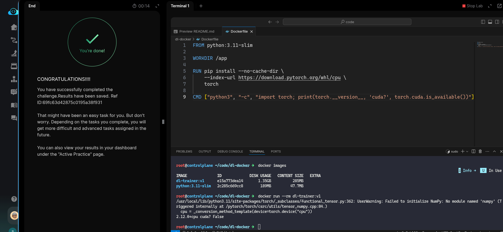

# Task: Create GPU-Enabled Docker Image for Deep Learning

The xFusionCorp Industries ML platform team ships the PyTorch deep-learning images as `dl-trainer:v1`. Every lab host is CPU-only, so the *Dockerfile* must target the CPU wheel index and the container's default command must run cleanly on hardware that has no GPU. The draft Dockerfile at `/root/code/dl-docker/` does not meet either requirement — `docker build` fails, and once the image does build the container exits on startup. Your task is to correct the Dockerfile so `docker build -t dl-trainer:v1 .` succeeds and `docker run --rm dl-trainer:v1` prints the installed `torch` version plus `cuda? False`.

1. The Docker daemon is already running. `docker version` can be run in a VS Code terminal to confirm. The lab host does not expose a GPU — `nvidia-smi` returns `command not found` and `torch.cuda.is_available()` returns `False` inside any CPU-only container.

2. The project layout under `/root/code/dl-docker/`:

  - *Dockerfile* – `FROM python:3.11-slim`, `WORKDIR /app`, a `RUN pip install` line targeting `torch`, and a CMD that probes `torch.cuda`.

3. Open `Dockerfile` in the VS Code editor, correct the Dockerfile, save, and run `docker build -t dl-trainer:v1 .` from inside `/root/code/dl-docker/`.

4. The end state must include:

  - The pip install line points at `https://download.pytorch.org/whl/cpu` (the official CPU-only wheel index – Under 300 MB versus the multi-GB CUDA default wheel).
  - The CMD does not assert `torch.cuda.is_available()`. Something along the lines of `CMD ["python3", "-c", "import torch; print(torch.__version__, 'cuda?', torch.cuda.is_available())"]` fits the release checklist.
  - `docker images dl-trainer:v1` lists the built image.
  - `docker run --rm dl-trainer:v1` exits `0` and prints a line containing `cuda?`.

---

# Solution

- This task is to remove the hard dependency on CUDA from the docker image, so it builds on systems with CPUs as well.

- `cd` into the `dl-docker` directory, and inspect the Dockerfile in VSCode. We could see that the `RUN` instruction has a hardcoded requirement on
CUDA while installing pytorch. We remove it and replace it with `https://download.pytorch.org/whl/cpu`.
Next, the `CMD` asserts that CUDA is required while building the image. We replace it with `["python3", "-c", "import torch; print(torch.__version__, 'cuda?', torch.cuda.is_available())"]`. Try to build the docker image with `docker build -t dl-trainer:v1 .`.

- Next, we list the images to confirm the image is available, and try to run it to see what valuw it prints for `cuda?`:

- We can see that it prints `cuda? False`. We can now hit **Check**.

