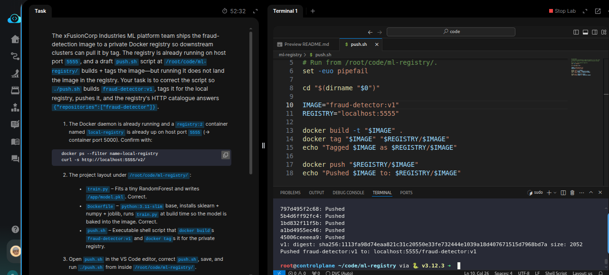
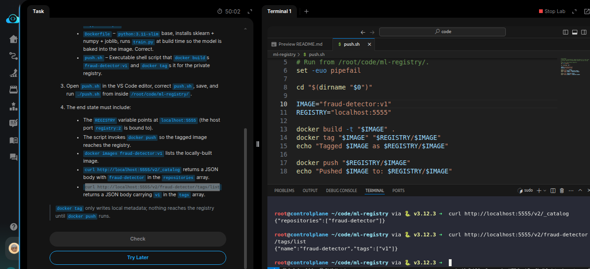

# Task: Push ML Model Images to Container Registry

The xFusionCorp Industries ML platform team ships the `fraud-detection` image to a private Docker registry so downstream clusters can pull it by tag.
The registry is already running on host port `5555`, and a draft `push.sh` script at `/root/code/ml-registry/` builds + tags the image—but running it
does not land the image in the registry. Your task is to correct the script so `./push.sh` builds `fraud-detector:v1`, tags it for the local registry,
pushes it, and the registry's HTTP catalogue answers `{"repositories":["fraud-detector"]}`.


1. The Docker daemon is already running and a `registry:2` container named `local-registry` is already up on host port `5555` (→ container port
`5000`). Confirm with:

```
   docker ps --filter name=local-registry
   curl -s http://localhost:5555/v2/
```

2. The project layout under `/root/code/ml-registry/`:

  - `train.py` – Fits a tiny RandomForest and writes `/app/model.pkl`. Correct.
  - *Dockerfile* – `python:3.11-slim` base, installs `sklearn` + `numpy` + `joblib,` runs `train.py` at build time so the model is baked into the image. Correct.
  - `push.sh` – Executable shell script that docker builds `fraud-detector:v1` and docker tags it for the private registry.

3. Open `push.sh` in the VS Code editor, correct `push.sh`, save, and run `./push.sh` from inside `/root/code/ml-registry/`.

4. The end state must include:

  - The REGISTRY variable points at localhost:5555 (the host port registry:2 is bound to).
  - The script invokes docker push so the tagged image reaches the registry.
  - docker images fraud-detector:v1 lists the locally-built image.
  - curl http://localhost:5555/v2/_catalog returns a JSON body with fraud-detector in the repositories array.
  - curl http://localhost:5555/v2/fraud-detector/tags/list returns a JSON body carrying v1 in the tags array.


> `docker tag` only writes local metadata; nothing reaches the registry until docker push runs.

--- 
# Solution


- The task is to fix `ml-registry/push.sh` so it builds and pushes the image to the local registry correctly.

- Change into `./ml-registry` and inspect `push.sh` in VSCode. Currently, the script only builds the image with the required tag but does not push it to the registry. Also, the port defined in the script points to the container port (`5000`) rather than the host port (`5555`).

Update the port and add the `docker push` command, then run `./push.sh`:



- The image has been pushed to the local registry. Verify that the registry catalog returns the expected image details and tags:



Confirm using the commands in the *end state* that the image is pushed to the local registry, then hit **Check**.


