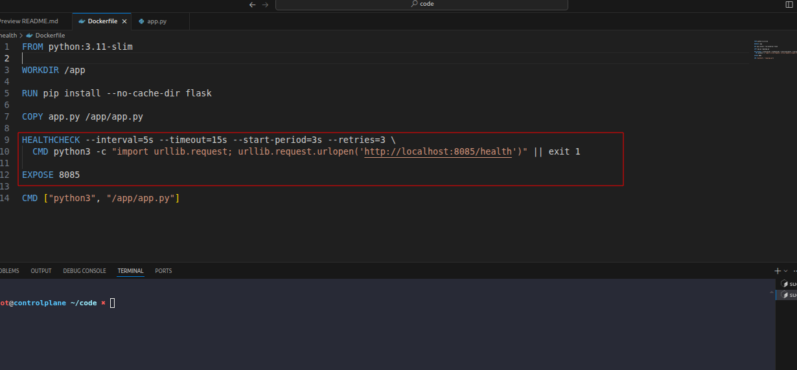

# Task: Add Health Checks and Graceful Shutdown to ML Containers

The xFusionCorp Industries ML platform team ships Flask-based inference APIs as Docker images with Docker-native `HEALTHCHECK` instructions so operators can read `docker inspect --format='{{.State.Health.Status}}'` and tell at a glance whether the process is serving. The draft *Dockerfile* at `/root/code/ml-health/` does not meet that bar — `docker inspect --format='{{.State.Health.Status}}' ml-health-api` reads unhealthy, and `docker inspect --format '{{.Config.ExposedPorts}}' ml-health:v1` reports no ports. Your task is to correct the `HEALTHCHECK` target and add the missing `EXPOSE` declaration.


1. The Docker daemon is already running. `docker version` can be run in a VS Code terminal to confirm.

2. The project layout under `/root/code/ml-health/`:

  - `app.py` – Flask API serving `GET /health` (returns `{"status": "ok"} / 200`) and `POST /predict` (returns a rule-based fraud flag) on port `8085`. Correct.
  - `Dockerfile` – `python:3.11-slim`, installs `flask`, copies `app.py`, carries a `HEALTHCHECK` + `CMD`.

3. Open `Dockerfile` in the VS Code editor, correct the Dockerfile, save, and from `/root/code/ml-health/`:

```
   docker build -t ml-health:v1 .
   docker run -d --rm --name ml-health-api -p 8085:8085 ml-health:v1
```


4. The end state must include:

  - The `HEALTHCHECK` probe targets `/health` (the path the Flask app actually serves).
  - The Dockerfile declares `EXPOSE 8085`, so `docker inspect --format '{{.Config.ExposedPorts}}' ml-health:v1` reports `map[8085/tcp:{}]`.
  - After `docker run`, `docker inspect --format='{{.State.Health.Status}}' ml-health-api` reads healthy within ~15 seconds.
  - `curl http://localhost:8085/health` returns `{"status": "ok"}` with HTTP 200.


> `HEALTHCHECK` reruns its `CMD` every `--interval` seconds and flips the state to unhealthy after `--retries` consecutive failures. `EXPOSE` does not change networking (that is done by -p)—it writes image metadata so `docker inspect` and downstream orchestrators know which port the image intends to serve on.

---
# Solution:


- The task is to fix the `HEALTHCHECK` instruction in the existing Dockerfile and wireup the healthcheck to return `healthy` response from the
container.
`cd` into the `./ml-health` directory and inspect the Dockerfile. We can see some issues.
- The lab instruction says, the *docker inspect ... should return healthy within 15 seconds*. But the `--timeout` in the `HEALTHCHECK` instruction is
  set to `3s`, which lower than the `--interval`. We update the `--timeout` to `15s`.
- The endpoint in the `HEALTHCHECK`s `CMD` *http://localhost:8085/healthz* points to `/healthz`, But, the `./app.py` exposes the endpoint as `./health` on port 8085. We update the enpoint accordingly.
- The Dockerfile does not `EXPOSE` port `8085`. We add `EXPOSE` instruction with `8085`.



- Build the image with `docker build -t ml-health:v1 .`:


- In a different terminal we will query the `/health` endpoint from the running container, and check for `docker inspect` as desired:


Hit **Check**


