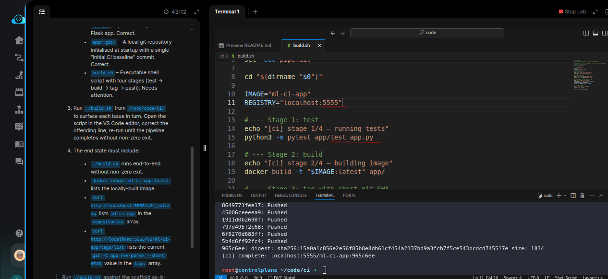
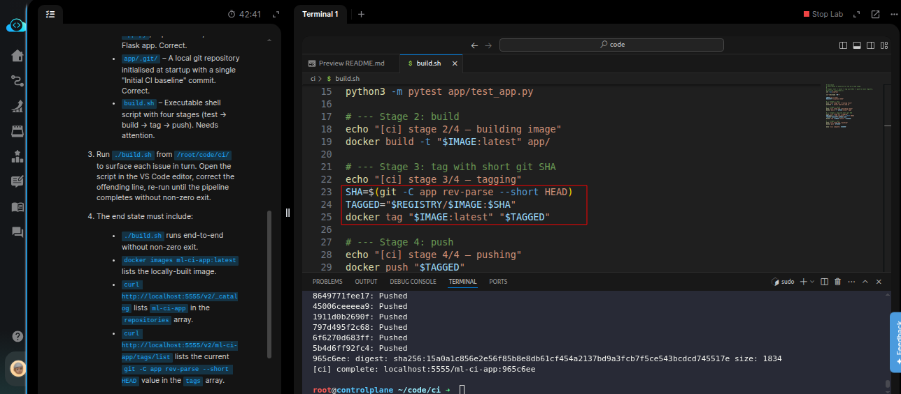
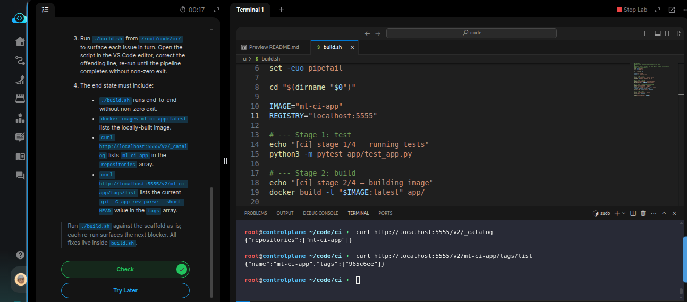

# Task: Automate ML Docker Image Building in CI Pipeline

The xFusionCorp Industries ML platform team runs a shell-based Docker CI pipeline for the `fraud-detection` Flask service—tests run, the image builds, a short git SHA gets stamped as the tag, and the tagged image is pushed to the local private registry. The pre-staged `build.sh` at `/root/code/ci/` does not currently run cleanly end-to-end. Your task is to correct the wiring so `./build.sh` runs cleanly end-to-end and the registry catalogue lists `ml-ci-app` tagged with the current git short SHA.


1. The Docker daemon is already running and a `registry:2` container named `local-registry` is already up on host port `5555`. Confirm with:

```
   docker ps --filter name=local-registry
   curl -s http://localhost:5555/v2/
```


2. The repository layout under `/root/code/ci/`:

  - `app/app.py` – Flask service exposing `/health` + `/predict` on port `8086`. Correct.
  - `app/test_app.py` – Three pytest cases covering `/health,` the `fraud-flag` flow, and the pass-through flow. Correct.
  - `app/Dockerfile` – `python:3.11-slim`, installs `flask`, COPYs app.py, exposes 8086, runs the Flask app. Correct.
  - `app/.git/` – A local git repository initialised at startup with a single "Initial CI baseline" commit. Correct.
  - `build.sh` – Executable shell script with four stages (test → build → tag → push). Needs attention.

3. Run `./build.sh` from `/root/code/ci/` to surface each issue in turn. Open the script in the VS Code editor, correct the offending line, re-run until the pipeline completes without non-zero exit.

4. The end state must include:

  - `./build.sh` runs end-to-end without non-zero exit.
  - `docker images ml-ci-app:latest` lists the locally-built image.
  - `curl http://localhost:5555/v2/_catalog` lists `ml-ci-app` in the repositories array.
  - `curl http://localhost:5555/v2/ml-ci-app/tags/list` lists the current `git -C app rev-parse --short HEAD` value in the tags array.

> Run `./build.sh` against the scaffold as-is; each re-run surfaces the next blocker. All fixes live inside build.sh.


---
# Solution:

- The tasks is to fix the CI shell script `./build.sh` and advised to *Run `./build.sh` against the scaffold as-is; each re-run surfaces the next
blocker. All fixes live inside `build.sh`.*

- `cd` into the `ci` directory and inspect the `./build.sh` and run it to surface the issues.

- First issue is the port `5000`, which is container port, but we need to target the host port `5555`.
- The first error we fac is `ERROR: file or directory not found: app/tests/`. Upon inspection, its `./app/test_app.py`. We update and run it again.
- Next error we face is `./build.sh: line 24: GIT_SHA: unbound variable` . We can see that the ENV for storing the git SHA is named as `SHA`, but the
  `TAGGED` wrongly refers to `GIT_SHA`. We updated the `TAGGED` to reference `SHA` correctly, and re run the script.
- This time it runs with out any errors. 





- We now need to curl the local registry for image and tag.



Hit **Check**

