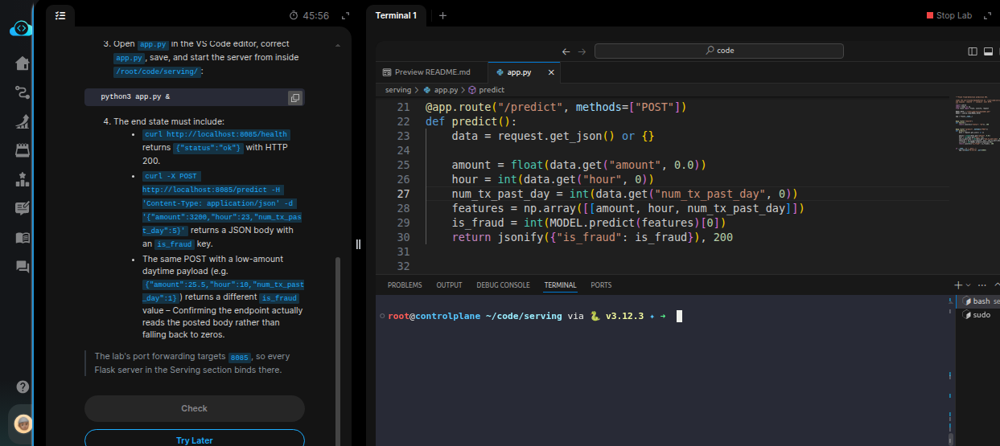
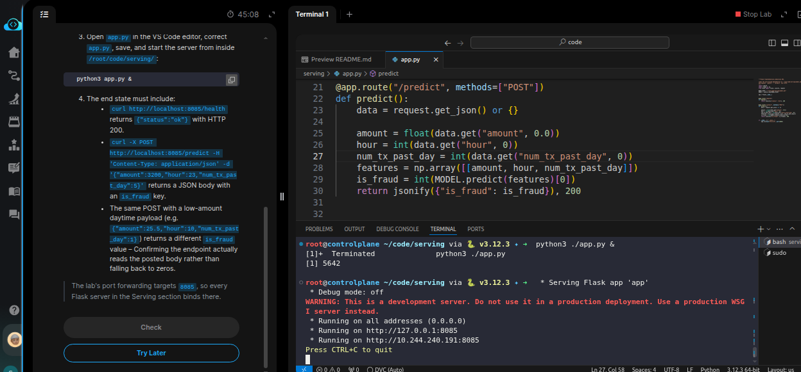
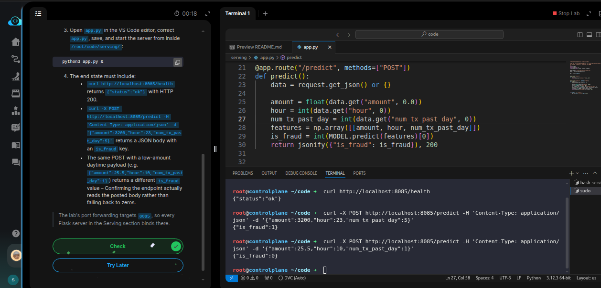

# Task: Serve an ML Model with Flask

The xFusionCorp Industries ML platform team serves the `fraud-detection` model over HTTP with a Flask app so downstream services can score transactions synchronously. A draft `app.py` at `/root/code/serving/` loads the pre-trained model and exposes `/health` + `/predict`, but the server is not reachable on the standard port and `/predict` returns the same response for every payload. Your task is to correct `app.py,` start the server, and confirm two distinct payloads produce two distinct responses.


1. Flask is installed at startup (it is not part of the lab image by default). `python3 -c "import flask; print(flask.__version__)"` confirms it.

2. The project layout under `/root/code/serving/`:

  - `model.pkl` – Deterministic RandomForest trained at startup on the shared `amount / hour / num_tx_past_day → is_fraud` synthetic set. Correct and must remain intact.
  - `train.csv` – The 10-row training source used to fit `model.pkl`.
  - `app.py` – Flask app loading `model.pkl` and declaring `GET /health` + `POST /predict`.

3. Open `app.py` in the VS Code editor, correct `app.py`, save, and start the server from inside `/root/code/serving/`:

```
   python3 app.py &
```


4. The end state must include:
  - `Acurl http://localhost:8085/health returns {"status":"ok"}` with HTTP 200.
  - `curl -X POST http://localhost:8085/predict -H 'Content-Type: application/json' -d '{"amount":3200,"hour":23,"num_tx_past_day":5}'` returns a JSON body with an is_fraud `key`.
  - The same POST with a low-amount daytime payload (e.g. `{"amount":25.5,"hour":10,"num_tx_past_day":1}`) returns a different `is_fraud` value – Confirming the endpoint actually reads the posted body rather than falling back to zeros.

> The lab's port forwarding targets 8085, so every Flask server in the Serving section binds there.


---
# Solution:


- The task is to fix the Flask app setup through `./app.py` and to make it reachable on port `8085` and to align it with the required *end state*.

- `cd` into the `serving` directory and inspect the `./app.py` in VSCode. We see that the `./app.py` sets the port wrongly as `5000` instead of
required `8085`. We correct it and try to run and reach the Fask app.
Another issue is that the `amount`, `hour` and `num_tx_past_day` are read as URL query parameters `request.args.get()`. But, we are passing a JSON
as payload to the `/predict`. These variables should store the data read from `request.het_json()`.



- Now start the Flask server with `python3 ./app.py &` to run in the background. 



- On the other terminal curl the `/health` and `/predict` endpoints with required payload given in the task:



Hit **Check**


