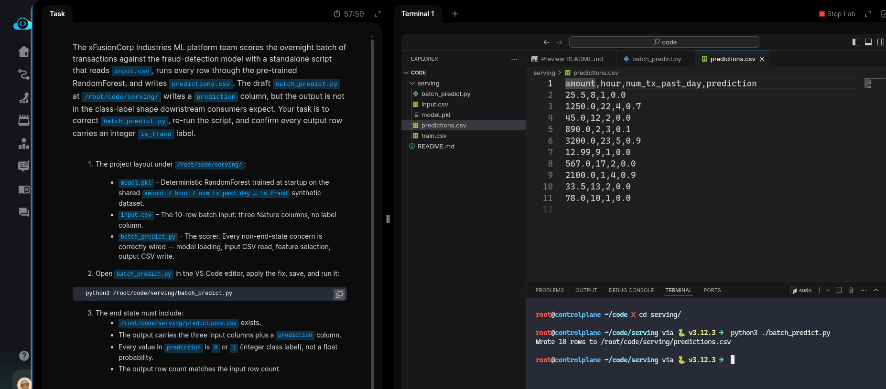
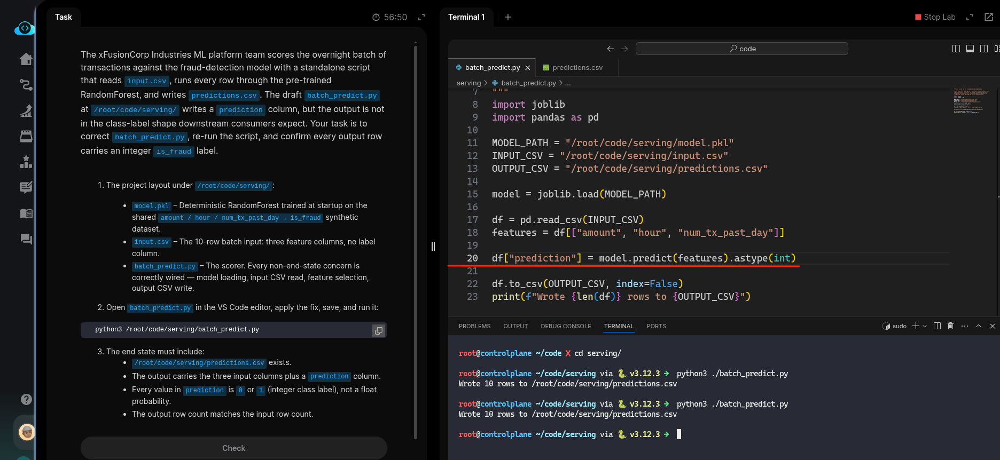
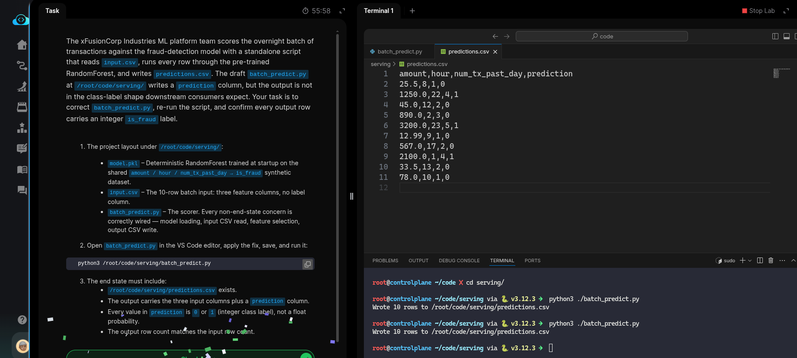

 # Task: Run Batch Predictions on a Dataset

The xFusionCorp Industries ML platform team scores the overnight batch of transactions against the fraud-detection model with a standalone script that reads `input.csv`, runs every row through the pre-trained RandomForest, and writes `prediction.csv`. The draft `batch_predict.py` at `/root/code/serving/` writes a prediction column, but the output is not in the class-label shape downstream consumers expect. Your task is to correct `batch_predict.py` re-run the script, and confirm every output row carries an integer `is_fraud` label.


1. The project layout under `/root/code/serving/`:

  - `model.pkl` – Deterministic RandomForest trained at startup on the shared `amount / hour / num_tx_past_day → is_fraud` synthetic dataset.
  - `input.csv` – The 10-row batch input: three feature columns, no label column.
  - `batch_predict.py` – The scorer. Every non-end-state concern is correctly wired — model loading, input CSV read, feature selection, output CSV write.

2. Open `batch_predict.py` in the VS Code editor, apply the fix, save, and run it:

```
   python3 /root/code/serving/batch_predict.py
```

3. The end state must include:
  - /root/code/serving/predictions.csv exists.
  - The output carries the three input columns plus a prediction column.
  - Every value in prediction is 0 or 1 (integer class label), not a float probability.
  - The output row count matches the input row count.

---

# Solution:

- The task is to fix the `batch_predict.py` and confirm every output row carries an alss label integer `is_fraud`. cd into the `serving` directory and inspect the `./batch_predict.py` in VSCode.

- We can see that if we run the script `./batch_predict.py`, the `./prediction.csv` carries a `prediction` column which prints a float value. This is because of `model.predict_proba()` returns the probabilty, currently for `fraud`  - 1. But the requirement is to get the `prediction`  as class label as an integer, either `0` or `1`. This can be acheived using `model.predict().astype(int)`:

> Refer to the offical API docs for [`sklearn` for the functions exposed](https://scikit-learn.org/stable/modules/generated/sklearn.ensemble.RandomForestClassifier.html?utm_source=chatgpt.com)


- Check `./predictions.csv`




- We update the `./batch_predict.py` accordingly by updating the prediction column of the dataframe:



- Verify that the `prediction` column in the `predictions.csv` now includes a class label for `is_fraud` with either `0` or `1`. Verify and hit
**Check**.




