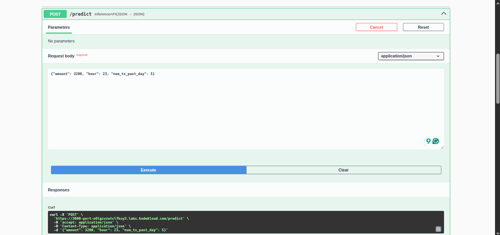
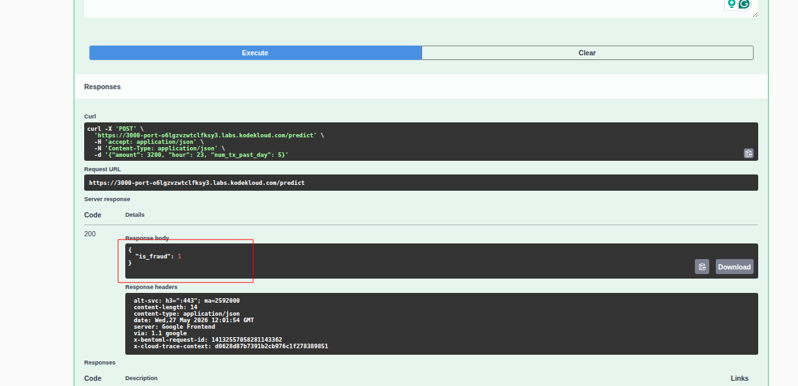
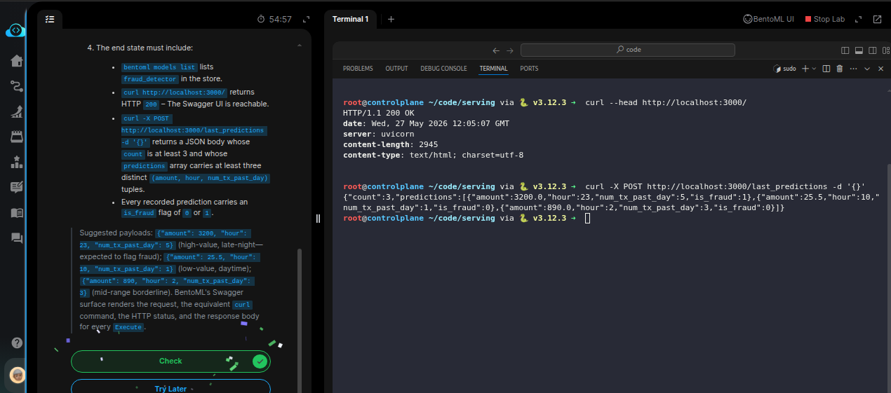

# Task: Package a Model as a BentoML Service

The xFusionCorp Industries ML platform team ships the fraud-detection model through *BentoML* — the model is registered in BentoML's local store and served over HTTP by `bentoml serve`, which auto-generates a *Swagger UI* at the server's root that engineers use to submit predictions interactively. The server is already running on port `3000` against the pre-registered `fraud_detector:latest` model. Your task is to submit three distinct fraud-detection predictions through the BentoML Swagger UI's Try it out panel and confirm every submission lands in the service's audit log.

1. The BentoML server is already running on port `3000`. The BentoML UI button at the top of the lab opens the Swagger surface directly. bentoml models list in a VS Code terminal confirms the model is registered.

2. The project layout under `/root/code/serving/`:

  - `service.py` – BentoML service definition wired with `POST /predict` (scores a single transaction) and `POST /last_predictions` (returns the audit log). Correct and must remain intact — this lab does not edit the code.
  - `train.csv` – The 10-row source used at startup to train the model and register it with `bentoml.sklearn.save_model("fraud_detector", model`).

3. Open the BentoML UI button, expand `POST /predict`, click `Try it out`, enter a payload in the editable JSON panel, click `Execute`, and observe the response. Repeat three times with three distinct (`amount`, `hour`, `num_tx_past_day`) combinations.

4. The end state must include:

  - `bentoml models list` lists `fraud_detector` in the store.
  - `curl http://localhost:3000/` returns `HTTP 200` – The Swagger UI is reachable.
  - `curl -X POST http://localhost:3000/last_predictions -d '{}'` returns a JSON body whose count is at least 3 and whose predictions array carries at least three distinct (`amount`, `hour`, `num_tx_past_day`) tuples.
  - Every recorded prediction carries an `is_fraud` flag of 0 or 1.

> Suggested payloads: `{"amount": 3200, "hour": 23, "num_tx_past_day": 5}` (high-value, late-night—expected to flag fraud); `{"amount": 25.5, "hour": 10, "num_tx_past_day": 1}` (low-value, daytime); `{"amount": 890, "hour": 2, "num_tx_past_day": 3}` (mid-range borderline). BentoML's Swagger surface renders the request, the equivalent curl command, the HTTP status, and the response body for every Execute.

---

- This task is similar to the previous one, but uses [BentoML](https://github.com/bentoml/BentoML) for serving AI models.

- Change into the `serving` directory and inspect the `./service.py` in VSCode. The task descriptions says that the server is already running on port
  3000 against the registered model. So we have to open the BentoML UI by clicking the button on the top-right of the lab.

- In the BentoML UI, navigate to **Service APIs**, click **Try it out** under the `/predict`
endpoint, and submit each payload:
  - `{"amount": 3200, "hour": 23, "num_tx_past_day": 5}`
  - `{"amount": 25.5, "hour": 10, "num_tx_past_day": 1}`
  - `{"amount": 890, "hour": 2, "num_tx_past_day": 3}`

Click **Execute** for each request body.

``

- After submitting all three predictions, open another terminal and verify the `/last_predictions`
endpoint returns all three queries:

- Confirm that `curl http://localhost:3000/` returns `200` and
`curl -X POST http://localhost:3000/last_predictions -d '{}'` returns a JSON body with `count >= 3`
and three distinct `(amount, hour, num_tx_past_day)` tuples. Hit **Check**.
