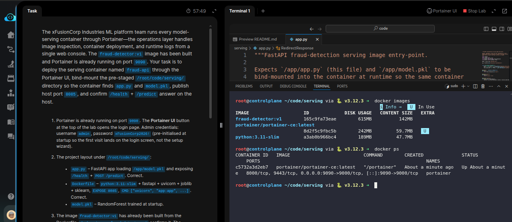
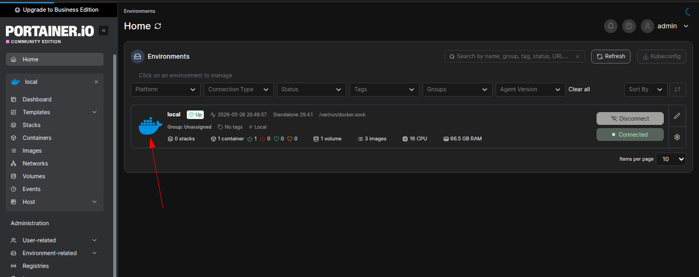
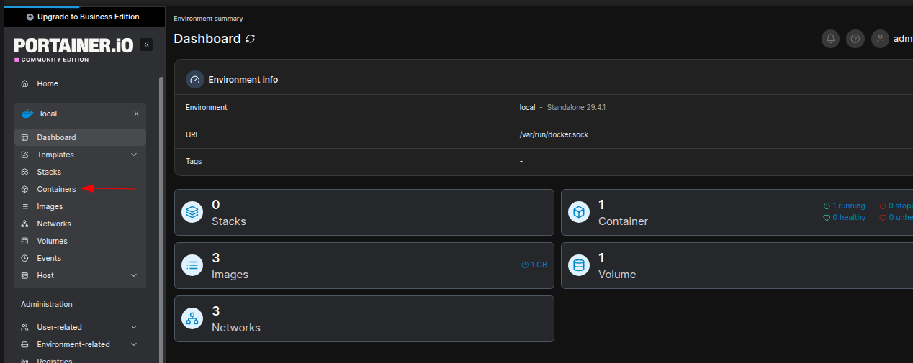
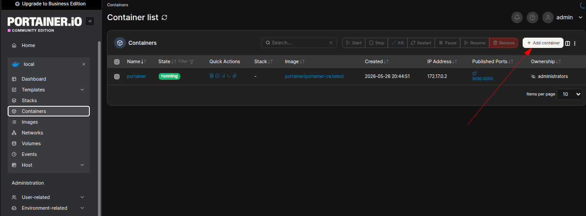
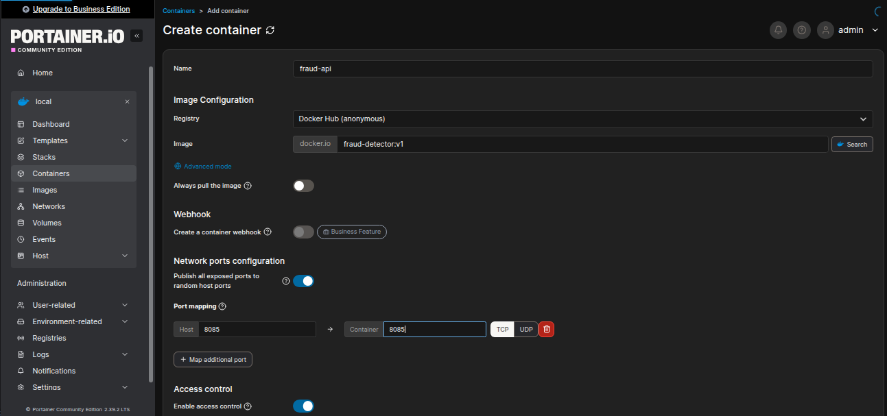
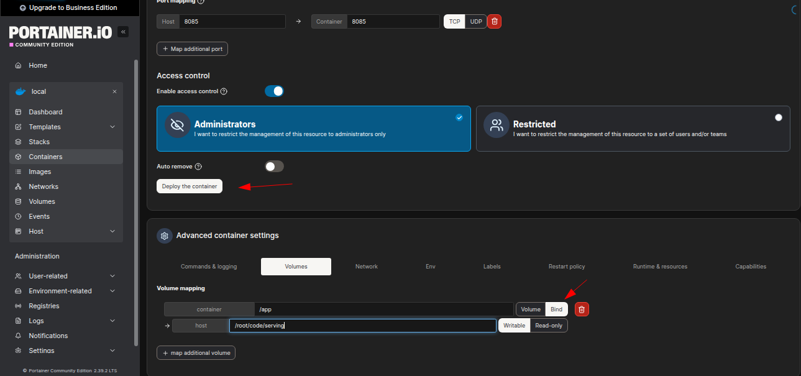
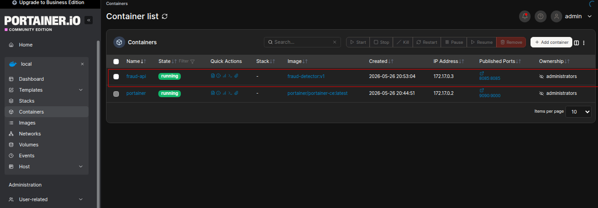
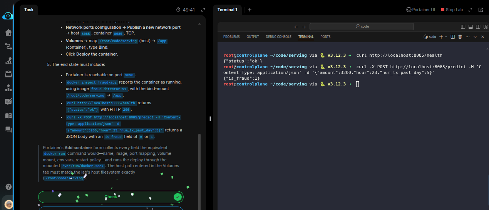

# Task: Containerize an ML Model API with Docker

The xFusionCorp Industries ML platform team runs every model-serving container through *Portainer* — the operations layer handles image inspection, container deployment, and runtime logs from a single web console. The `fraud-detector:v1` image has been built and Portainer is already running on port `9090`. Your task is to deploy the serving container named `fraud-api` through the Portainer UI, bind-mount the pre-staged `/root/code/serving/` directory so the container finds `app.py` and `model.pkl,` publish host port `8085`, and confirm `/health` + `/predict` answer on the host.

1. Portainer is already running on port `9090`. The Portainer UI button at the top of the lab opens the login page. Admin credentials: username `admin`, password `xFusionCorp2026`! (pre-initialised at startup so the first visit lands on the login screen, not the setup wizard).

2. The project layout under `/root/code/serving/`:

  - app.py – FastAPI app loading /app/model.pkl and exposing /health + POST /predict. Correct.
  - Dockerfile – python:3.11-slim + fastapi + uvicorn + joblib + sklearn, EXPOSE 8085, CMD ["uvicorn", "app:app", ...]. Correct.
  - model.pkl – RandomForest trained at startup.

3. The image `fraud-detector:v1` has already been built from the *Dockerfile*. `docker images` `fraud-detector:v1` confirms it. The container will bind-mount `/root/code/serving/ → /app` so the same image picks up new `app.py` or `model.pkl` versions on restart.

4. From the Portainer **UI button**:

  - Log in with `admin` / `xFusionCorp2026!`.
  - Select the *local* environment.
  - Navigate to *Containers → Add container*.
  - Name: `fraud-api`.
  - Image: `fraud-detector:v1` (local daemon image – Type the name or pick from the dropdown).
  - Network ports configuration → Publish a new network port → host `8085`, container `8085`, `TCP`.
  - Volumes → map `/root/code/serving` (host) → `/app` (container), type `Bind.`
  - Click Deploy the container.

5. The end state must include:

  - Portainer is reachable on port `9090`.
  - `docker inspect fraud-api` reports the container as running, using image `fraud-detector:v1`, with the bind-mount `/root/code/serving → /app`.
  - `curl http://localhost:8085/health` returns `{"status":"ok"}` with HTTP `200`.
  - `curl -X POST http://localhost:8085/predict -H 'Content-Type: application/json' -d '{"amount":3200,"hour":23,"num_tx_past_day":5}'` returns a JSON body with an `is_fraud` field of `0` or `1`.

> Portainer's Add container form collects every field the equivalent docker run command would—name, image, port mapping, volume mount, env vars, restart policy—and runs the deploy through the mounted /var/run/docker.sock. The host path entered in the Volumes tab must match the lab's host filesystem exactly (/root/code/serving).

---

# Solution:

- This task deals with [Portainer](https://docs.portainer.io/user/docker/containers).

The task is to deploy the model-serving container through Portainer so that deployments and logs are managed from a central web console. The `fraud-detector:v1` image is already built and available in the lab environment. Deploy the container via the Portainer web UI, which runs on port `9090`.

- First, verify the image is available with `docker images`:

- Next, open the Portainer UI by clicking the button at the top right and log in with the credentials: username `admin`, password `xFusionCorp2026!`.

- Create a new local environment in Portainer and define the required parameters for deploying the container as described in **step 4** of the task.
  - Select the `local` enviornment from the UI:

  - From the `local` enviornment, select the **Containers** from the left menu.

  - Click **Add container**

  - Fill the form with the values provided in **Step 4**

  - Add the Ports and volumes and click **Deploy the container**

  - Verify that the deployed container is in *running* state

- Once the container is deployed, return to the lab terminal and confirm by curling the `/health` and `/predict` endpoints.

- After receiving the expected responses from the curl queries, hit **Check** to complete the task.
