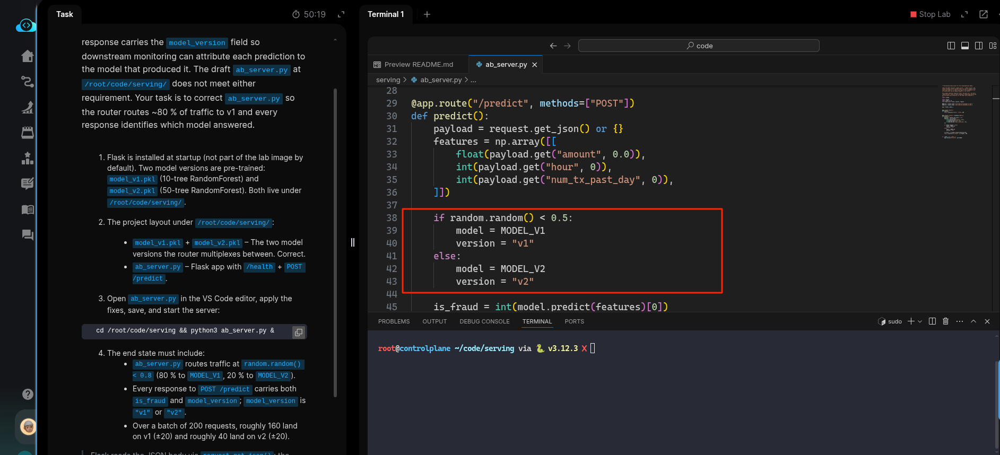
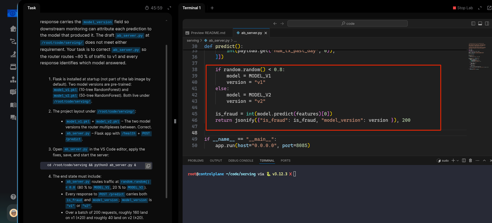
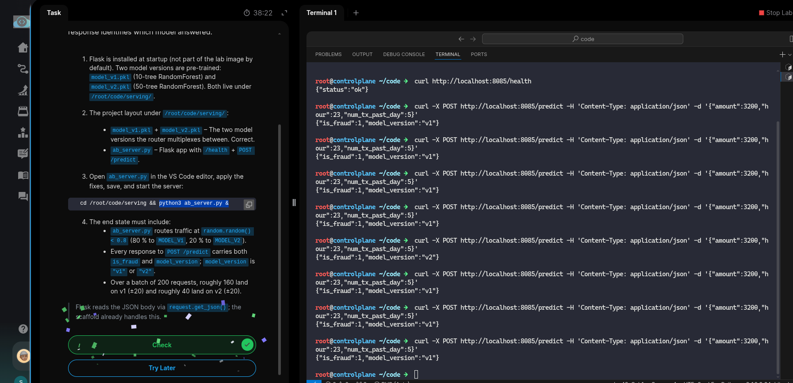

# Task:  Implement A/B Testing for Model Deployment


The xFusionCorp Industries ML platform team rolls a new fraud-detection model into production behind an A/B router. Traffic is split between the stable `MODEL_V1` (80 %) and the candidate `MODEL_V2` (20 %), and every response carries the `model_version` field so downstream monitoring can attribute each prediction to the model that produced it. The draft `ab_server.py` at `/root/code/serving/` does not meet either requirement. Your task is to correct `ab_server.py` so the router routes ~80 % of traffic to v1 and every response identifies which model answered.


1. Flask is installed at startup (not part of the lab image by default). Two model versions are pre-trained: `model_v1.pkl` (10-tree RandomForest) and `model_v2.pkl` (50-tree RandomForest). Both live under `/root/code/serving/`.

2. The project layout under `/root/code/serving/`:

  - `model_v1.pkl` + `model_v2.pkl` – The two model versions the router multiplexes between. Correct.
  - `ab_server.py` – Flask app with `/health` + POST `/predict.`

3. Open `ab_server.py` in the VS Code editor, apply the fixes, save, and start the server:

```
   cd /root/code/serving && python3 ab_server.py &
```

4. The end state must include:

  - `ab_server.py` routes traffic at `random.random() < 0.8` (80 % to `MODEL_V1`, 20 % to `MODEL_V2`).
  - Every response to POST /predict carries both `is_fraud` and `model_version;` `model_version` is "`v1`" or "`v2`".
  - Over a batch of 200 requests, roughly 160 land on v1 (±20) and roughly 40 land on v2 (±20).
  - Flask reads the JSON body via `request.get_json()`; the scaffold already handles this.

---

# Solution:

- We need to fix the `./serving/ab_server.py` to route the requests as required: 80% to `MODEL_V1` and 20% to `MODEL_V2`

- We enter the `./serving` directory and inspect the `ab_server.py` in VSCode. We see that currently the `random.randon()` is configured to route to
`MODEL_V1` 50%, and rest to `MODEL_V2`. We can also see that the JSON reponse currently only sends the `is_fraud` value and no `mode_version`.




- Update the `if`- `else` block per our requirements, and add `model_version` to response in final `return` statement:



- Run the `python3 ab_server.py &` in one terminal, and on other terminal query the `health` and `/predict` endpoints. We can see that maximum
requests are handled by `MODEL_V1` and the reponse contains both the `mode_version`, along with `is_fraud` classification.



Hit **Check**


