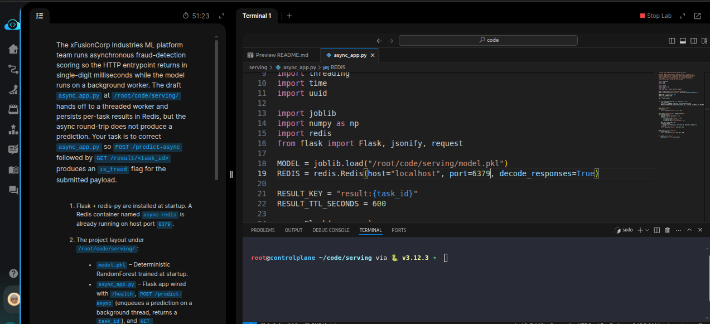
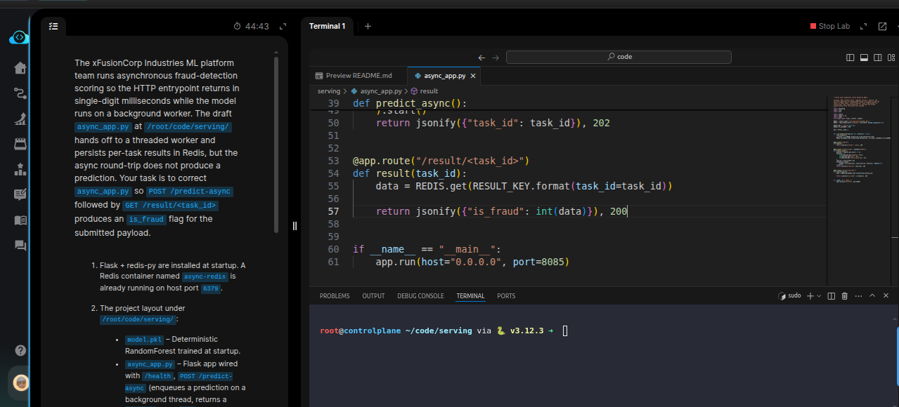
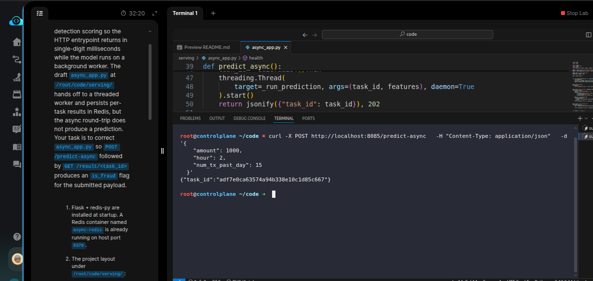
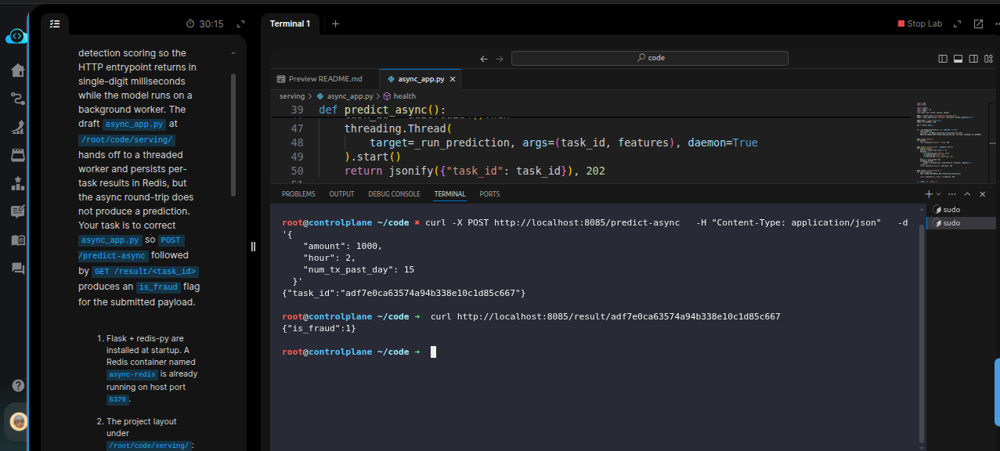

# Task: Implement Async Batch Prediction with Task Queue

The xFusionCorp Industries ML platform team runs asynchronous fraud-detection scoring so the HTTP entrypoint returns in single-digit milliseconds while the model runs on a background worker. The draft `async_app.py` at `/root/code/serving/` hands off to a threaded worker and persists per-task results in Redis, but the async round-trip does not produce a prediction. Your task is to correct `async_app.py` so POST `/predict-async` followed by `GET /result/<task_id>` produces an `is_fraud` flag for the submitted payload.


1. Flask + redis-py are installed at startup. A Redis container named `async-redis` is already running on host port `6379`.

2. The project layout under `/root/code/serving/`:

  - `model.pkl` – Deterministic RandomForest trained at startup.
  - `async_app.py` – Flask app wired with `/health`, `POST /predict-async` (enqueues a prediction on a background thread, returns a `task_id`), and `GET /result/<task_id>` (looks up the stored result).

3. Open `async_app.py` in the VS Code editor, apply the fixes, save, and start the server:

```
   cd /root/code/serving && python3 async_app.py &
```


4. The end state must include:
  - `redis.Redis(host="localhost", port=6379, ...)` in `async_app.py`.
  - `GET /result/<task_id>` reads the stored value from Redis (e.g. `REDIS.get(f"result:{task_id}")`) and returns it as part of the JSON body.
  - `POST /predict-async` returns a JSON body carrying a `task_id`; after a short poll, GET `/result/<task_id>` returns a JSON body carrying an `is_fraud` flag of `0` or `1`.

> The background worker stores results at keys shaped result:<task_id>, with a 600-second TTL.


--- 
# Solution:

- The task is to fix the `/result` endpoint in the `async_app.py` so that the round-trip while invoking the `/result/<task-id>` fetches and returns the predictionsaved in Redis.

- Enter in `./serviing` direfctiory, and inspect the `./async_app.py` in VSCode.

  - At first glance, we could see that the port defined while declaring `REDIS` is wrongly set to `6380` instead of `6379`. We updated that:



- The `REDIS.set()` in `_run_predictions()` on line *30*, sets the `task_id=task_id` correctly. So nothing to update here. We check the
`/result/<task-id>` endpoint definition:

- The `result(task_id)` does not fetch the result from REDIS using `REDIS.get()` and return it in JSON with `jsonify`. We need to fix this:



- Now, we need to make a query to `/predict_async` to get the `task_id`. Start the `async_app.py` in a terminal with

`python3 ./predict_async.py`

- Now from another terminal we query the `/predict-async` endpoint with some json payload for `amount`, `hour`, and `num_tx_per_day` values, and we should get a `task-id` a UUID in this case:



- Now, we can call the `/result` with this `task-id`, and we should expect a JSON response with `is_fraud` classification value:



And we should be good to hit **Check**


