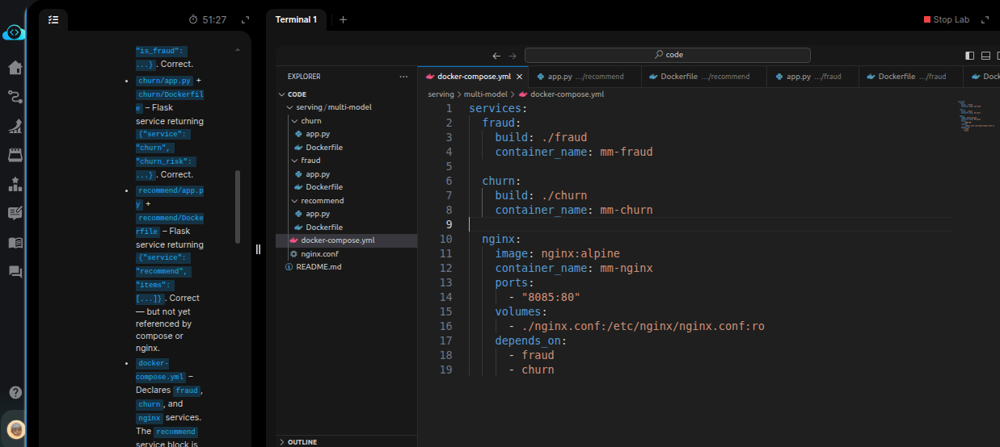
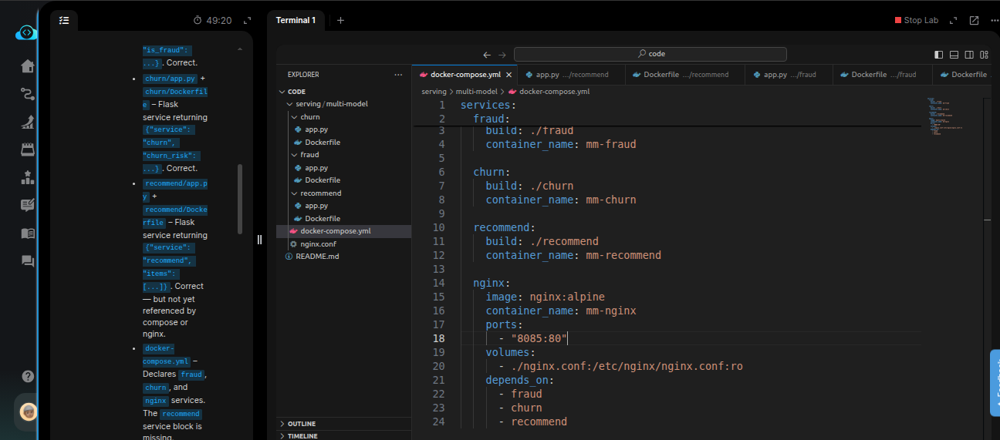
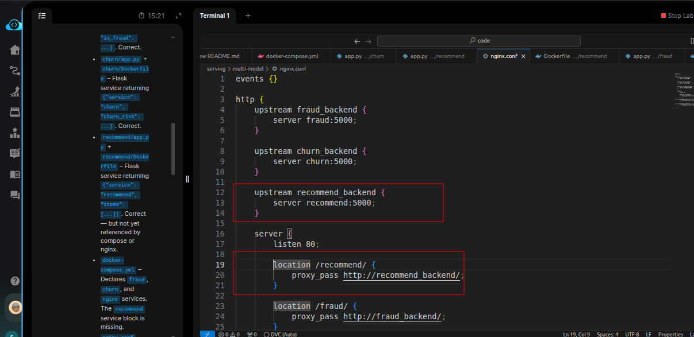
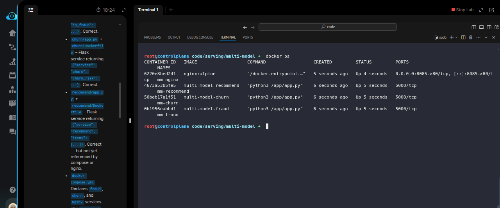
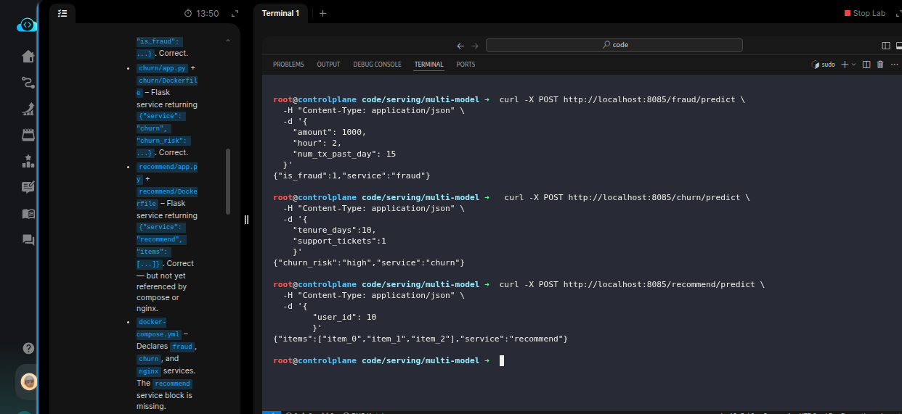

# Task: Serve Multiple Models Behind Unified API Gateway

The xFusionCorp Industries ML platform team serves three fraud-and-customer models behind a single nginx reverse-proxy on port `8085` — `/fraud/`, `/churn/`, and `/recommend/` each route to their own Flask container. The fraud and churn services are already wired end-to-end in `docker-compose.yml` + `nginx.conf`, and the `recommend` service directory is on disk with a working app and Dockerfile. Your task is to add the `recommend` service to the compose file, add its upstream + location block to the nginx configuration, bring the stack up, and confirm every route answers.


1. The Docker daemon is already running. Base images `(python:3.11-slim`, `nginx:alpine`) are being pulled in the background at startup, so the first `docker compose up -d` returns in seconds.

2. The project layout under `/root/code/serving/multi-model/`:


  - `fraud/app.py` + `fraud/Dockerfile` – Flask service returning `{"service": "fraud", "is_fraud": ...}`. Correct.
  - `churn/app.py` + `churn/Dockerfile` – Flask service returning `{"service": "churn", "churn_risk": ...}`. Correct.
  - `recommend/app.py` + `recommend/Dockerfile` – Flask service returning `{"service": "recommend", "items": [...]}`. Correct — but not yet referenced by compose or nginx.
  - `docker-compose.yml` – Declares `fraud`, `churn`, and `nginx` services. The `recommend` service block is missing.
  - `nginx.conf` – Routes `/fraud/` and `/churn/` to their container upstreams. The `recommend` upstream + location block is missing.

3. Edit `docker-compose.yml` and `nginx.conf` to wire in recommend, then `run docker compose up -d` from `/root/code/serving/multi-model/`.

4. The end state must include:

  - `docker-compose.yml` declares a recommend service that builds from `./recommend` and carries `container_name: mm-recommend`.
  - `nginx.conf` declares a recommend upstream (server `recommend:5000`;) and a location `/recommend/` block that proxies to it.
  - `docker compose ps` reports all four containers `(mm-fraud`, `mm-churn`, `mm-recommend`, `mm-nginx`) as Up.
  - `curl -X POST http://localhost:8085/fraud/predict -d '{...}'` returns a JSON body with `"service": "fraud"`.
  - `curl -X POST http://localhost:8085/churn/predict -d '{...}'` returns a JSON body with `"service": "churn"`.
  - `curl -X POST http://localhost:8085/recommend/predict -d '{...}'` returns a JSON body with `"service": "recommend"` and a non-empty items array.

> Model the new entries on the existing fraud and churn blocks—same structure, same naming convention. After editing both files, docker compose up -d reads the new compose entry and builds the recommend image; nginx mounts the updated config from the host filesystem at container start.

---

# Solution:


- The task is to fix the `docker-compose.yml` and add `reccomend` service and wire it up with nginx service. Enter the `./serving/multi-model` directory and inspect
  all the `./app.py` scripts in different service directory and the `docker-compose.yml`.




- We can see that the `recommend` service is missing, we add it 



- `nginx.conf` also needs an update, as need to add t he `upstream` block directing to the `recommend:5000`



- Build the containrs using `docker compose up -d`, and we should see all the containers up and running:



- Now we need to test the different modesl on `/prediction` endpoint. As the task does not provide the JSON palyload for the request, we need to
inspect different `./app.py` for each service and build the JSON payload for the POST request to `*/predict` endpoing. You can use the following
payloads:

```
# /fraud/predict

curl -X POST http://localhost:8085/fraud/predict \
  -H "Content-Type: application/json" \
  -d '{
    "amount": 1000,
    "hour": 2,
    "num_tx_past_day": 15
  }'
```

```
# /churn/predict

 curl -X POST http://localhost:8085/churn/predict \
  -H "Content-Type: application/json" \
  -d '{
    "tenure_days":10,
    "support_tickets":1
    }'
```

```
# /recommend/predict

curl -X POST http://localhost:8085/recommend/predict \
  -H "Content-Type: application/json" \
  -d '{
  	"user_id": 10
  	}'
```


And, we should get a JSON response with `service` name within the response:



Done!, we can hit **Check**


