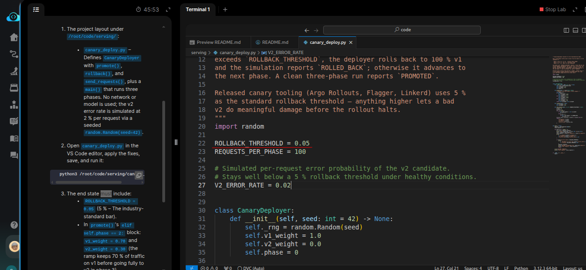
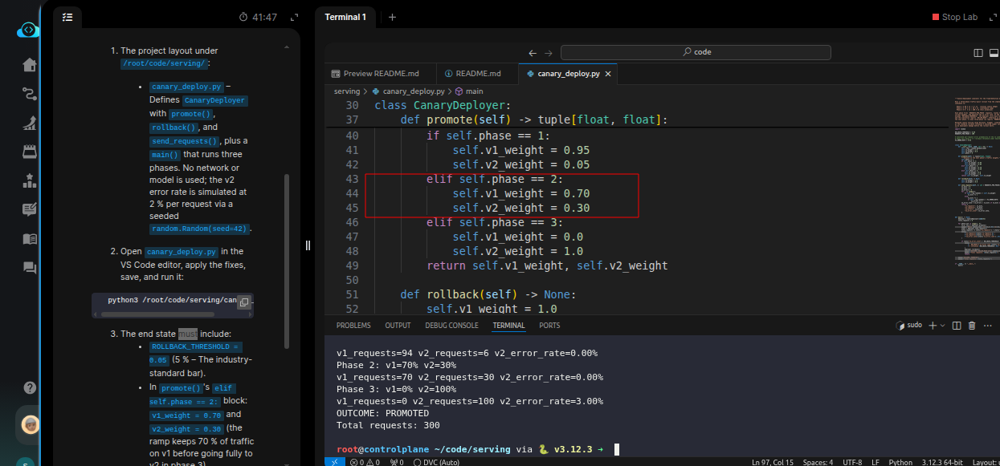
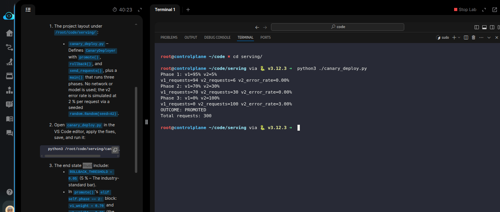

# Task:  Implement Canary Deployment for Model Updates

The xFusionCorp Industries ML platform team rehearses canary rollouts with a pure-Python simulator before wiring the same traffic-split shape into *Argo Rollouts*. The draft `canary_deploy.py` at `/root/code/serving/` runs the three phase-weights `(95/5` → `70/30` → `0/100`) and monitors the `v2` error rate, but it does not currently reflect the release checklist's canary policy. Your task is to correct `canary_deploy.py` so the simulator reflects that policy and completes with `OUTCOME: PROMOTED` under healthy v2 conditions.


1. The project layout under `/root/code/serving/`:

  - `canary_deploy.py` – Defines `CanaryDeployer` with `promote()` `rollback()`, and `send_requests()`, plus a `main()` that runs three phases. No network or model is used; the v2 error rate is simulated at 2 % per request via a `seeded random.Random(seed=42)`.

2. Open `canary_deploy.py` in the VS Code editor, apply the fixes, save, and run it:

```
   python3 /root/code/serving/canary_deploy.py
```


3. The end state must include:

  - `ROLLBACK_THRESHOLD = 0.05` (5 % – The industry-standard bar).
  - In `promote()`'s `elif self.phase == 2:` block: `v1_weight = 0.70` and `v2_weight = 0.30` (the ramp keeps 70 % of traffic on v1 before going fully to v2 in phase 3).
  - Running the script prints three `Phase N:` lines, a `Total requests: 300` line, and ends with `OUTCOME: PROMOTED`.
  - The phase-2 log line shows `v1_requests` > `v2_requests`.


> Argo Rollouts / Flagger / Linkerd all use ~5 % as their default rollback threshold—anything higher lets a broken v2 do meaningful damage before the rollout halts.

---

# Solution:

- The tasks is to fix the traffic-split configured in the `./canary_deploy.py` as follows:

```
  Phase 1 — 95 % v1 / 5 % v2   (initial canary wedge)
  Phase 2 — 70 % v1 / 30 % v2  (confidence ramp)
  Phase 3 — 0  % v1 / 100 % v2 (full promotion)
```

Read the docstring in the `canary_deploy.py`, it mentions the requirements. From the script we can first see that the `ROLLBACK_THRESHOLD` is wrongly
set to `50%` (`0.50`). We correct it by setting it to `0.05`.



Next we see that the conditional split in the script for *Phase 2* is interchanged, v1 should route 70% and 30 % to v2. We correct that as well.
Currently, it shows as follows.

```
        elif self.phase == 2:
            self.v1_weight = 0.30
            self.v2_weight = 0.70
```



- Now, try runing the script and observer the behavior.



We can see that the traffic was routed correctly, and the `OUTCOME: PROMPTED` with 300 requests.

Done! We can hit **Check**.

