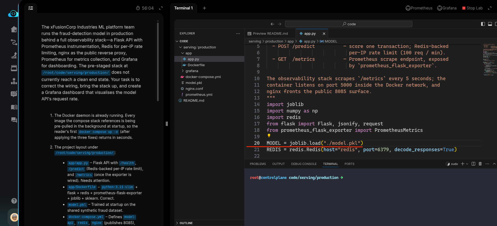
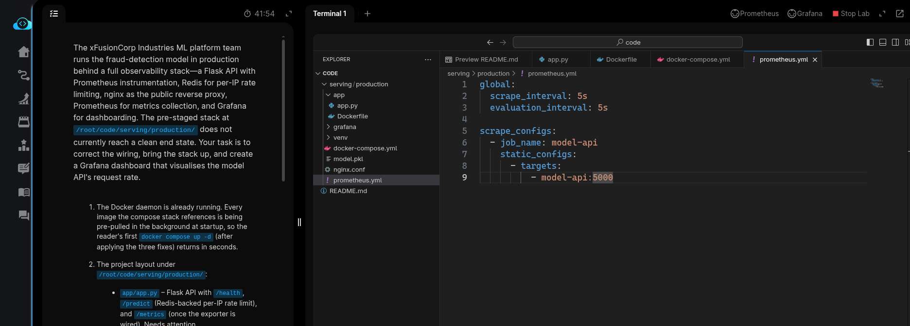
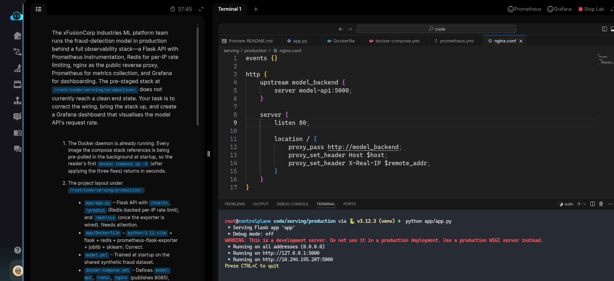
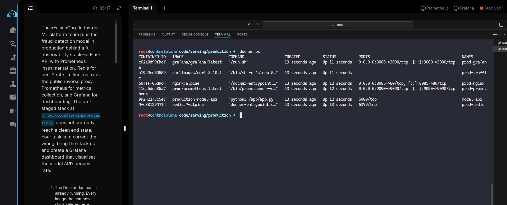
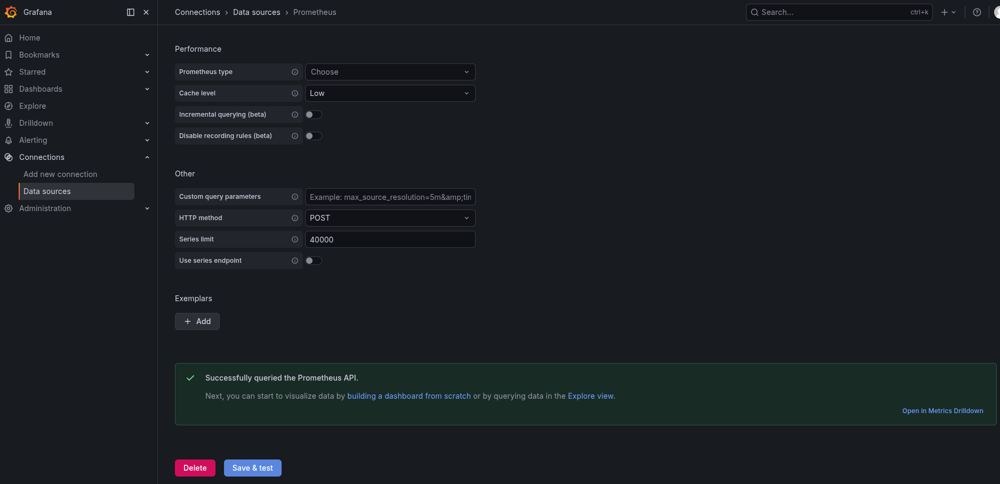
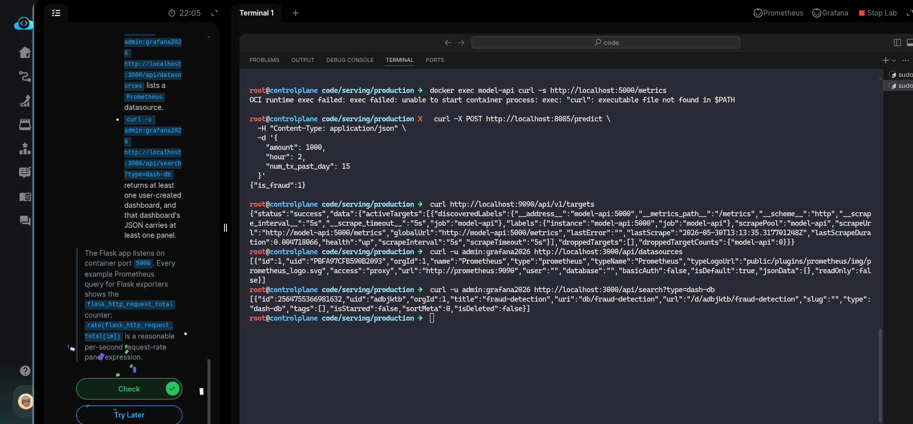

# Task: Production Model Serving with Docker Compose


The xFusionCorp Industries ML platform team runs the fraud-detection model in production behind a full observability stack — a Flask API with *Prometheus* instrumentation, *Redis* for per-IP rate limiting, *nginx* as the public reverse proxy, *Prometheus* for metrics collection, and *Grafana* for dashboarding. The pre-staged stack at `/root/code/serving/production/` does not currently reach a clean end state. Your task is to correct the wiring, bring the stack up, and create a *Grafana* dashboard that visualises the model API's request rate.


1. The Docker daemon is already running. Every image the compose stack references is being pre-pulled in the background at startup, so the reader's first `docker compose up -d` (after applying the three fixes) returns in seconds.

2. The project layout under `/root/code/serving/production/`:

  - `app/app.py` – Flask API with `/health,` `/predict` (Redis-backed per-IP rate limit), and `/metrics` (once the exporter is wired). Needs attention.
  - `app/Dockerfile` – `python:3.11-slim` + flask + redis + prometheus-flask-exporter + joblib + sklearn. Correct.
  - `model.pkl` – Trained at startup on the shared synthetic fraud dataset.
  - `docker-compose.yml` – Defines `model-api`, `redis`, `nginx` (publishes `8085`), `prometheus` (publishes `9090`), `grafana` (publishes `3000`, admin password `grafana2026`), and a traffic-generator sidecar (continuously POSTs to `/predict` so `Grafana` has live request-rate data to plot). Correct.
  - `prometheus.yml` – Scrape config for the `model-api` job. Needs attention.
  - `nginx.conf` – Reverse-proxy config with an upstream model_backend block + location / forwarding every request. Needs attention.
  - `grafana/provisioning/datasources/prometheus.yml` – Pre-provisions a Prometheus datasource pointing at `http://prometheus:9090`, so the reader's Grafana task focuses on dashboard creation.

3. Fix the three wiring issues, bring the stack up with `docker compose up -d` from `/root/code/serving/production/`, then open the Grafana UI button, log in with `admin` / `grafana2026`, and create a dashboard carrying at least one panel that queries the Prometheus datasource.

4. The end state must include:

  - All six containers `(model-api`, `prod-redis,` `prod-nginx`, `prod-prometheus`, `prod-grafana`, `prod-traffic)` are reported running by docker inspect.
  - `curl -s http://localhost:5000/metrics` returns a Prometheus exposition-format body (HTTP 200).
  - `curl -X POST http://localhost:8085/predict -d '{...}'` through nginx returns a JSON is_fraud response.
  - `curl http://localhost:9090/api/v1/targets` reports the model-api job's health as up.
  - `curl -u admin:grafana2026 http://localhost:3000/api/datasources` lists a Prometheus datasource.
  - `curl -u admin:grafana2026 http://localhost:3000/api/search?type=dash-db` returns at least one user-created dashboard, and that dashboard's JSON carries at least one panel.


> The Flask app listens on container port 5000. Every example Prometheus query for Flask exporters shows the flask_http_request_total counter; rate(flask_http_request_total[1m]) is a reasonable per-second request-rate panel expression.

---

# Solution:


- This deals with wiring all the components correctly and bring the complete stack up. There are multiple moving parts to this, to start with we enter
  into the `./serving/production` directrpry, and inspect each file available in vSCode.

- The requirements clearly states, which specific component needs attention:
  - `./app/app.py` needs attention to all the endpoints `/health`, `/predict`, and `/metrics`.
  - `peometheus.yml` which defines the scrape-config for the `model-api` service in docker compose.
  - `nginx.conf` a reverse-proxy defining upstream, and request forwarding.

> Note: cd into the `./serving/production` director. this will be the working directory.

- We start with `./app/app.py`. The first issue we can see is the path defined for `MODEL` on line *20*. It's wronglt pointing at a absolute path, but
  the `model.pkl` is in the `CWD`. We update and look for more.



- In the docstrings it's mentioned that the **/metrics Prometheus scrape endpoint, exposed by `prometheus_flask_exporter`.**. But we do not see
`/metrics` defined or the `PrometheusMetrics()` called in the script which defines the `/metrics` endpoint. We define the `metrics` endpoint on line
*27*, calling the `PrometheusMetrics()`.


- Now we try to run the Flask server with `python3 ./app/app.py`. We see *ModuleNotFoundError*. This enviornment does not have a python virtual
enviornment or a  `requirements.txt` . We need to create a `venv` and install all the required packages.

```
python3 -m venv venv

# Activate the venv
source venv/bin/activate

# Install dependencies
pip install joblib numpy redis prometheus-flask-exporter scikit-learn
```

The Flask server can now run with `python ./app/app.py`

- Next we move to `prometheus.yml`. We can observer that the `model-api` service, which is the Flask app, runs and listnes on port `5000` ( defined in
the `./app/app.py`), but the `prometheus.yml` binds to a different port. We update the port to `5000`.



- Now, to `nginx.conf`. We see the same issue, wrong port assigned to `model-api`, we update the port to `5000`.


- We need to bring up the complete stack and test connectivity and exported metrics on Prometheus and Grafana UI.

Start the Flask server with `python ./app/app.py`



- On a different terminal, we bring up the complete stack using `docker compose up -d`. *We need to enter `./serving/production` on this terminal*.
Once all the containers are built. We confirm if all the *six* containers are up and running with `docker ps`:



- Opent the Grafana UI, and log in with provided username `admin`, and password `grafana2026`. Confirm the default data source *Prometheus*. is up and
  working.



- One condition in the *End state* defines that *at least one user-created dashboard* should be available in Grafana. We create a simple Dashboard
  in Grafana.

- Now, we need to test the required endpoints using `curl` as asked in the *end state in step-4*.

  - `docker exec model-api curl -s http://localhost:5000/metrics`
  
  - The `/predict` endpoint with following JSON payload:

  ```
  curl -X POST http://localhost:8085/predict \
  -H "Content-Type: application/json" \
  -d '{
    "amount": 1000,
    "hour": 2,
    "num_tx_past_day": 15
  }'
  ```

  - `curl http://localhost:9090/api/v1/targets`

  - `curl -u admin:grafana2026 http://localhost:3000/api/datasources`

  - `curl -u admin:grafana2026 http://localhost:3000/api/search?type=dash-db`




Done, hit **Check**

