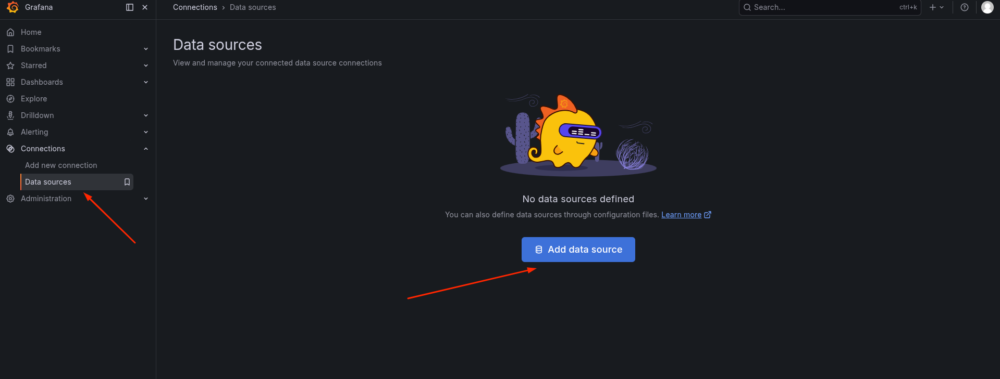
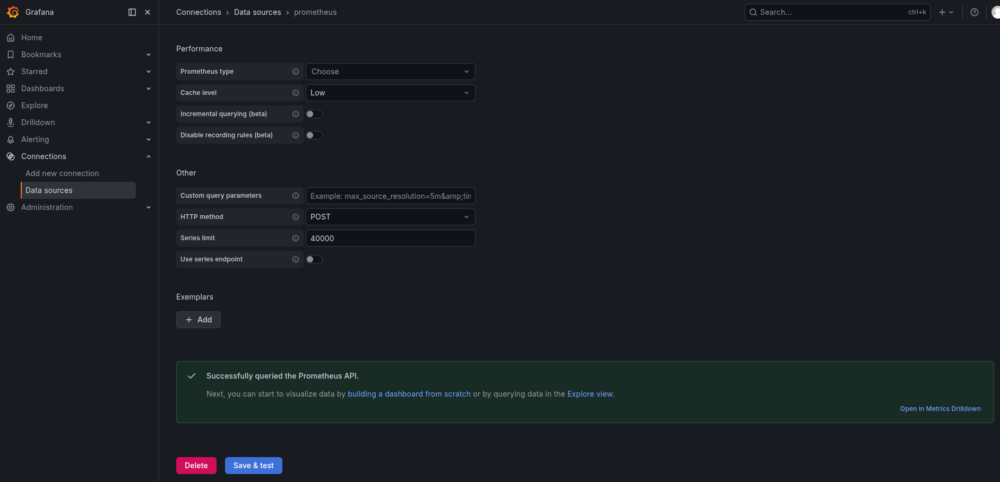
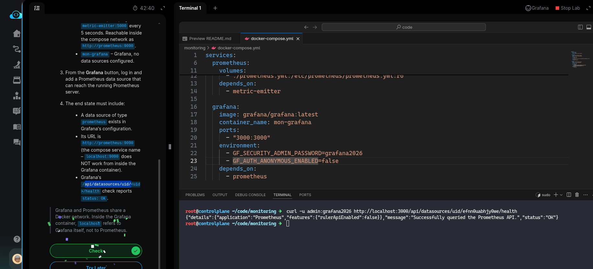

# Task: Add Prometheus as a Grafana Data Source

The xFusionCorp Industries ML platform team is rolling out Grafana-based monitoring for the fraud-detection model. *Prometheus* and *Grafana* are already running in *Docker* alongside a *Flask* metric-emitter that exposes live ML signals — but Grafana has no data source configured yet, so the UI cannot read any of those metrics. Your task is to open Grafana and add the running Prometheus container as a data source through the Grafana UI, so every subsequent Monitoring lab can query it.

w1. The Grafana UI is already running on port `3000`. The Grafana button at the top of the lab opens the login page. Admin credentials: `admin` / `grafana2026`.

2. The stack running under `/root/code/monitoring/` (via docker compose):

  - `metric-emitter` – Flask app exposing `/metrics` with `flask_http_request_total{version}`, `prediction_accuracy`, `data_drift_score{column}`, and `model_inference_duration_seconds` metrics. A background thread nudges the values every 5 seconds so panels built on top see real motion.
  - `mon-prometheus` – *Prometheus*, scraping `metric-emitter:5000` every 5 seconds. Reachable inside the compose network as `http://prometheus:9090`
  - `mon-grafana` – *Grafana*, no data sources configured.

3. From the *Grafana* button, log in and add a *Prometheus* data source that can reach the running *Prometheus* server.

4. The end state must include:

  - A data source of type prometheus exists in Grafana's configuration.
  - Its URL is http://prometheus:9090 (the compose service name – localhost:9090 does NOT work from inside the Grafana container).
  - Grafana's /api/datasources/uid/<uid>/health check reports status: OK.

> Grafana and Prometheus share a Docker network. Inside the Grafana container, localhost refers to Grafana itself, not to Prometheus. 

- This requires to configure *Grafana* with *Prometheus* as Daya Source so every subsequent Monitoring lab can query it. All the containers defined in
  the `./docker-compose.yml` are up and running.

- Open the **Grafana** by clinking the button on the top-righ of the lab. After logging in using the provided credentials. From the left menu select
**Data sources** from the **Connections* tab. 

- Select **Prometheus** from the list of Data sources. On the *settings* page, we need to privide the *Prometheus server URL*. As Prometheus is
running as a container with the same name. The DNS resolution on the Docker network also resolves over the container name. We provide the Server URL
as `http://prometheus:9090`. (Also provided in the *End state* step)

- Leave rest of the fields as it is (to defaults), and click **Save & test** at the end of the form. And, we should see **Successfully queried the
Prometheus API.** message.

- Done, now on the lab terminal curl the `/health` endpoint of the **Grafana** server. Get the `uid` from the Grafana UI in Connections → Data Sources → Prometheus. A `curl` request to grana requires the credentials, the query should contain `curl -u admin:grafana2026 http://localhost:3000/...`

Done!, hit **Check**

