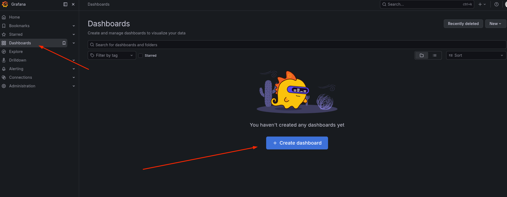
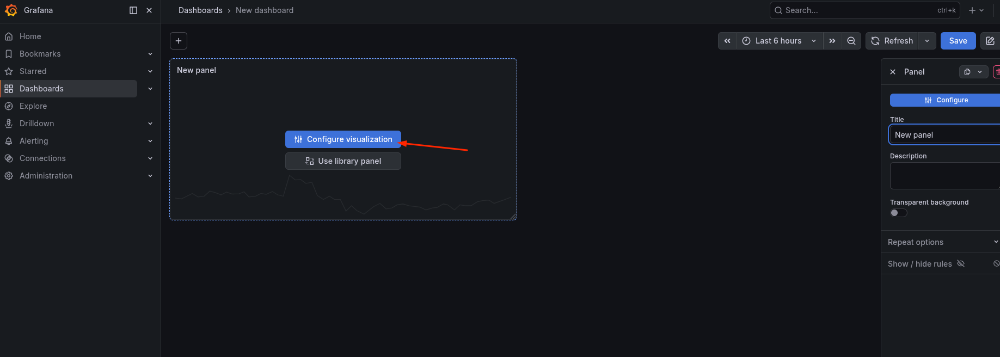
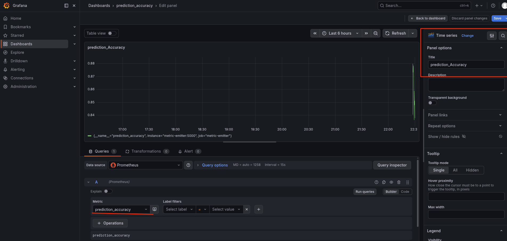
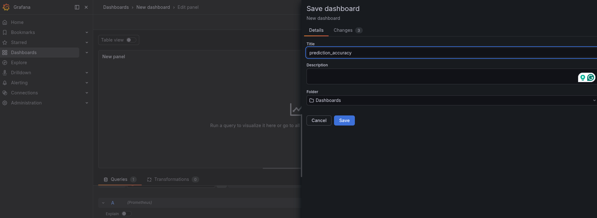
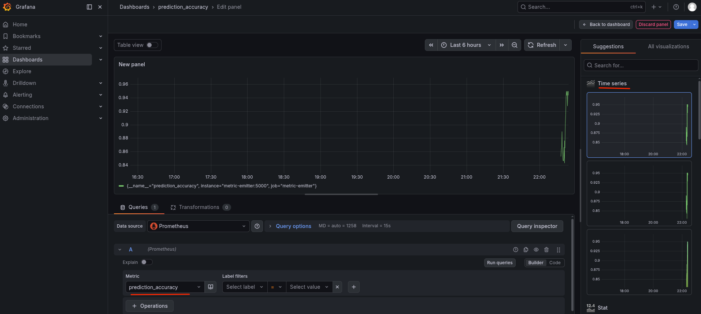
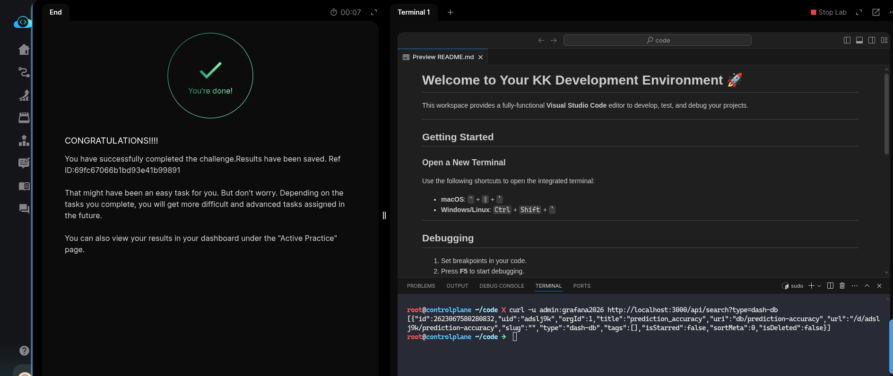

# Task: Generate a Model Performance Report

The xFusionCorp Industries ML platform team tracks the fraud-detection model's rolling prediction accuracy on a *Grafana* dashboard. The monitoring stack is running, the *Flask* metric-emitter exposes `prediction_accuracy` as a gauge, *Prometheus* is scraping it, and *Grafana* already has the *Prometheus* datasource pre-provisioned. Your task is to create a Grafana dashboard with a time-series panel that plots `prediction_accuracy` over time.

1. The Grafana UI is running on port `3000`. The Grafana button opens the login page. Admin credentials: `admin` / `grafana2026`. The Prometheus datasource is already wired (pre-provisioned at startup—no datasource form to fill).

2. Available metrics on the Prometheus datasource include:

  - prediction_accuracy – The gauge for this lab.
  - flask_http_request_total{version, endpoint, method} – Counter.
  - data_drift_score{column} – Per-column drift gauge.
  - model_inference_duration_seconds – Latency histogram.

3. From the Grafana button, log in and create a dashboard with a time-series panel that plots `prediction_accuracy`.

4. The end state must include:

  - Grafana's Data sources list shows a provisioned Prometheus datasource (pre-staged).
  - `GET /api/search?type=dash-db` returns at least one user-created dashboard.
  - That dashboard carries at least one panel whose type is `timeseries`.
  - At least one panel across the reader's dashboards has a *Prometheus* query that references `prediction_accuracy`

---

- We need to create a new Dashboard on the Grafana of type `timeseries` that plots `prediction_acuracy`. Every thing in this lab is already set-up,
and we need to open the Grafana UI and create the Dashboard.

- Follow the steps in the Grafana UI sto setup a new Dashboard of type *Time series*:

- Create a New Dashboard

- Add a *New panel* from the menu on the right

- Configure visualizations

- Set the `metric` as `prediction_accuracy` and `Time series` and visualization

- Save and give the Dashboard a name

- Verify the Dashboard

- `curl` the Grafana to fetch our newly created dashboard.

Done, hit **Check**.

