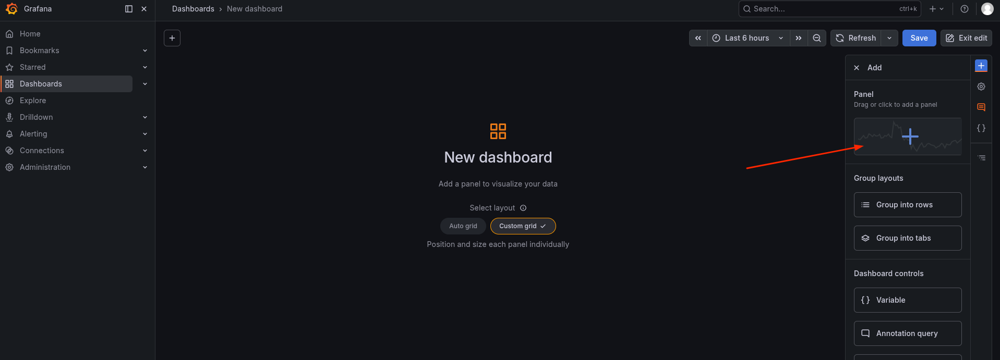
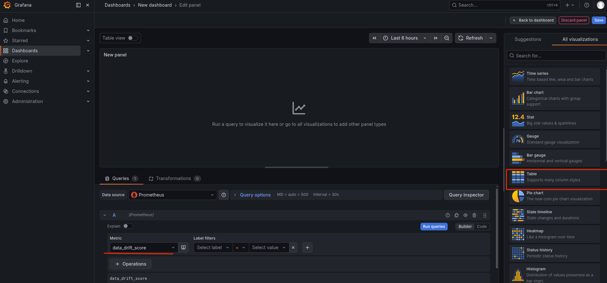
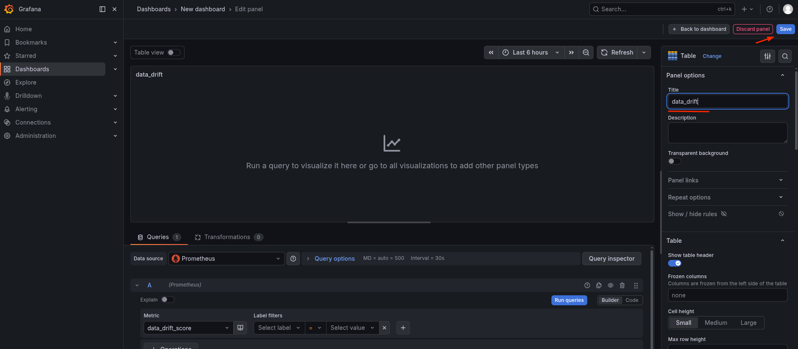
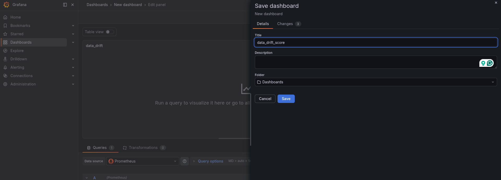
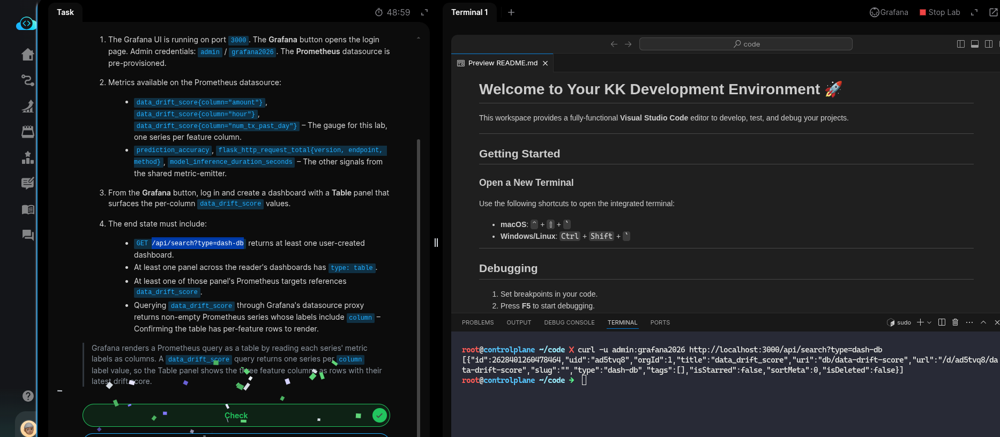

# Task: Generate a Data Quality Report

The xFusionCorp Industries ML platform team tracks per-feature data drift for the fraud-detection model on a *Grafana* table — one row per feature, one column per drift score — so reviewers can scan the whole feature set at a glance. The monitoring stack is running, the Flask metric-emitter exposes `data_drift_score` as a labelled gauge (one time-series per feature), *Prometheus* is scraping, and *Grafana* has the Prometheus datasource pre-provisioned. Your task is to create a Grafana dashboard with a Table panel that surfaces the per-column `data_drift_score` values.

1. The Grafana UI is running on port `3000`. The Grafana button opens the login page. Admin credentials: `admin` / `grafana2026`. The Prometheus datasource is pre-provisioned.

2. Metrics available on the *Prometheus* datasource:

  - `data_drift_score{column="amount"}`, `data_drift_score{column="hour"}`, `data_drift_score{column="num_tx_past_day"}` – The gauge for this lab, one series per feature column.
  - `prediction_accuracy`, `flask_http_request_total{version, endpoint, method}`, `model_inference_duration_seconds` – The other signals from the shared metric-emitter.

3. From the Grafana button, log in and create a dashboard with a Table panel that surfaces the per-column data_drift_score values.

4. The end state must include:

  - GET /api/search?type=dash-db returns at least one user-created dashboard.
  - At least one panel across the reader's dashboards has type: table.
  - At least one of those panel's Prometheus targets references data_drift_score.
  - Querying data_drift_score through Grafana's datasource proxy returns non-empty Prometheus series whose labels include column – Confirming the table has per-feature rows to render.

> Grafana renders a Prometheus query as a table by reading each series' metric labels as columns. A data_drift_score query returns one series per column label value, so the Table panel shows the three feature columns as rows with their latest drift score.

---

# Solution:

- This task involes with creating a new dashboard of Table panel type, that surfaces the per-column `data_drift_score` values.

- Login to Grana UI using the credentials and create a new dashboard

- Create a New panel from the right side menu

- Set the `metrics` as `data_drift_score` and visualization type as **Table**

- Give a name to visualization and save

- Save the dashboard with a name

- Test the dashboard with `curl` on the lab terminal:

Done! Hit **Check**

