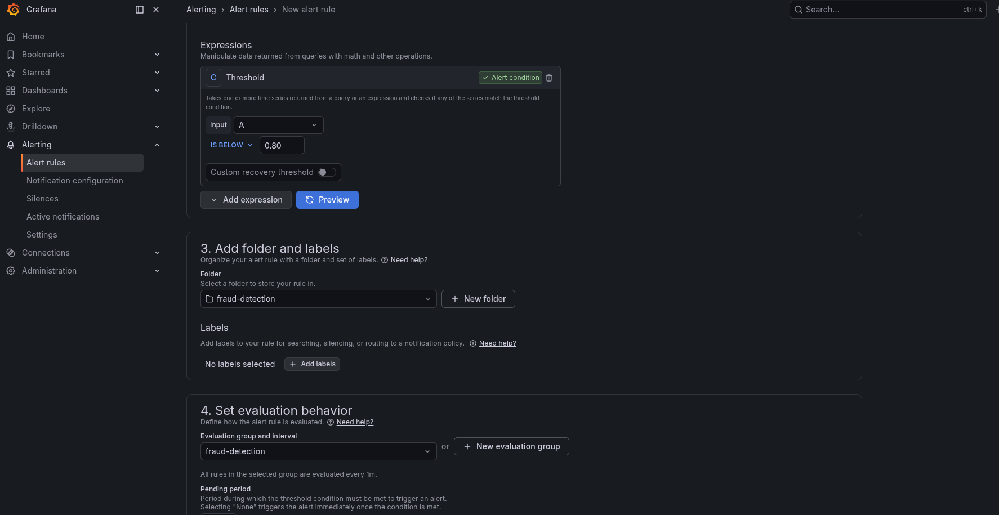
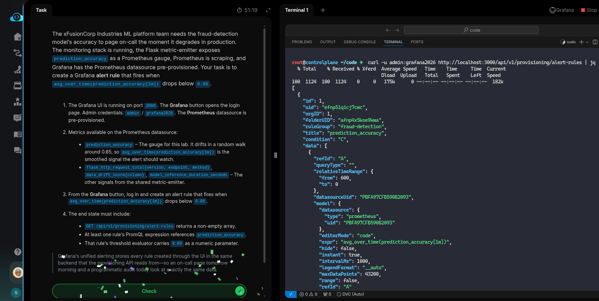

# Task: Create Automated Tests with Evidently Test Suites

The xFusionCorp Industries ML platform team needs the fraud-detection model's accuracy to page on-call the moment it degrades in production. The monitoring stack is running, the Flask metric-emitter exposes `prediction_accuracy` as a *Prometheus* gauge, *Prometheus* is scraping, and Grafana has the Prometheus datasource pre-provisioned. Your task is to create a Grafana alert rule that fires when `avg_over_time(prediction_accuracy[1m])` drops below `0.80`.

1. The Grafana UI is running on port `3000`. The Grafana button opens the login page. Admin credentials: `admin` / `grafana2026`. The Prometheus datasource is pre-provisioned.

2. Metrics available on the Prometheus datasource:

  - `prediction_accuracy` – The gauge for this lab. It drifts in a random walk around `0.85`, so `avg_over_time(prediction_accuracy[1m])` is the smoothed signal the alert should watch.
  - `flask_http_request_total{version, endpoint, method}`, `data_drift_score{column}`, `model_inference_duration_seconds` – The other signals from the shared metric-emitter.

3. From the Grafana button, log in and create an alert rule that fires when `avg_over_time(prediction_accuracy[1m])` drops below `0.80`.

4. The end state must include:

  - `GET /api/v1/provisioning/alert-rules` returns a non-empty array.
  - At least one rule's PromQL expression references `prediction_accuracy`.
  - That rule's threshold evaluator carries `0.80` as a numeric parameter.

> Grafana's unified alerting stores every rule created through the UI in the same backend that the provisioning API reads from—so an on-call page tomorrow morning and a programmatic audit today look at exactly the same data.

---

# Solution:

- This task requires us to create an alert rule which fires when the value of `avg_over_time(prediction_accuracy[1m])` drops below `0.80`.

- Log in to the Grafana UI using the credentials provided in the description. Create a new alerting rule 

! [add-new-alerting-rule1](./assets/mlops-day70a.png)

- Add the alerting query and condition

- Set the labels and env for the alert

- Set the Contact point for sending alerts as default, and save the alerting rule.

- Verify the alert query is plotted on the screen

- Test if the `alert-rule` endpoint returns the newly created alerting rule.

Done! Hit **Check**

