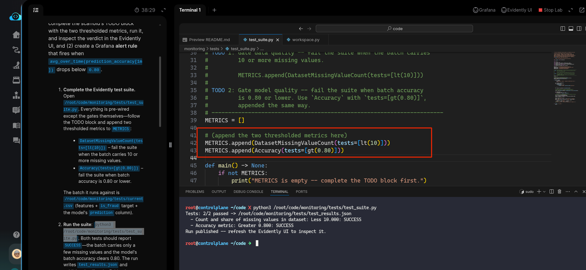
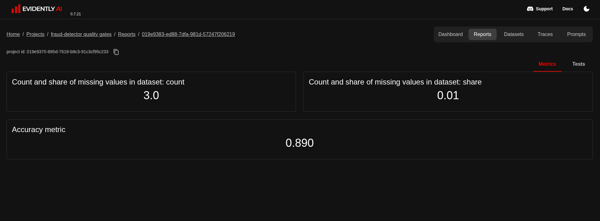
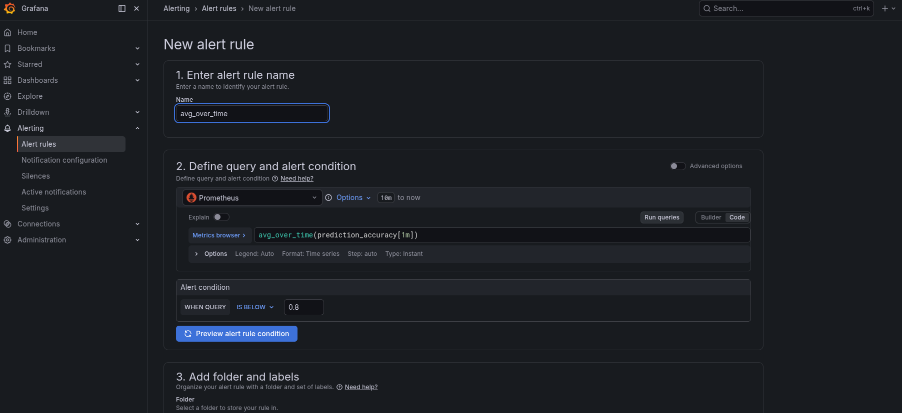
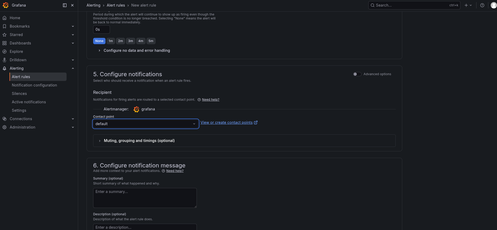
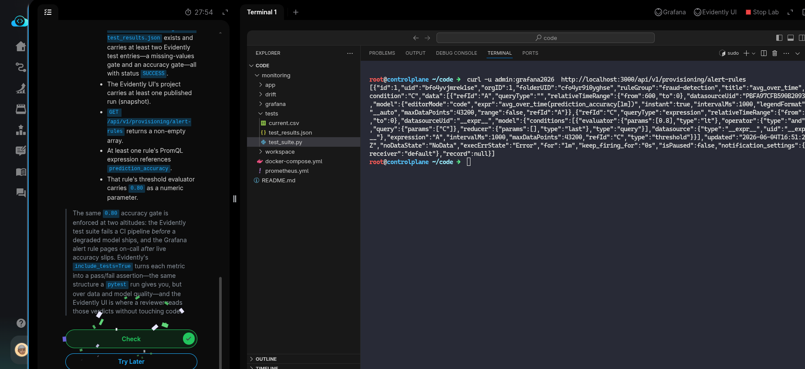

# Task: Create Automated Tests with Evidently Test Suites

The xFusionCorp Industries ML platform team wants the fraud-detection model's quality gates enforced twice: codified as an Evidently test suite that any CI job can run against a production batch, and wired into Grafana so on-call is paged the moment live accuracy degrades. The monitoring stack is running, and the test-suite scaffold is already in place—data loading, classification mapping, report run, and publishing to the Evidently UI are all wired up. Your task has two parts: (1) complete the scaffold's TODO block with the two thresholded metrics, run it, and inspect the verdict in the Evidently UI, and (2) create a Grafana alert rule that fires when `avg_over_time(prediction_accuracy[1m])` drops below `0.80`.

1. Complete the Evidently test suite. Open `/root/code/monitoring/tests/test_suite.py`. Everything is pre-wired except the gates themselves — follow the TODO block and append two thresholded metrics to `METRICS`:

  - `DatasetMissingValueCount(tests=[lt(10)])` – fail the suite when the batch carries 10 or more missing values.
  - `Accuracy(tests=[gt(0.80)])` – fail the suite when batch accuracy is `0.80` or lower.

The batch it runs against is /root/code/monitoring/tests/current.csv (features + is_fraud target + the model's prediction column).

2. Run the suite: `python3 /root/code/monitoring/tests/test_suite.py`. Both tests should report *SUCCESS* — the batch carries only a few missing values and the model's batch accuracy clears `0.80`. The run writes `test_results.json` and publishes itself to the Evidently workspace. Open the Evidently UI button (port `8000`), go to the fraud-detector quality gates project -> Reports -> View on your run, and inspect the pass/fail verdicts on the Tests tab (the Metrics tab carries the raw numbers).

3. Create the Grafana alert rule. The Grafana UI is running on port `3000`. The Grafana button opens the login page. Admin credentials: `admin` / `grafana2026`. The Prometheus datasource is pre-provisioned. Metrics available:

  - `prediction_accuracy` – The gauge for this lab. It drifts in a random walk around 0.85, so `avg_over_time(prediction_accuracy[1m])` is the smoothed signal the alert should watch.
  - `data_drift_score{column}`, `evidently_drift_share` – Per-feature PSI and the drifted-columns share, computed by the Evidently drift scorer at `/root/code/monitoring/drift/drift_scorer.py.`
  - `flask_http_request_total{version, endpoint, method}`, `model_inference_duration_seconds` – The other signals from the shared metric-emitter.

From the Grafana button, log in and create an alert rule that fires when avg_over_time(prediction_accuracy[1m]) drops below 0.80.

4. The end state must include:

  - `/root/code/monitoring/tests/test_results.json` exists and carries at least two Evidently test entries—a missing-values gate and an accuracy gate—all with status SUCCESS.
  - The Evidently UI's project carries at least one published run (snapshot).
  - `GET /api/v1/provisioning/alert-rules` returns a non-empty array.
  - At least one rule's PromQL expression references prediction_accuracy.
  - That rule's threshold evaluator carries 0.80 as a numeric parameter.

The same `0.80` accuracy gate is enforced at two altitudes: the Evidently test suite fails a CI pipeline before a degraded model ships, and the Grafana alert rule pages on-call after live accuracy slips. Evidently's `include_tests=True` turns each metric into a pass/fail assertion—the same structure a `pytest` run gives you, but over data and model quality—and the Evidently UI is where a reviewer reads those verdicts without touching code.

---

# Solution:

 - There are two sets of tasks to complete:
   - Fix the `./tests/test_suite.py` such that:
     - The test should fail when the batch carries 10 or more missing values.
     - The test should fail when batch accuracy is 0.80 or lower.

   - The next tasks is to create an alert rule which fires when the value of `avg_over_time(prediction_accuracy[1m])` drops below `0.80`.

- Inspect the `./tests/test_suite.py` and read the docstring in the script. We get a hint on setting thresholds. Update the test suite and run it to
see if it passes with SUCCESS:

- Navigate to the Eventually UI and inspect, if the metrics are pushed to the Evidently workspace and navigate to Project -> Reports -> View:

Done, we completed the first task. Now setting up a Grafana Alerting rule.

- Navigate to Grafana UI, and from the left menu select Alerting rules, and create a new Alert rule with PromQL query `avg_over_time(prediction_accuracy[1m])`

- Finally, verify the `/root/code/monitoring/tests/test_results.json` is been generated, and test the `GET /api/v1/provisioning/alert-rules` returns
an non-emty array:

Done! Hit **Check**

