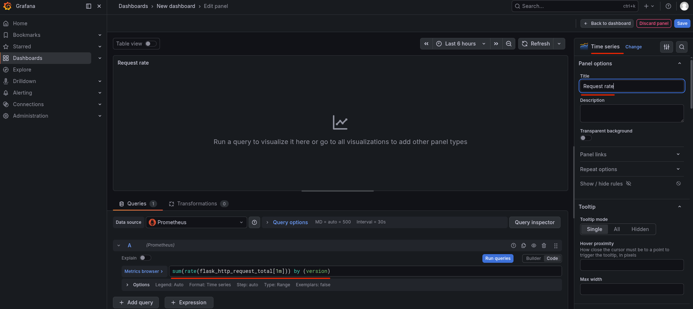
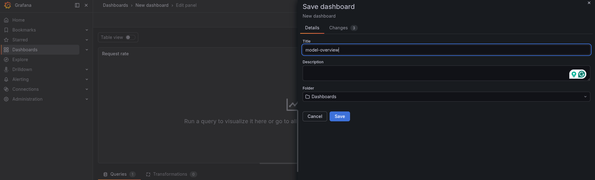
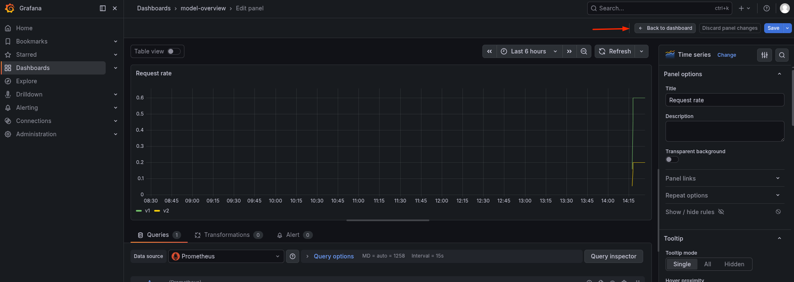
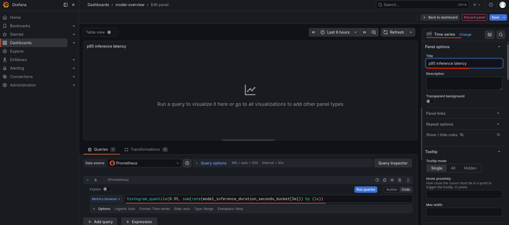
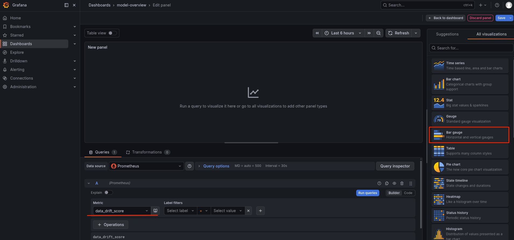
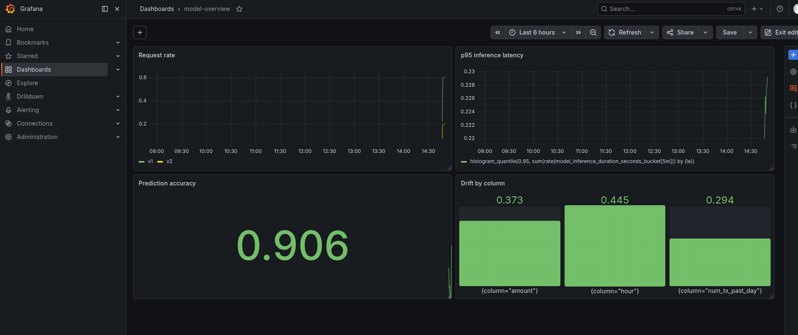
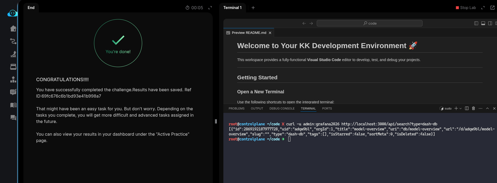

# Task: Set Up Evidently Monitoring Dashboard

The xFusionCorp Industries ML platform team wants one model-overview dashboard in Grafana that surfaces request rate, p95 inference latency, current prediction accuracy, and per-feature drift side-by-side—so the on-call engineer can scan the model's health in a single glance. The monitoring stack is running, the Flask metric-emitter exposes all four signals, Prometheus is scraping, and Grafana has the Prometheus datasource pre-provisioned. Your task is to build a single 4-panel Grafana dashboard that mixes multiple visualization types.

1. The Grafana UI is running on port `3000`. The Grafana button opens the login page. Admin credentials: `admin` / `grafana2026`. The Prometheus datasource is pre-provisioned.

2. The dashboard must contain one panel for each of the four signals below, and mix at least three distinct visualization types across them:

  - Request rate – `sum(rate(flask_http_request_total[1m]))` by (version) as a Time series.
  - p95 inference latency – `histogram_quantile(0.95` `sum(rate(model_inference_duration_seconds_bucket[5m]))` by (le)) as a Time series.
  - Prediction accuracy – `prediction_accuracy` as a Stat.
  - Drift by column – `data_drift_score` as a Bar gauge (one bar per column label).

3. From the Grafana button, log in and build the four-panel dashboard.

4. Cross-check against Evidently's own monitoring dashboard. Open the Evidently UI button (port `8000`) -> `fraud-detector` drift monitoring project -> Dashboard tab: it plots the drifted-columns share and the per-column PSI over time, one point per scoring run (a new run lands roughly every minute). The Reports tab lists the underlying runs—View any of them for the raw numbers behind your Grafana bars. Nothing to configure here; it's the same drift data, seen from Evidently's side.

4. The end state must include:

  - `GET /api/search?type=dash-db` returns at least one user-created dashboard.
  - The dashboard carries 4 or more non-row panels.
  - The panel targets collectively reference `flask_http_request_total`, `model_inference_duration_seconds_bucket`, `prediction_accuracy`, and `data_drift_score`.
  - The panels use at least 3 distinct visualization types (e.g. `timeseries`, `stat`, `bargauge`).
  - The Evidently UI's project keeps accumulating scoring runs (pre-wired—nothing to change).

> The power of a multi-panel dashboard is not just density—it's that each signal answers a different question. Request rate tells you traffic shape, p95 latency tells you tail behavior, accuracy tells you model quality right now, and per-feature drift tells you why quality is shifting. Different questions deserve different visualizations.

---

# Solution:

- The task is to build a single 4-panel Grafana dashboard that mixes multiple visualization types.

- Everythnig is already configured, we just need to open the Grafana UI and set up a dashboard with four panes as follws:
  - *Request rate* – `sum(rate(flask_http_request_total[1m]))` by (version) as a Time series.
  - *p95 inference latency* – `histogram_quantile(0.95` `sum(rate(model_inference_duration_seconds_bucket[5m]))` by (le)) as a Time series.
  - *Prediction accuracy* – `prediction_accuracy` as a Stat.
  - *Drift by column* – `data_drift_score` as a Bar gauge (one bar per column label).

- Create a new Dashboard and add the first panel for `Request rate`:

- Save the dashboard by giving it a name *Model overview* (You can name it anything)

- Clock on the *Back to dashboard* to add a new panel

- Add a new panel for `p95 inference latency`, by adding the query and of visualization type *Time series*

- Add third panel for `prediction_accuracy` metric of *Stat* visualization

- Add the fourth and final panel for `data_drift_score` metric of type *Bar guage*. You can view the drifted columns from the Evidently dashboard:

- Save the panel and click on the dashboard to view the *Model overview* dashboard with all four panels displaying relevant metrics.

- Finally, test using `curl` on `/search` endpoint on a query type `dash-db`. The response should get you one user created dashboard.

Done! Hit **Check**.
