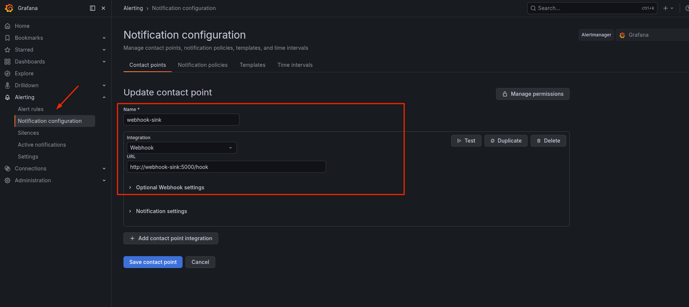
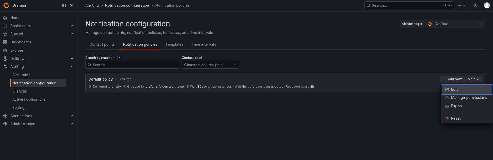
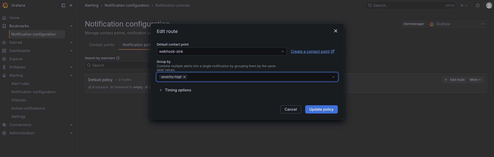
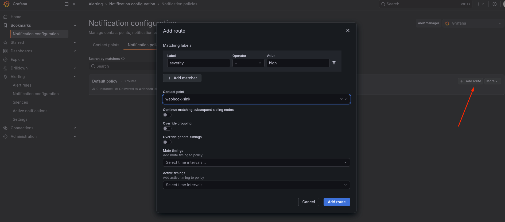
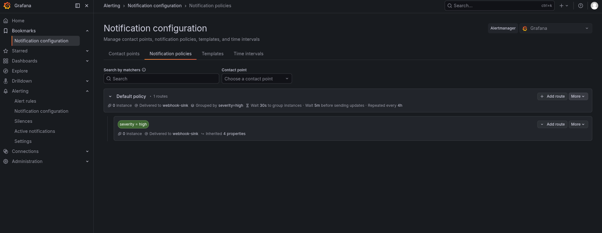
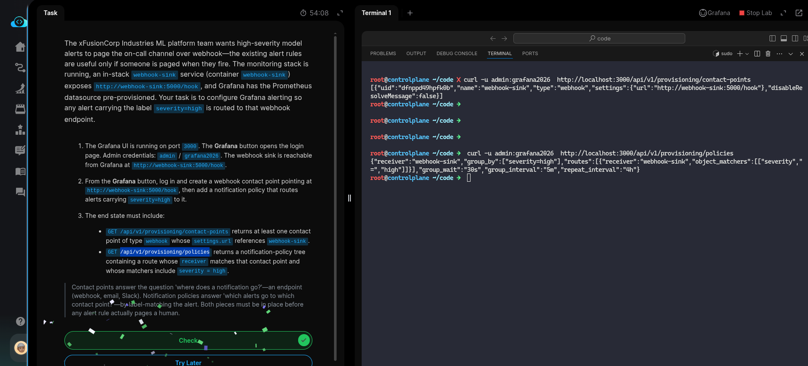

# Task: Set Up Drift Detection Alerts

The xFusionCorp Industries ML platform team wants high-severity model alerts to page the on-call channel over webhook — the existing alert rules are useful only if someone is paged when they fire. The monitoring stack is running, an in-stack `webhook-sink` service (container webhook-sink) exposes `http://webhook-sink:5000/hook`, and *Grafana* has the *Prometheus* datasource pre-provisioned. Your task is to configure Grafana alerting so any alert carrying the label `severity=high` is routed to that webhook endpoint.

1. The *Grafana* UI is running on port `3000`. The Grafana button opens the login page. Admin credentials: *admin* / *grafana2026*. The webhook sink is reachable from Grafana at `http://webhook-sink:5000/hook`.

2. From the Grafana button, log in and create a webhook contact point pointing at `http://webhook-sink:5000/hook`, then add a notification policy that routes alerts carrying `severity=high` to it.

3. The end state must include:

  - `GET /api/v1/provisioning/contact-points` returns at least one contact point of type webhook whose settings.url references webhook-sink.
  - `GET /api/v1/provisioning/policies` returns a notification-policy tree containing a route whose receiver matches that contact point and whose matchers include severity = high.
  
> Contact points answer the question 'where does a notification go?'—an endpoint (webhook, email, Slack). Notification policies answer 'which alerts go to which contact point?'—by label-matching the alert. Both pieces must be in place before any alert rule actually pages a human.

---

# Solution:

- This involes two tasks first is to create a *Alerting Contact point* wwith webhook sink, and the second configuring the [*Notification policy*](https://grafana.com/docs/grafana/latest/alerting/configure-notifications/create-notification-policy/) such that any alert carrying the label `severity=high` is routed to that webhook endpoint at `http://webhook-sink:5000/hook`.

- First we create a Contact point with integration type Webhook and URL `http://webhook-sink:5000/hook` from *Alerting* -> *Notification
configuration* of type *Webhook*, and URL pointing to `http://webhook-sink:5000/hook`.

- Next we add the *Notification policy* wich triggers on a metric with any label of `severity-=high`

- Optionally, edit the grouping policy for the notification and update the *Defult policy*.

- *Add route* to the default policy with label `severity-high` and contact point, and save the route:

- Confirm the route and default policy are aligned with requirements:

- Finally test the `contact-points` and `/policies` endpoints with `curl` from the lab terminal :

Done! Hit **Check**.

