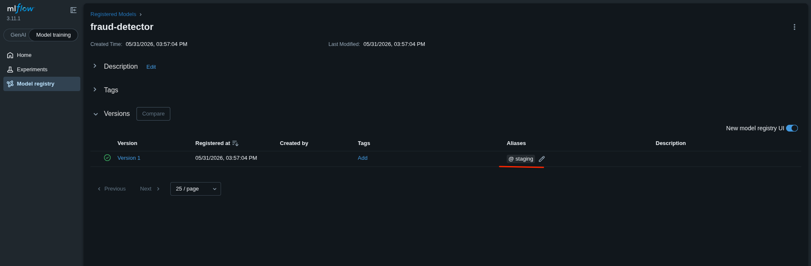
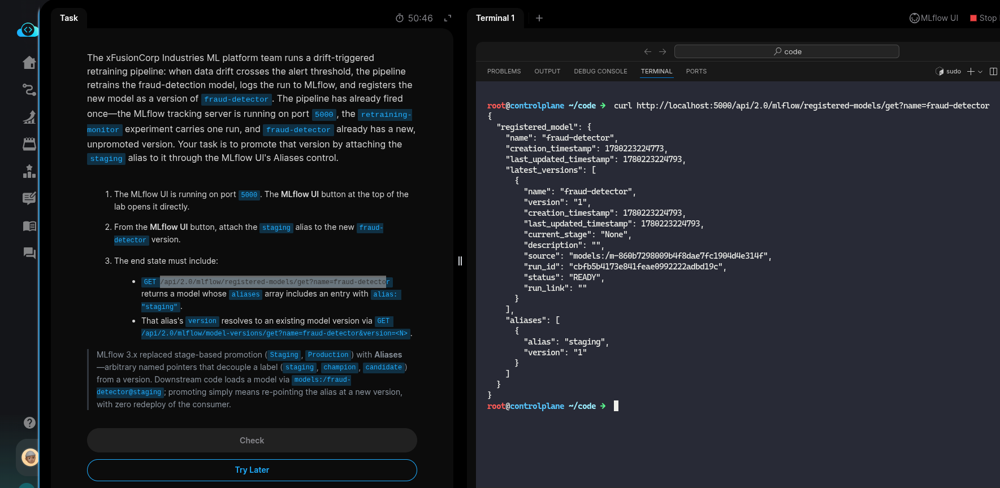
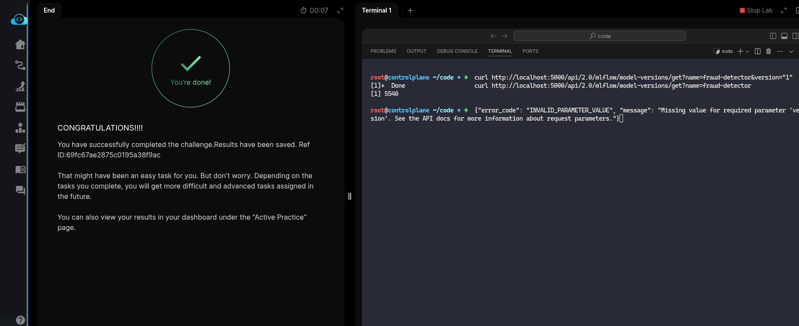

# Task: Automatic Retraining Triggered by Drift Detection

The xFusionCorp Industries ML platform team runs a drift-triggered retraining pipeline: when data drift crosses the alert threshold, the pipeline retrains the fraud-detection model, logs the run to MLflow, and registers the new model as a version of `fraud-detector`. The pipeline has already fired once—the MLflow tracking server is running on port `5000`, the retraining-monitor experiment carries one run, and `fraud-detector` already has a new, unpromoted version. Your task is to promote that version by attaching the staging alias to it through the MLflow UI's Aliases control.

1. The MLflow UI is running on port `5000`. The MLflow UI button at the top of the lab opens it directly.

2. From the MLflow UI button, attach the staging alias to the new `fraud-detector` version.

3. The end state must include:

  - `GET /api/2.0/mlflow/registered-models/get?name=fraud-detector` returns a model whose aliases array includes an entry with `alias: "staging"`.
  - That alias's version resolves to an existing model version via `GET /api/2.0/mlflow/model-versions/get?name=fraud-detector&version=<N>`.

> MLflow 3.x replaced stage-based promotion (Staging, Production) with Aliases—arbitrary named pointers that decouple a label (staging, champion, candidate) from a version. Downstream code loads a model via models:/fraud-detector@staging; promoting simply means re-pointing the alias at a new version, with zero redeploy of the consumer.

---
# Solution:

- This task asks to promote already run retraining model version by attaching the `staging` alias to it through the *MLflow*.

- Login in to the MLFlow UI. Under *Model training* -> *Model registry*, select the model with `Version 1` and add an alias `staging` to it.

- Now, in the lab terminal test the endpoints with curl:

Done!. Hit **Check**.

