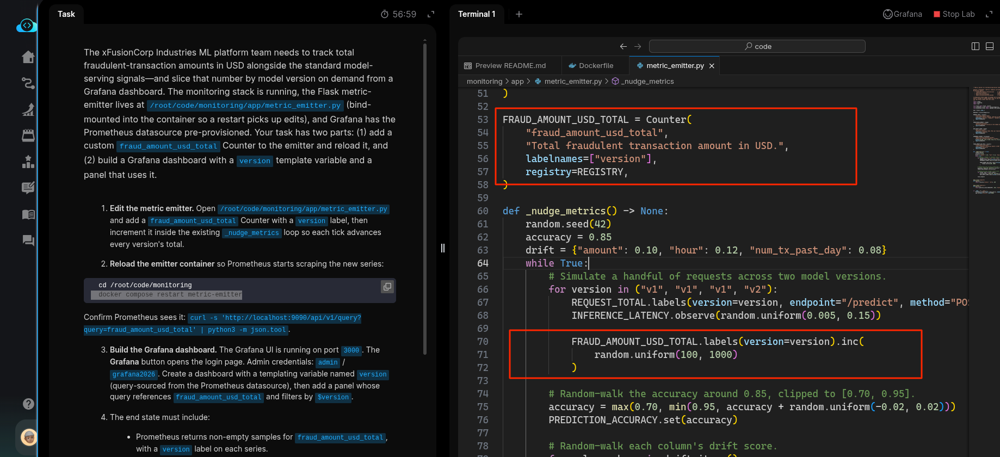
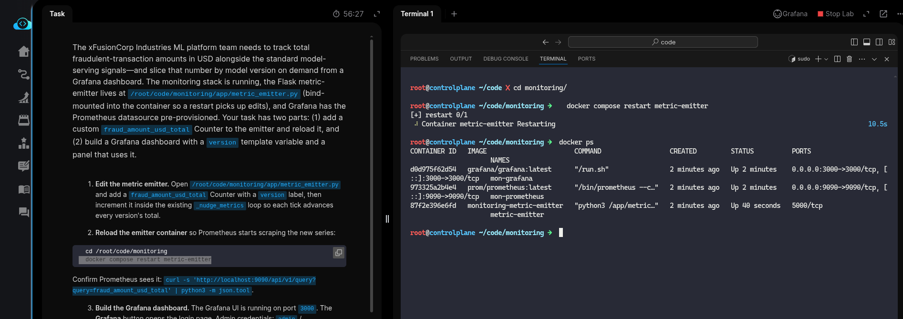
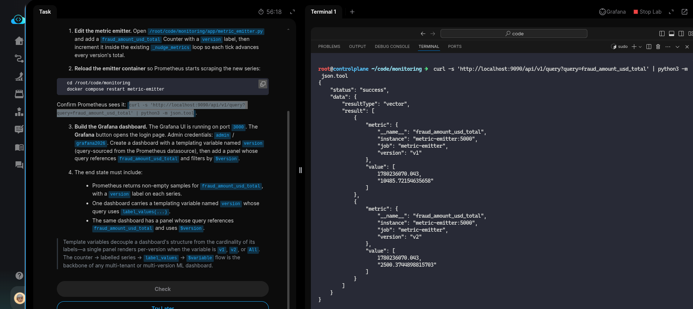
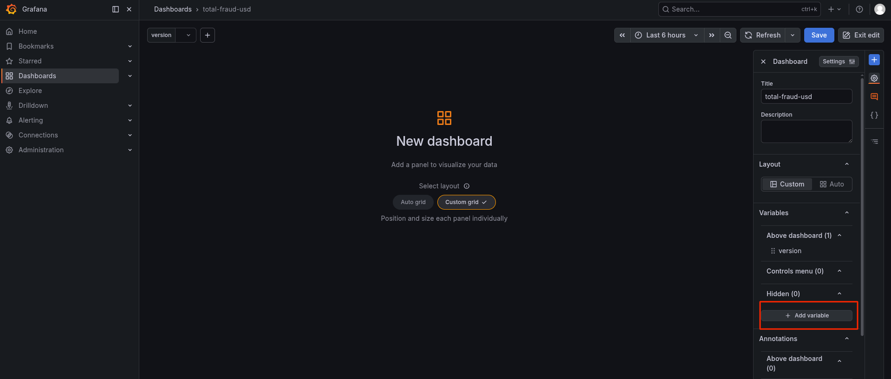
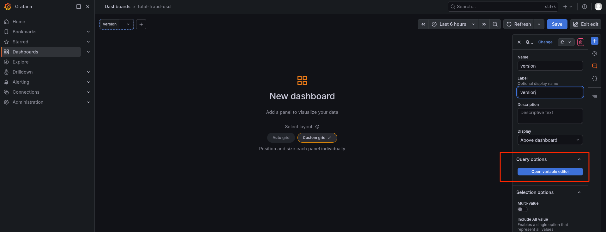
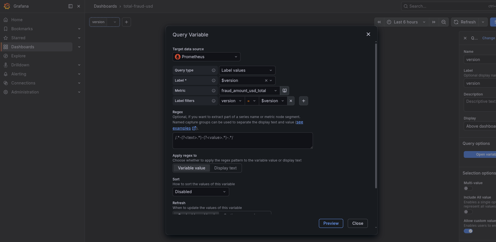
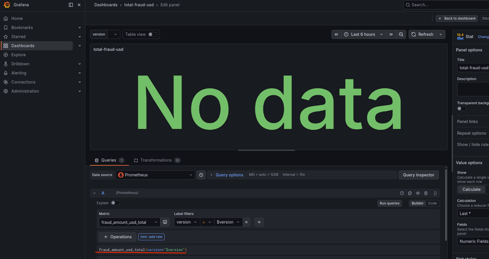

# Task: Monitor Custom Business Metrics Alongside ML Metrics

The xFusionCorp Industries ML platform team needs to track total fraudulent-transaction amounts in USD alongside the standard model-serving signals—and slice that number by model version on demand from a Grafana dashboard. The monitoring stack is running, the Flask metric-emitter lives at `/root/code/monitoring/app/metric_emitter.py` (bind-mounted into the container so a restart picks up edits), and *Grafana* has the *Prometheus* datasource pre-provisioned. Your task has two parts: (1) add a custom fraud_amount_usd_total Counter to the emitter and reload it, and (2) build a Grafana dashboard with a version template variable and a panel that uses it.


1. Edit the metric emitter. Open `/root/code/monitoring/app/metric_emitter.py` and add a `fraud_amount_usd_total` *Counter* with a *version* label, then increment it inside the existing `_nudge_metrics` loop so each tick advances every version's total.

2. Reload the emitter container so Prometheus starts scraping the new series:

```
   cd /root/code/monitoring
   docker compose restart metric-emitter
```


Confirm Prometheus sees it: `curl -s 'http://localhost:9090/api/v1/query?query=fraud_amount_usd_total' | python3 -m json.tool`.

3. Build the *Grafana* dashboard. The Grafana UI is running on port `3000`. The Grafana button opens the login page. Admin credentials: `admin` / `grafana2026`. Create a dashboard with a templating variable named `version` (query-sourced from the Prometheus datasource), then add a panel whose query references `fraud_amount_usd_total` and filters by `$version`.

4. The end state must include:

  - Prometheus returns non-empty samples for `fraud_amount_usd_total,` with a `version` label on each series.
  - One dashboard carries a templating variable named version whose query uses `label_values(...)`.
  - The same dashboard has a panel whose query references `fraud_amount_usd_total` and uses `$version`.


> Template variables decouple a dashboard's structure from the cardinality of its labels—a single panel renders per-version when the variable is `v1`, `v2`, or `All`. The counter -> labelled series -> `label_values` -> `$variable` flow is the backbone of any multi-tenant or multi-version ML dashboard.


---

# Solution:

- We have two tasks with this:
  - add a custom fraud_amount_usd_total Counter to the emitter and reload it
  - build a Grafana dashboard with a version template variable and a panel that uses it.

- Fist, we add a metric named `fraud_amount_usd_total` to the `./metric_emitter.py` and incremnt it inside existing `_nudge_metrics()`:



- After this we need to restart all the containers with `docker compose restart metric-emitter` and we need to confirm if all containers are restarted
  and are in running condition:




- Query the prometheus:9090 and verify `fraud_amount_usd_total` is registered:



- Now, Add a new dashboard with template variable `version` with above registered metric. Open and login to the Grafana UI, and create a new
dashboard.

First create a template variable from the dashboard window:



- Enter the variable configuration dialog





- Add a new panel which shoes `fraud_amount_usd_total` metric


- Query again the Prometheus endpoint and see if `fraud_amount_usd_total` is captured for both the versions:




Done! Hit **Check**

