# Task: End-to-End Monitoring: Prometheus, Grafana, Evidently

The xFusionCorp Industries ML platform team tried to stand up a fresh monitoring stack for the fraud-detection model — metric-emitter + Prometheus + Grafana — but nothing is flowing end-to-end. Grafana renders empty panels, Prometheus's Targets page shows metric-emitter as DOWN, and the emitter's `/metrics` endpoint `404s`. Three wiring bugs are scattered across the stack's configuration. Your capstone task is to find and fix all three, then build a tagged monitoring overview dashboard in Grafana.


1. The stack is at `/root/code/monitoring/` with three services defined in `docker-compose.yml`:

  - `metric-emitter` – Flask exporter (Python source bind-mounted).
  - `mon-prometheus` – Port `9090`.
  - `mon-grafana` – Port `3000`, `admin` / `grafana2026`. The Prometheus datasource is provisioned on boot.

2. Diagnose and fix the three integration bugs. Symptoms to chase back to their source files:

  - `metric-emitter's` `/metrics` endpoint returns `404`.
  - `Prometheus`'s Targets page lists `metric-emitter` as `DOWN`.
  - Grafana renders empty panels even when Prometheus has fresh samples.

Each bug lives in exactly one file under `/root/code/monitoring/` (`app/metric_emitter.py`, `prometheus.yml`, or `grafana/provisioning/datasources/prometheus.yml`).

3. Reload the affected services so the configs take effect:

```
   cd /root/code/monitoring
   docker compose restart metric-emitter prometheus grafana
```

4. Build a tagged monitoring-overview dashboard. The Grafana UI is running on port `3000`. The Grafana button opens the login page. Admin credentials: `admin` / `grafana2026`.

  - Navigate to Dashboards -> New -> New dashboard.
  - Add three panels – One each for `request rate`, `p95 inference latency` and `prediction accuracy` (or similar signals from the shared metric-emitter).
  - Save dashboard (disk icon). In the save dialog, set a title (e.g. `Monitoring overview`) and add at least one tag (e.g. `mlops` or `monitoring`) so the ops team can find it from the Dashboards search.

5. The end state must include:

  - `docker exec metric-emitter curl -sf http://localhost:5000/metrics` returns HTTP `200`.
  - *Prometheus* `GET /api/v1/targets` lists the `metric-emitter` job with health: "up".
  - *Grafana* `GET /api/datasources` shows the Prometheus datasource URL ending in :9090.
  - One user-created dashboard has 3 or more panels and at least one tag.

> A monitoring stack is only as useful as its weakest link. Each of these three bugs is silent on its own—none of them crashes a container—but together they cost you every metric Grafana would otherwise surface. The capstone is reading failure symptoms back to their config file, not retyping Python.

---
  # Solution:

- This involves fixing issues existing issues in the pipline. The description explictly says the issues are confined to:
    - `metric-emitter's` `/metrics` endpoint returns `404`.
    - `Prometheus`'s Targets page lists `metric-emitter` as `DOWN`.
    - Grafana renders empty panels even when Prometheus has fresh samples.

Each bug lives in exactly one file under `/root/code/monitoring/` (`app/metric_emitter.py`, `prometheus.yml`, or `grafana/provisioning/datasources/prometheus.yml`).

- Enter the `monitoring` directory, and start with we test the curent behaviour by testing the endpoint with `docker exec metric-emitter curl -sf --head http://localhost:5000/metrics`. We get an `404` response. Inspect the `./app/metric_emitter.py` in VSCode.

We can see that there is no endpoint `/metrics` defined, but we see that there's one `/prom-metrics` on line 81. We update it to `/metrics`. Now,
after restarting the containers with `docker compose restart metric-emitter prometheus grafana`, we can see that the `/metrics` endpoint responds with `200`.

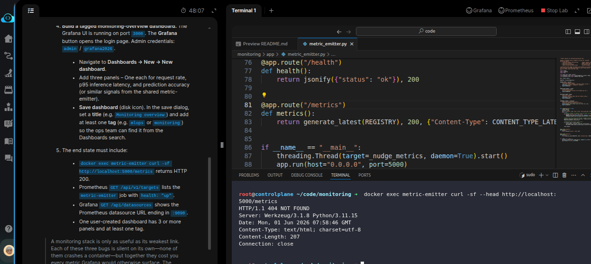

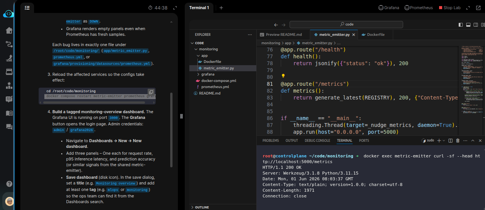

- Now check the `./prometheus.yml` as its showing emtric-emitter as `DOWN`. We can see that the `metric-emitter` port is wronly defined as `8000`.
Correct it to `5000` as defined in `./app/metric_emitter.py`. restart the containers and test the `prometheus` server.


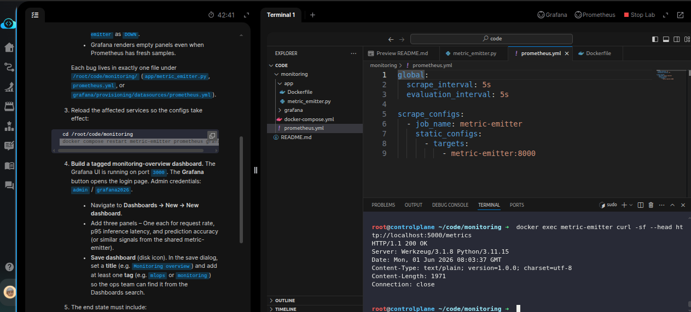

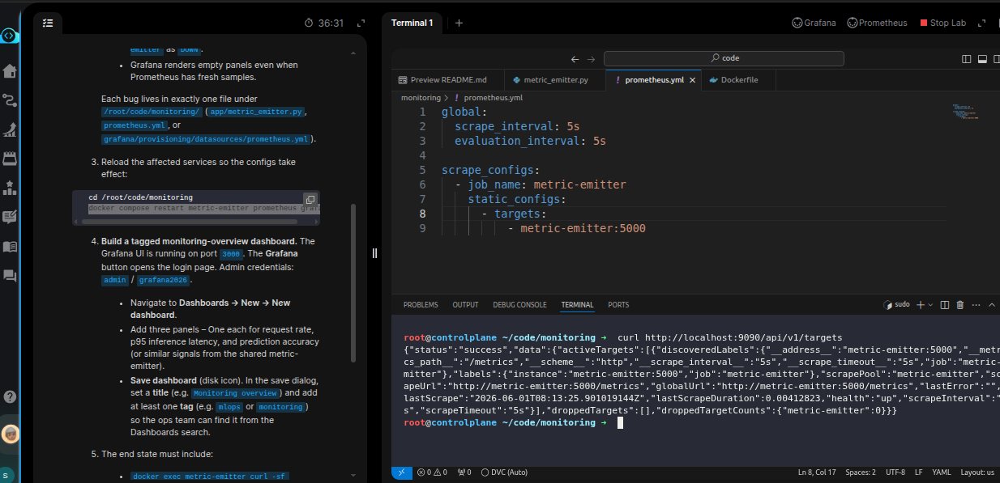

- Next, inspect the `grafana/provisioning/datasources/prometheus.yml` file. We see that the prometheus endpoint here is wronly defined as `9091`.
Correct it to `9090`. Restart the containers, and all the services should be wired up as desired.

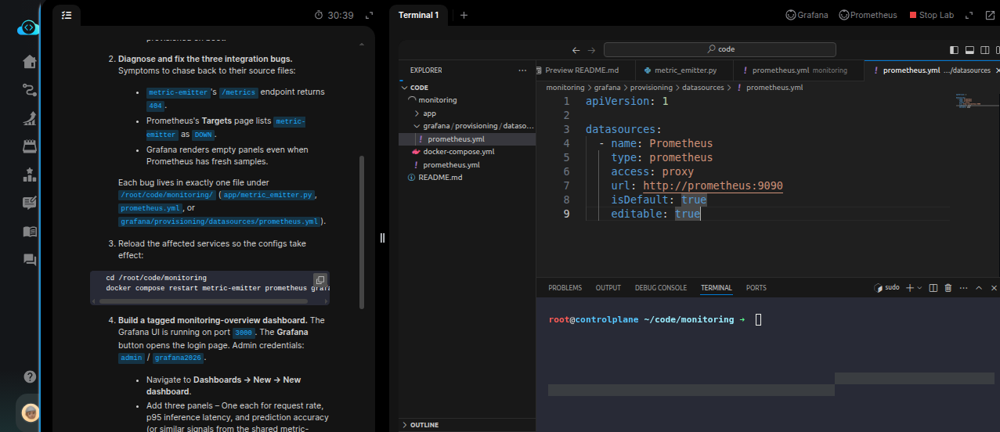

> **NOTE**: Restart all the containers once all the issues are fixed with `   docker compose restart metric-emitter prometheus grafana` command


- Next,we ned to create a Grafana dashboard with three panels, one each for `request rate`, `p95 inference latency`, and `prediction accuracy`. Login
  to Grafana UI and create a new Dashboard.

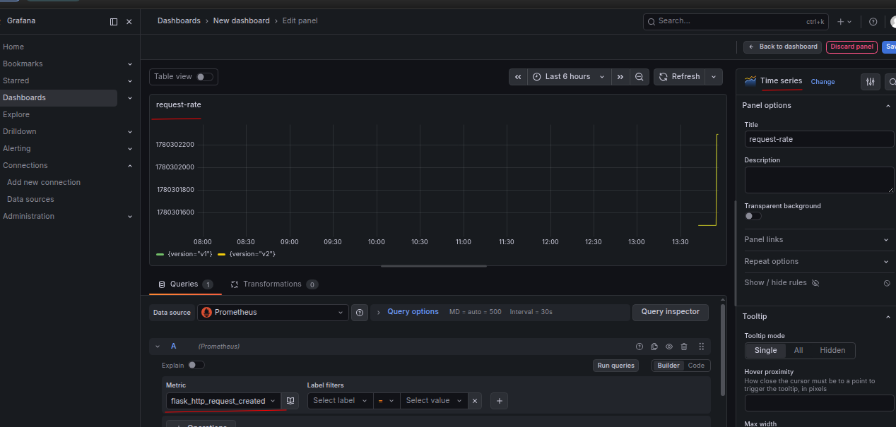

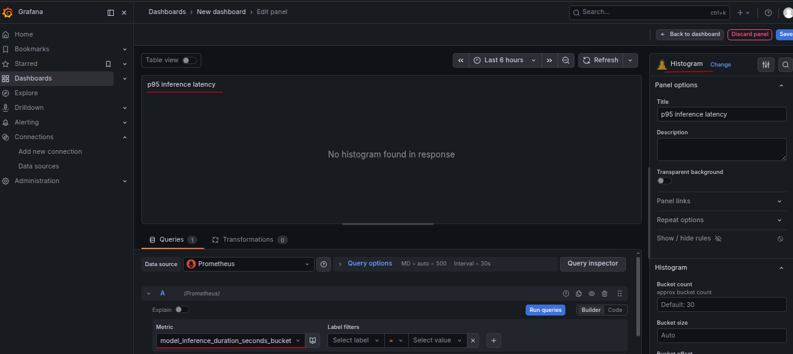

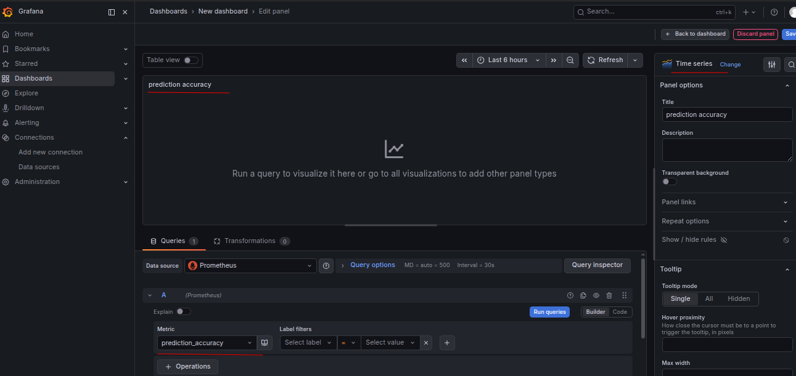

- Once all three panels are created, we need to save the dashboard with `Monitoring overview` as  the name.

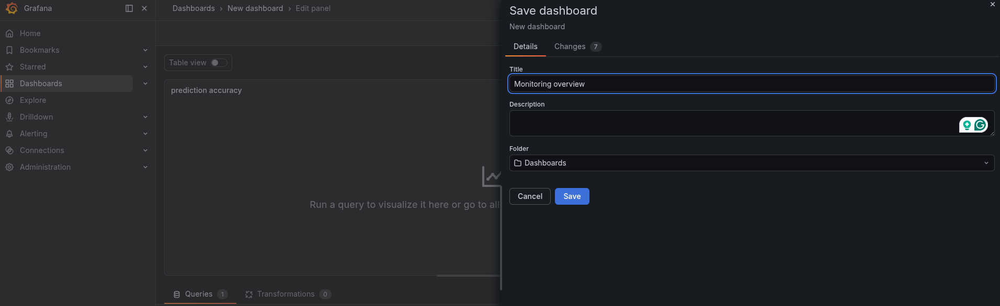

- Tag the Dashboard with either `mlops` or `monitoring`. open the settings page by clicking the gear icon on the dashboard edit page:

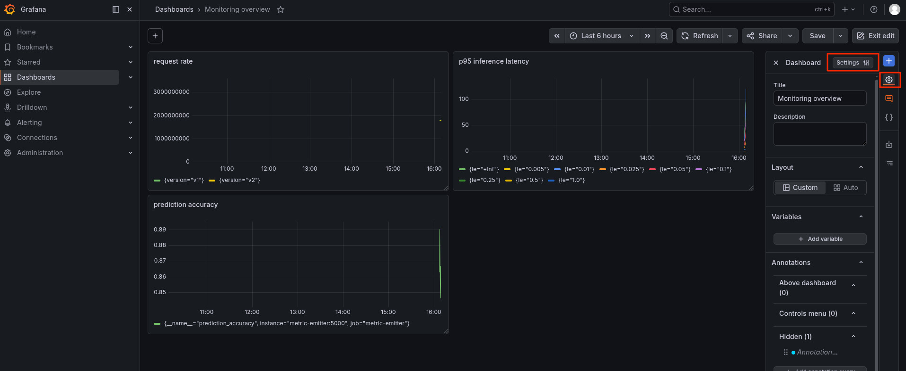

Then add the tag `monitoring` or `mlops` in the **Tags** tab

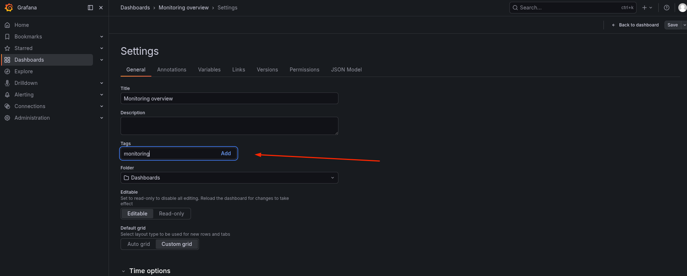

- Navigate to the Dashboard page, and you should see the dashboard with `Monitoring overview` name, and `monitoring` tag.

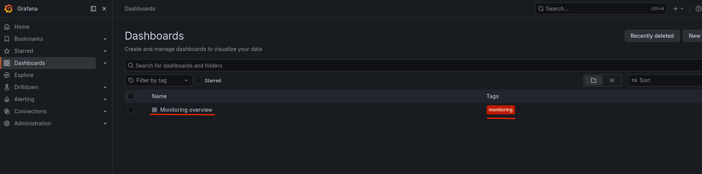


Done! navigae to the lab terminal and hit **Check**.


