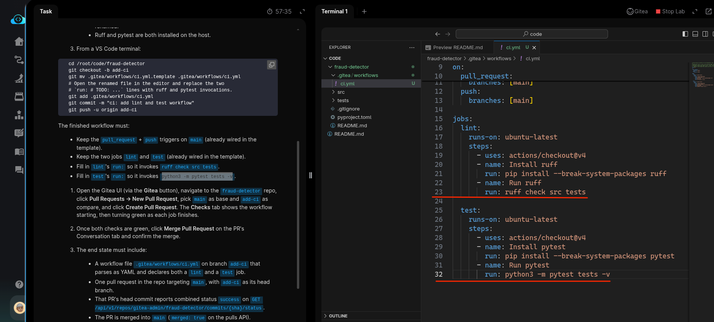
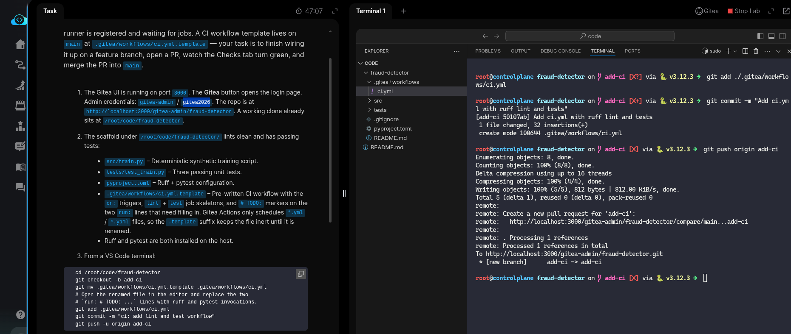
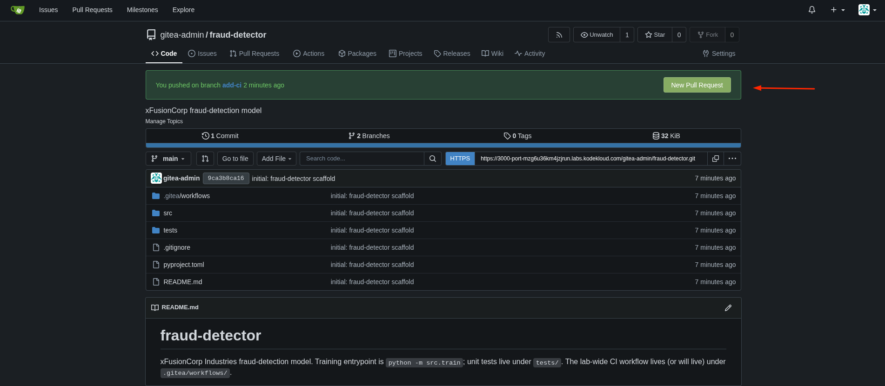
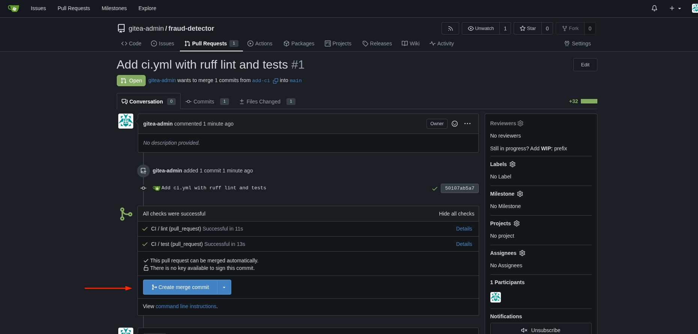
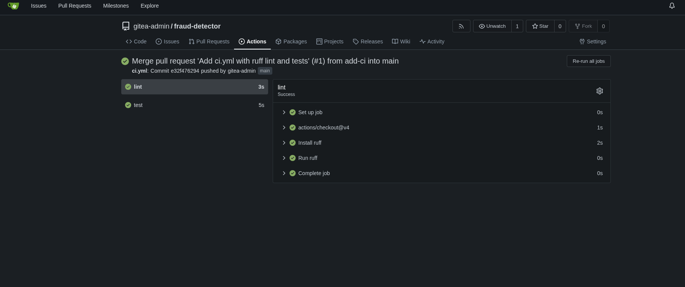

# Task: Create CI Pipeline for ML Code Linting and Testing


The xFusionCorp Industries ML platform team wants pull requests on the `fraud-detector` repository to run lint and tests automatically before anyone reviews them. A local *Gitea* server is already running with the `fraud-detector` repo pre-pushed on main, and a self-hosted Actions runner is registered and waiting for jobs. A CI workflow template lives on main at `.gitea/workflows/ci.yml.template` — your task is to finish wiring it up on a `feature` branch, open a PR, watch the Checks tab turn green, and merge the PR into main.


1. The Gitea UI is running on port `3000`. The Gitea button opens the login page. Admin credentials: `gitea-admin` / `gitea2026.` The repo is at `http://localhost:3000/gitea-admin/fraud-detector`. A working clone already sits at `/root/code/fraud-detector`.

2. The scaffold under /root/code/fraud-detector/ lints clean and has passing tests:

  - `src/train.py` – Deterministic synthetic training script.
  - `tests/test_train.py` – Three passing unit tests.
  - `pyproject.toml` – Ruff + pytest configuration.
  - `.gitea/workflows/ci.yml.template` – Pre-written CI workflow with the on: triggers, lint + test job skeletons, and # TODO: markers on the two run: lines that need filling in. Gitea Actions only schedules `*.yml` / `*.yaml` files, so the `.template` suffix keeps the file inert until it is renamed.
  - Ruff and pytest are both installed on the host.

3. From a VS Code terminala:

```
   cd /root/code/fraud-detector
   git checkout -b add-ci
   git mv .gitea/workflows/ci.yml.template .gitea/workflows/ci.yml
   # Open the renamed file in the editor and replace the two
   # `run: # TODO: ...` lines with ruff and pytest invocations.
   git add .gitea/workflows/ci.yml
   git commit -m "ci: add lint and test workflow"
   git push -u origin add-ci
```

The finished workflow must:

  - Keep the `pull_request` + push triggers on main (already wired in the template).
  - Keep the two jobs lint and test (already wired in the template).
  - Fill in lint's run: so it invokes ruff check src tests.
  - Fill in test's run: so it invokes `python3 -m pytest tests -v`.


4. Open the Gitea UI (via the Gitea button), navigate to the `fraud-detector` repo, click Pull Requests -> New Pull Request, pick `main` as base and `add-ci` as compare, and click Create Pull Request. The Checks tab shows the workflow starting, then turning green as each job finishes.

5. Once both checks are green, click Merge Pull Request on the PR's Conversation tab and confirm the merge.

6. The end state must include:

  - A workflow file .gitea/workflows/ci.yml on branch add-ci that parses as YAML and declares both a lint and a test job.
  - One pull request in the repo targeting main, with add-ci as its head branch.
  - That PR's head commit reports combined status success on GET /api/v1/repos/gitea-admin/fraud-detector/commits/{sha}/status.
  - The PR is merged into main (merged: true on the pulls API).

> Gitea Actions uses the same YAML syntax as GitHub Actions, so the workflow you ship here is also the kind of file you would drop into any github.com repo. Real CI engineers rarely author these from scratch — they inherit a template and edit the two or three lines that are project-specific, which is exactly what the .template scaffold mirrors.

---

# Solution


- This involes fixing the CI in the `fraud-detector`  repo with `ruff` lint and test, create a PR and merge it into main.

- Enter the `fraud-detector` directory. Inspect the files within on VSCode. We can see that the CI workflow file is named as `ci-yml.temlate`, and Gitea Actions only schedules `*.yml` / `*.yaml` files. We need to rename the file, create a new branch `add-ci` to work with:

Run following commands provided in the task description:

```
   cd /root/code/fraud-detector
   git checkout -b add-ci
   git mv .gitea/workflows/ci.yml.template .gitea/workflows/ci.yml
```

- Now we need to update the `ci.yml` by updating the **# TODO** markers:



- Stage the updated file and commit it with appropriate commit message. Finally push the commit to origin as a new branch.



- Open the Gitead UI and log in using the credentials provided, navigate to the `fraud-detector` repo and create a new PR by clicking the button in
the UI.



- Wait for all the CI check to show pass witha tick mark. Then go ahead and merge the PR to the `main` branch.



- Verify the Action runs and all jobs and steps are run succesfuly. Done! hit **Check**.


