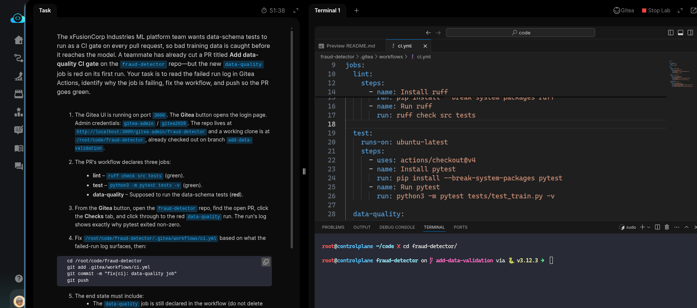
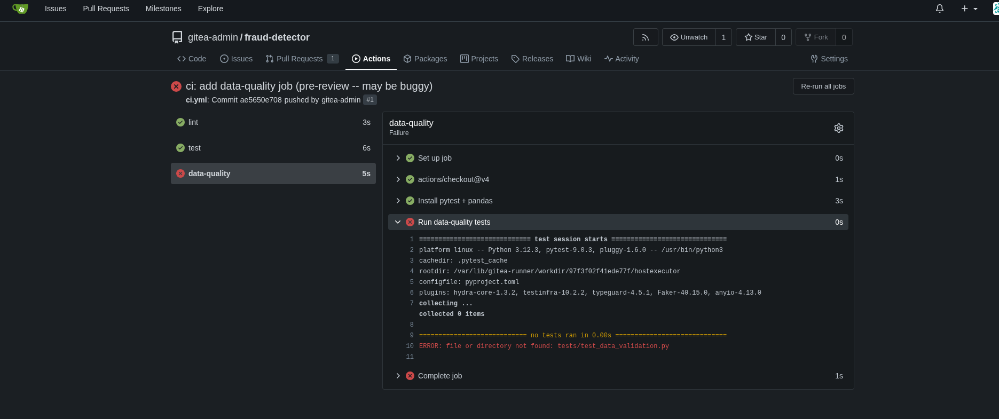
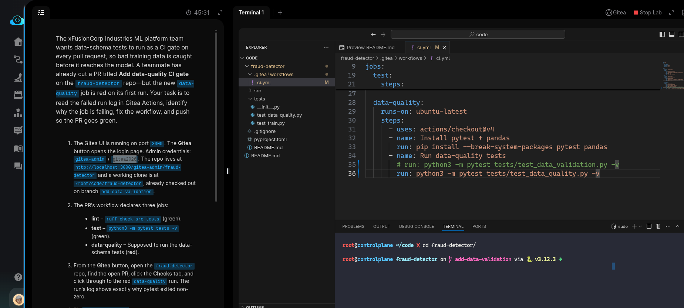
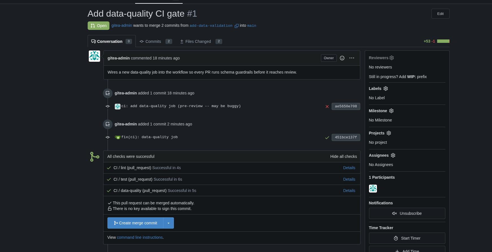

# Task: Add Data Validation to CI Pipeline

The xFusionCorp Industries ML platform team wants data-schema tests to run as a CI gate on every pull request, so bad training data is caught before it reaches the model. A teammate has already cut a PR titled Add data-quality CI gate on the `fraud-detector` repo—but the new data-quality job is red on its first run. Your task is to read the failed run log in Gitea Actions, identify why the job is failing, fix the workflow, and push so the PR goes green.


1. The Gitea UI is running on port `3000`. The Gitea button opens the login page. Admin credentials: `gitea-admin` / `gitea2026`. The repo lives at `http://localhost:3000/gitea-admin/fraud-detector` and a working clone is at `/root/code/fraud-detector`, already checked out on branch add-data-validation.

2. The PR's workflow declares three jobs:

  - `lint` – `ruff check src tests` (green).
  - `test` – `python3 -m pytest tests -v` (green).
  - `data-quality` – Supposed to run the data-schema tests (red).

3. From the Gitea button, open the `fraud-detector` repo, find the open PR, click the Checks tab, and click through to the red data-quality run. The run's log shows exactly why pytest exited non-zero.

4. Fix `/root/code/fraud-detector/.gitea/workflows/ci.yml` based on what the failed-run log surfaces, then:

```
   cd /root/code/fraud-detector
   git add .gitea/workflows/ci.yml
   git commit -m "fix(ci): data-quality job"
   git push
```


5. The end state must include:
  - The data-quality job is still declared in the workflow (do not delete the job itself).
  - The data-quality job's pytest step references a .py file that exists on the add-data-validation branch.
  - After the latest push, the PR's head commit's combined status reaches success (all three jobs green).

> The point of a red CI run is not just the red pill in the PR—it is the log underneath it. A workflow can look fine by static inspection and still fail at runtime. The fix is almost always visible in the first twenty lines of the failed step's log.


---

# Solution:

- This task is to fix the `data-quality` job in the `ci.yml` for `fraud-detector` repo and push the fixed `ci.yml` to the upstream.

- Enter the `fraud-detector` directory, and inspect the `./.gitea/workflows/ci.yml` in VSCode and look for any errors or hints.



- Open the Gitea UI and login using the credentials provided. Inspect the last CI run logs  and see any errors. 



- We can notice that the name of the test file in the ci is wrongly referring to `tests/test_data_validation.py`. But the correct file in `./tests` is
  `test_data_quality.py`. Update the `ci.yml` with correct filename.



- Stage, commit and push the updated `ci.yml` to upstream repo uwing the commands provided in the task description:

```
   cd /root/code/fraud-detector
   git add .gitea/workflows/ci.yml
   git commit -m "fix(ci): data-quality job"
   git push
```

- Verify the PRs head commit after the push passes the `data-quality` job.



Done! Hit **Check**


