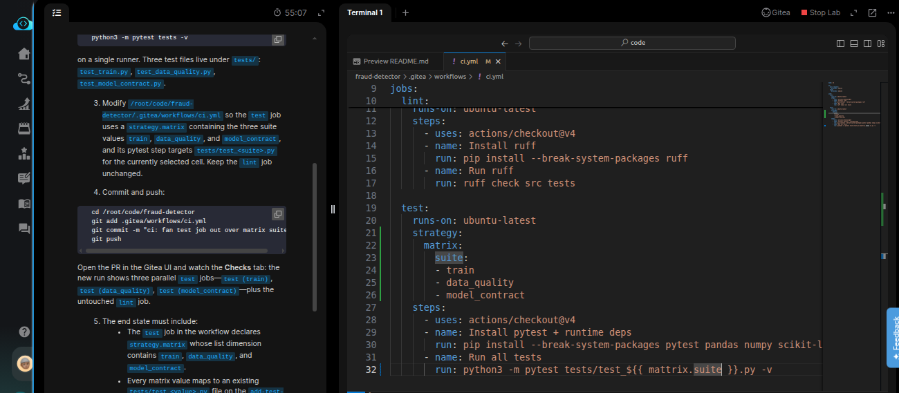
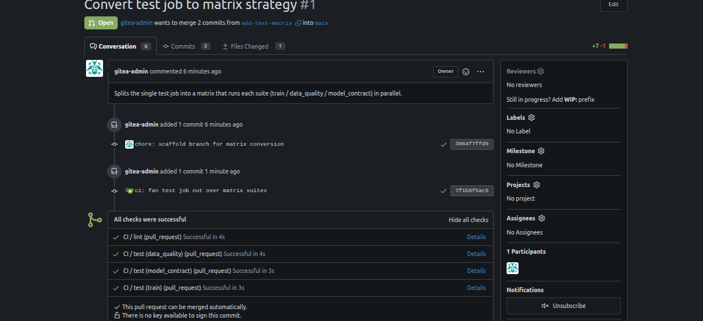

# Task: Add Model Validation Tests to CI

The xFusionCorp Industries ML platform team has three separate test suites on the `fraud-detector` repo—unit (`test_train.py`), data-quality (`test_data_quality.py`), and model-contract (`test_model_contract.py`) — but the CI runs all three serially inside one test job. As the suites grow, the job is becoming the bottleneck on every PR. A teammate has opened a PR titled Convert test job to matrix strategy; your task is to modify the workflow so the test job fans out into a Gitea Actions matrix that runs each suite in its own parallel job.


1. The Gitea UI is running on port `3000`. The Gitea button opens the login page. Admin credentials: `gitea-admin` / `gitea2026`. The repo lives at `http://localhost:3000/gitea-admin/fraud-detector` and a working clone is at `/root/code/fraud-detector`, already checked out on branch `add-test-matrix`. The PR is pre-opened.

2. The current .gitea/workflows/ci.yml declares a test job that runs:

```
   python3 -m pytest tests -v
```


On a single runner. Three test files live under `tests/`: `test_train.py`, `test_data_quality.py`, `test_model_contract.py`.

3. Modify `/root/code/fraud-detector/.gitea/workflows/ci.yml` so the test job uses a `strategy.matrix` containing the three suite values `train`, `data_quality`, and `model_contract`, and its `pytest` step targets `tests/test_<suite>.py` for the currently selected cell. Keep the lint job unchanged.

4. Commit and push:

```
   cd /root/code/fraud-detector
   git add .gitea/workflows/ci.yml
   git commit -m "ci: fan test job out over matrix suites"
   git push
```


5. Open the PR in the Gitea UI and watch the Checks tab: the new run shows three parallel test jobs—test (`train`), test (`data_quality`), test (`model_contract`) — plus the untouched lint job.

6. The end state must include:
  - The test job in the workflow declares `strategy.matrix` whose list dimension contains `train`, `data_quality`, and `model_contract`.
  - Every matrix value maps to an existing `tests/test_<value>.py` file on the `add-test-matrix` branch.
  - The latest run on the PR head commit reports combined status success, with at least three test status entries (one per matrix cell).

> A matrix strategy is the CI equivalent of a loop variable: one job definition, many parameterised executions. The classical case is a Python-version matrix (3.10 / 3.11 / 3.12), but any axis works—test suites, feature flags, target platforms. The point is to express 'run this N times with N variants' once instead of copying the job body.

---

# Solution:

- This tasks requires to update the existing CI workflow file with a matrix strategy, such that all the three tests `test_train.py`,
`test_data_quality.py`, and `test_model_contract.py` within a single runner instead of rach test runs individually as a saperate test step.

- Enter the `fraud-detector` directory and inspect the current branch, and the `./.gitea/workflows/ci.yml` in VSCode. Currently, all tests with
`./test/` directory run serially in the `test` job. We need to update it using `strategy.metrix`:



- Stage, commit and push the changes to remote using the commands provided in the task description:

```
   git add .gitea/workflows/ci.yml
   git commit -m "ci: fan test job out over matrix suites"
   git push
```

- Open Gitea UI and login using the credentials provided in the descrition, and navigate to the PR page and you should see two jobs with `test` job reporting a combined success status, with all the three test status entries.



Done! Hit **Check**


